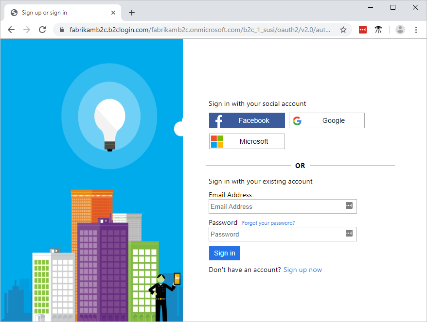

# Quickstart: Set up sign-in for an ASP.NET application using Azure Active Directory B2C

Azure Active Directory (Azure AD) B2C provides cloud identity management to keep your application, business, and customers protected. Azure AD B2C enables your applications to authenticate to social accounts and enterprise accounts using open standard protocols. In this quickstart, you use an ASP.NET application to sign in using a social identity provider and call an Azure AD B2C protected web API.

[!INCLUDE [quickstarts-free-trial-note](../../includes/quickstarts-free-trial-note.md)]

## Prerequisites

- [Visual Studio 2017](https://www.visualstudio.com/downloads/) with the **ASP.NET and web development** workload. 
- A social account from either Facebook, Google, Microsoft, or Twitter.
- [Download a zip file](https://github.com/Azure-Samples/active-directory-b2c-dotnet-webapp-and-webapi/archive/master.zip) or clone the sample web application from GitHub.

    ```
    git clone https://github.com/Azure-Samples/active-directory-b2c-dotnet-webapp-and-webapi.git
    ```

    These two projects are in the sample solution:

    - **TaskWebApp** - A web application that creates and edits a task list. The web application uses the **sign-up or sign-in** user flow to sign-up or sign-in users.
    - **TaskService** - A web API that supports the create, read, update, and delete task list functionality. The web API is protected by Azure AD B2C and called by the web application.

## Run the application in Visual Studio

1. In the sample application project folder, open the **B2C-WebAPI-DotNet.sln** solution in Visual Studio.
2. For this quickstart, you run both the **TaskWebApp** and **TaskService** projects at the same time. Right-click the **B2C-WebAPI-DotNet** solution in Solution Explorer, and then select **Set StartUp Projects**. 
3. Select **Multiple startup projects** and change the **Action** for both projects to **Start**. 
4. Click **OK**.
5. Press **F5** to debug both applications. Each application opens in its own browser tab:

    - `https://localhost:44316/` - The ASP.NET web application. You interact directly with this application in the quickstart.
    - `https://localhost:44332/` - The web API that's called by the ASP.NET web application.

## Sign in using your account

1. Click **Sign up / Sign in** in the ASP.NET web application to start the workflow.

    

    The sample supports several sign-up options including using a social identity provider or creating a local account using an email address. For this quickstart, use a social identity provider account from either Facebook, Google, Microsoft, or Twitter.

2. Azure AD B2C presents a custom login page for a fictitious brand called Wingtip Toys for the sample web application. To sign up using a social identity provider, click the button of the identity provider you want to use.

    

    You authenticate (sign-in) using your social account credentials and authorize the application to read information from your social account. By granting access, the application can retrieve profile information from the social account such as your name and city. 

3. Finish the sign-in process for the identity provider.

## Edit your profile

Azure Active Directory B2C provides functionality to allow users to update their profiles. The sample web app uses an Azure AD B2C edit profile user flow for the workflow. 

1. In the application menu bar, click your profile name and select **Edit profile** to edit the profile you created.

    

2. Change your **Display name** or **City**, and then click **Continue** to update your profile. 

    The changed is displayed in the upper right portion of the web application's home page.

## Access a protected API resource

1. Click **To-Do List** to enter and modify your to-do list items. 

2. Enter text in the **New Item** text box. Click **Add** to call the Azure AD B2C protected web API that adds a to-do list item.

    

    The ASP.NET web application includes an Azure AD access token in the request to the protected web API resource to perform operations on the user's to-do list items.

You've successfully used your Azure AD B2C user account to make an authorized call an Azure AD B2C protected web API.

## Clean up resources

You can use your Azure AD B2C tenant if you plan to try other Azure AD B2C quickstarts or tutorials. When no longer needed, you can [delete your Azure AD B2C tenant](active-directory-b2c-faqs.md#how-do-i-delete-my-azure-ad-b2c-tenant).

## Next steps

In this quickstart, you used a sample ASP.NET application to sign in with a custom login page, sign in with a social identity provider, create an Azure AD B2C account, and call a web API protected by Azure AD B2C. 

Get started creating your own Azure AD B2C tenant.

> [!div class="nextstepaction"]
> [Create an Azure Active Directory B2C tenant in the Azure portal](tutorial-create-tenant.md)
