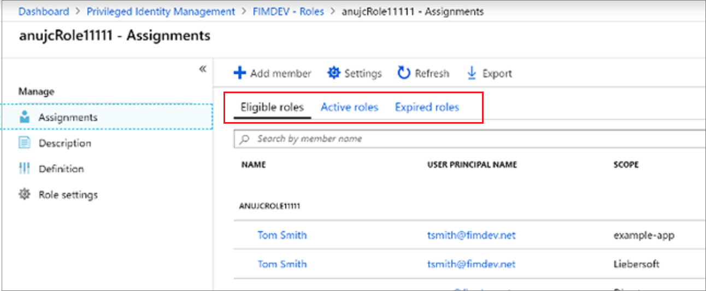
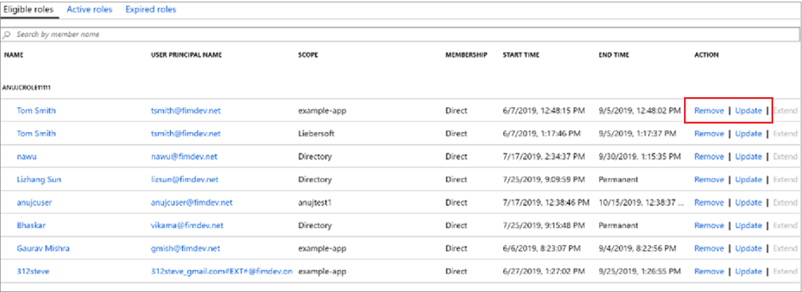

# Update or remove an assigned Azure AD custom role in Privileged Identity Management

This article tells you how to use Privileged Identity Management (PIM) to update or remove just-in-time and time-bound assignment to custom roles created for application management in the Azure Active Directory (Azure AD) administrative experience. 

- For more information about creating custom roles to delegate application management in Azure AD, see [Custom administrator roles in Azure Active Directory (preview)](../users-groups-roles/roles-custom-overview.md). 
- If you haven't used Privileged Identity Management yet, get more information at [Start using Privileged Identity Management](pim-getting-started.md).

> [!NOTE]
> Azure AD custom roles are not integrated with the built-in directory roles during preview. Once the capability is generally available, role management role management will take place in the built-in roles experience.

## Update or remove an assignment

Follow these steps to update or remove an existing custom role assignment.

1. Sign in to [Privileged Identity Management](https://portal.azure.com/?Microsoft_AAD_IAM_enableCustomRoleManagement=true&Microsoft_AAD_IAM_enableCustomRoleAssignment=true&feature.rbacv2roles=true&feature.rbacv2=true&Microsoft_AAD_RegisteredApps=demo#blade/Microsoft_Azure_PIMCommon/CommonMenuBlade/quickStart) in the Azure portal with a user account that is assigned to the Privileged role administrator role.
1. Select **Azure AD custom roles (Preview)**.

    

1. Select **Roles** to see a the **Assignments** list of custom roles for Azure AD applications.

    

1. Select the role that you want to update or remove.
1. Find the role assignment on the **Eligible roles** or **Active roles** tabs.
1. Select **Update** or **Remove** to update or remove the role assignment.

    

## Next steps

- [Activate an Azure AD custom role](azure-ad-custom-roles-assign.md)
- [Assign an Azure AD custom role](azure-ad-custom-roles-assign.md)
- [Configure an Azure AD custom role assignment](azure-ad-custom-roles-configure.md)
