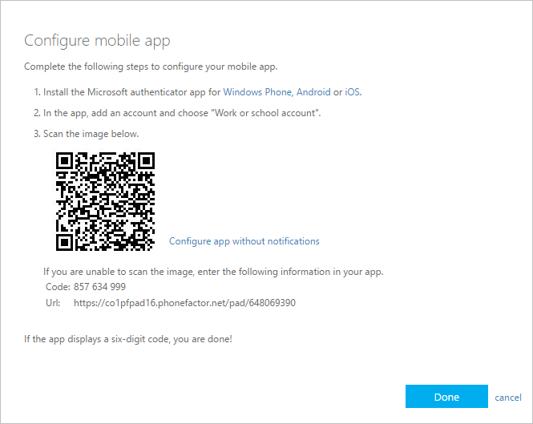
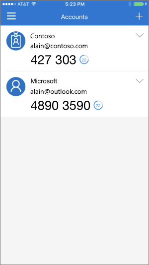

# Add your work or school account

If your organization uses two-factor verification, you can set up your work or school account to use the Microsoft Authenticator app as one of the verification methods.

>[!Important]
>Before you can add your account, you must download and install the Microsoft Authenticator app. If you haven't done that yet, follow the steps in the [Download and install the app](user-help-auth-app-download-install.md) article.

## Add your work or school account

1. On your computer, go to the [Additional security verification](https://aka.ms/mfasetup) page.

    >[!Note]
    >If you don't see the **Additional security verification** page, it's possible that your administrator has turned on the security info (preview) experience. If that's the case, you should follow the instructions in the [Set up security info to use an authenticator app](security-info-setup-auth-app.md) section. If that's not the case, you will need to contact your organization's Help Desk for assistance. For more information about security info, see [Security info (preview) overview](user-help-security-info-overview.md).

2. Check the box next to **Authenticator app**, and then select **Configure**.

    The **Configure mobile app** page appears.

    

3. Open the Microsoft Authenticator app, select **Add account** from the **Customize and control** icon in the upper-right, and then select **Work or school account**.

4. Use your device's camera to scan the QR code from the **Configure mobile app** screen on your computer, and then choose **Done**.

    >[!Note]
    >If your camera is unable to capture the QR code, you can manually add your account information to the Microsoft Authenticator app for two-factor verification. For more information and how to do it, see [Manually add your account](user-help-auth-app-add-account-manual.md).

5. Review the **Accounts** screen of the app on your device, to make sure your account is right and that there's an associated six-digit verification code. For additional security, the verification code changes every 30 seconds preventing someone from using a code multiple times.

    

## Next steps

- After you add your accounts to the app, you can sign in using the Authenticator app on your device. For more information, see [Sign in using the app](user-help-auth-app-sign-in.md).

- For devices running iOS, you can also back up your account credentials and related app settings, such as the order of your accounts, to the cloud. For more information, see [Backup and recover with Microsoft Authenticator app](user-help-auth-app-backup-recovery.md).
