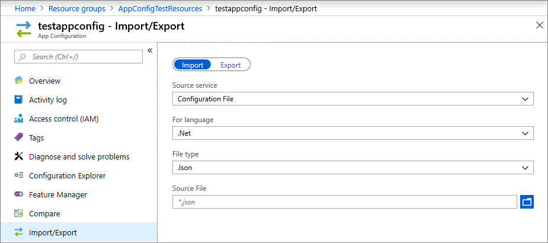
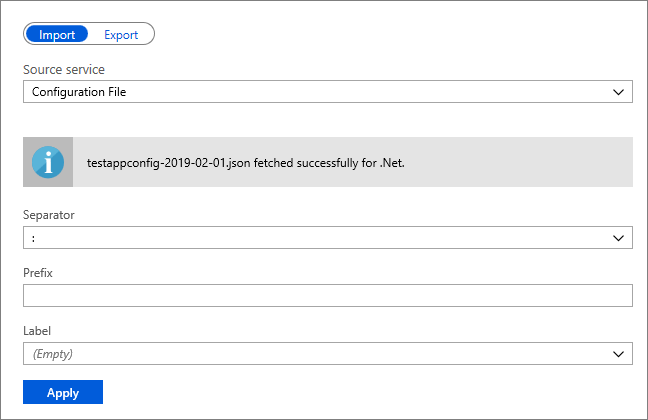
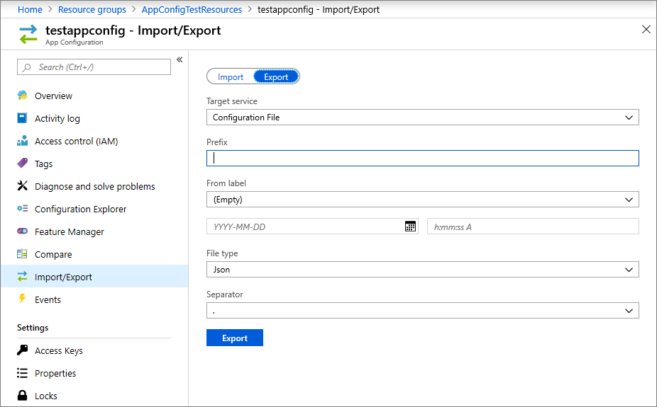

# Import or export configuration data

Azure App Configuration supports data import and export operations. Use these operations to work with configuration data in bulk and exchange data between your app configuration store and code project. For example, you can set up one app configuration store for testing and another for production. You then can copy application settings between them via a file so that you don't have to enter data twice.

This article provides a guide for importing and exporting data with App Configuration.

## Import data

Import brings configuration data into an App Configuration store from an existing source, instead of manually entering it. Use the import function to migrate data into an app configuration store or aggregate data from multiple sources. App Configuration supports importing from a JSON, YAML, or properties file.

Import data by using either the [Azure portal](https://aka.ms/azconfig/portal) or the [Azure CLI](./scripts/cli-import.md). From the Azure portal, follow these steps:

1. Browse to your app configuration store, and select **Import/Export**.

2. On the **Import** tab, select **Source service** > **Configuration File**.

3. Select **For language** > **File type**.

4. Select the **Folder** icon, and browse to the file to import.

    

5. Select a **Separator**, and optionally enter a **Prefix** to use for imported key names.

6. Optionally, select a **Label**.

7. Select **Apply** to finish the import.

    

## Export data

Export writes configuration data stored in App Configuration to another destination. Use the export function, for example, to save data in an app configuration store to a file that's embedded with your application code during deployment.

Export data by using either the [Azure portal](https://aka.ms/azconfig/portal) or the [Azure CLI](./scripts/cli-export.md). From the Azure portal, follow these steps:

1. Browse to your app configuration store, and select **Import/Export**.

2. On the **Export** tab, select **Target service** > **Configuration File**.

3. Optionally enter a **Prefix** and select a **Label** and a point-in-time for keys to be exported.

4. Select a **File type** > **Separator**.

5. Select **Apply** to finish the export.

    

## Next steps

> [!div class="nextstepaction"]
> [Create an ASP.NET Core web app](./quickstart-aspnet-core-app.md)  
