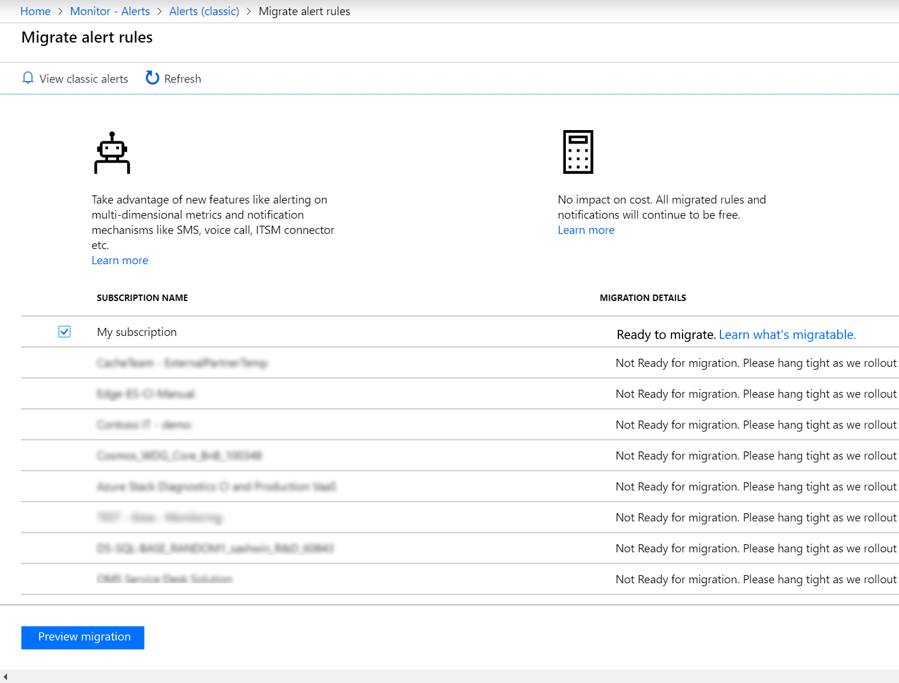
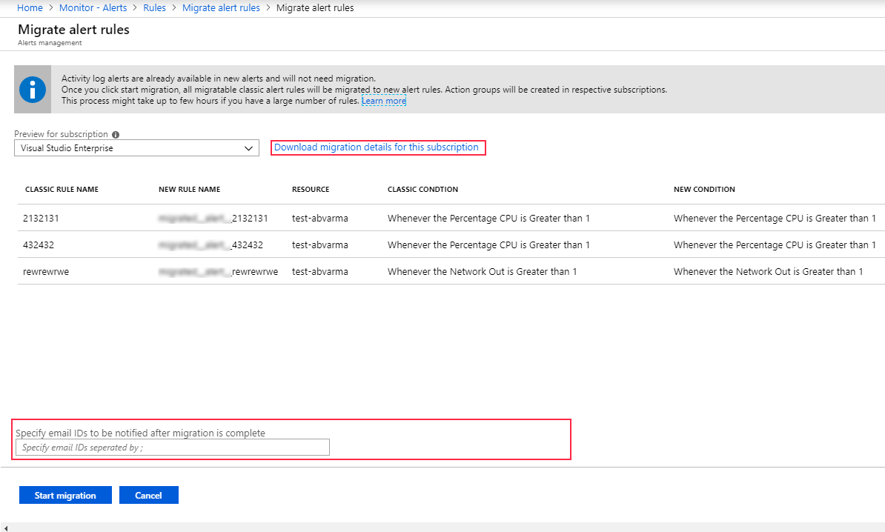
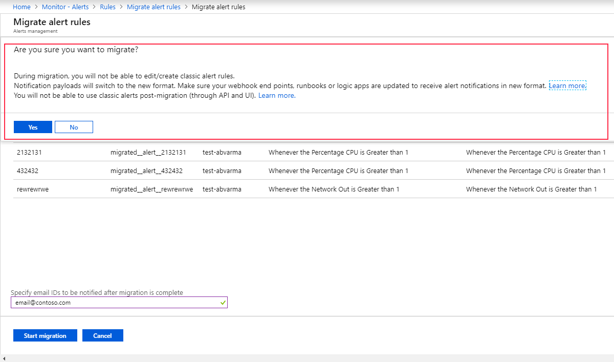

# Use the voluntary migration tool to migrate your classic alert rules

As [previously announced](monitoring-classic-retirement.md), classic alerts in Azure Monitor are being retired in July 2019. The migration tool to trigger migration voluntarily is available in Azure portal and is rolling out to customers who use classic alert rules. This article will walk you through on how to use the migration tool to voluntarily migrate your classic alert rules before the automatic migration starts in July 2019.

## Benefits of new alerts

Classic alerts are being replaced by new unified alerting in Azure Monitor. The new alerts platform has the following benefits:

- Alert on a variety of multi-dimensional metrics for [many more Azure services](alerts-metric-near-real-time.md#metrics-and-dimensions-supported)
- New metric alerts support [multi-resource alert rules](alerts-metric-overview.md#monitoring-at-scale-using-metric-alerts-in-azure-monitor) which greatly reduce the overhead of managing many rules.
- Unified notification mechanism
  - [Action Groups](action-groups.md) is a modular notification mechanism that works with all new alert types (metric, log and activity log)
  - You will also be able to take advantage of new notification mechanisms like SMS, Voice and ITSM Connector
- The [unified alert experience](alerts-overview.md) brings all the alerts on different signals (metric, activity log and log) into one place

## Before you migrate

As part of the migration, classic alert rules are converted to equivalent new alert rules and action groups are created.

- The notification payload format as well as the APIs to create and manage new alert rules is different from those of the classic alert rules as they support more features. Learn [how to prepare for the migration](alerts-prepare-migration.md).

- Some classic alert rules cannot be migrated using the tool. [Learn which rules are not migratable and see how to migrate them](alerts-understand-migration.md#which-classic-alert-rules-can-be-migrated).

    > [!NOTE]
    > Migration process will not impact the evaluation of your classic alert rules. They will continue to run and send alerts till they are migrated and new alert rules start evaluating.

## How to use the migration tool

The following procedure describes how to trigger the migration of your classic alert rules in Azure portal:

1. In [Azure portal](https://portal.azure.com), click on **Monitor**.

2. Click **Alerts** then click on **Manage alert rules** or **View classic alerts**.

3. Click **Migrate to new rules** to go to the migration landing page. This page shows a list of all your subscriptions and the status of migration for them.

    

4. All the subscriptions that can be migrated using the tool will be marked as **Ready to migrate**.

    > [!NOTE]
    > The migration tool is rolling out in phases to all the subscriptions that use classic alert rules. In the early phases of roll-out, you might see some subscriptions as not ready for migration.

5. Select one or more subscriptions and click on **Preview migration**

6. On this page, you can see the details of classic alert rules that will be migrated for one subscription at a time. You can also **Download the migration details for this subscription** in a .csv format.

    

7. Provide one or more **email addresses** to be notified of migration status. We will send an email when the migration completes or an action is needed from you.

8. Click on **Start Migration**. Read the information shown in the confirmation dialog and confirm if you are ready to start the migration process.

    >[!IMPORTANT]
    > Once you initiate the migration process for a subscription, you will not be able to edit/create classic alert rules for the subscription. However, your classic alert rules will continue running and providing you alerts till they are migrated over. This is to ensure the fidelity between classic alert rules and the new rules created during migration. Once the migration is complete for your subscription, you can not use classic alert rules anymore.

    

9. As we complete migration or need an action from you, you will receive an email on the email addresses provided in the step 8. You can also periodically check the status from the migration landing page in the portal.

## Frequently asked questions

### **Why is my subscription(s) listed as Not ready for migration?**

The migration tool is rolling out in phases to all customers. In the early phases, most or all your subscriptions might be marked as **Not ready for migration**. However, by mid-April, all subscriptions should be ready to migrate.

When a subscription becomes ready for migration, Subscription Owners will receive an email notifying the availability of the tool. Keep an eye out for this notification.

### **Who can trigger the migration?**

Users who have the Monitoring Contributor role assigned to them at the subscription level will be able to trigger the migration. Learn more about [Role Based Access Control for migration process](alerts-understand-migration.md#who-can-trigger-the-migration).

### **How long is the migration going to take?**

For most subscriptions, migration typically completes under an hour. You can keep track of the migration progress from the migration landing page.  During this time, please be ensured that your alerts are still running either in the classic alerts system or the new one.

### **What can I do if I run into an issue during migration?**

Please follow the [troubleshooting guide to see remediation steps for any issues you might face during migration](alerts-understand-migration.md#common-issues-and-remediations). If any action is needed from you to complete the migration, you will be notified on the email address(es) provided during migration.

## Next steps

- [Prepare for migration](alerts-prepare-migration.md)
- [Understand how the migration tool works](alerts-understand-migration.md)
