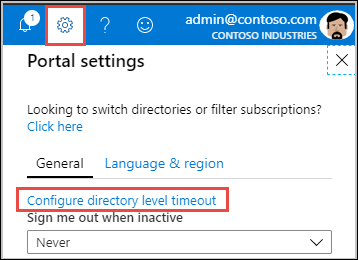

# Set directory-level inactivity timeout

The inactivity timeout setting helps to protect your resources from unauthorized access if users forget to secure their workstation. When a user has been idle for a while, their Azure portal session is automatically signed out. Admins in the [Global Administrator role](../active-directory/users-groups-roles/directory-assign-admin-roles.md#global-administrator--company-administrator) can enforce the maximum idle time before a session is signed out. The inactivity timeout setting applies at the directory level. For more information about directories, see [Active Directory Domain Services Overview](/windows-server/identity/ad-ds/get-started/virtual-dc/active-directory-domain-services-overview).

## Configure the inactive timeout setting

If you’re a Global Administrator, and you want to enforce an idle timeout setting for all users of the Azure portal, follow these steps:

1. Sign in to the [Azure portal](https://portal.azure.com).
2. Select **Settings** from the global page header.
3. Select the link text **Configure directory level timeout**.

    

4. A new page opens. On the **Configure directory level inactivity timeout** page, select **Enable directory level idle timeout for the Azure portal** to turn on the setting.
5. Next, enter the **Hours** and **Minutes** for the maximum time that a user can be idle before their session is automatically signed out.
6. Select **Apply**.

    

To confirm that the inactivity timeout policy is set correctly, select **Notifications** from the global page header. Verify that a success notification is listed.

  

The setting takes effect for new sessions. It won’t apply immediately to any users who are already signed in.

> [!NOTE]
> If an admin has configured a directory-level timeout setting, users can override the policy and set their own inactive sign-out duration. However, the user must choose a time interval that is less than what is set at the directory level.
>

## Next steps

* [Set your Azure portal preferences](set-preferences.md)
* [Export or delete user settings](azure-portal-export-delete-settings.md)
* [Turn on high contrast or change theme](azure-portal-change-theme-high-contrast.md)
