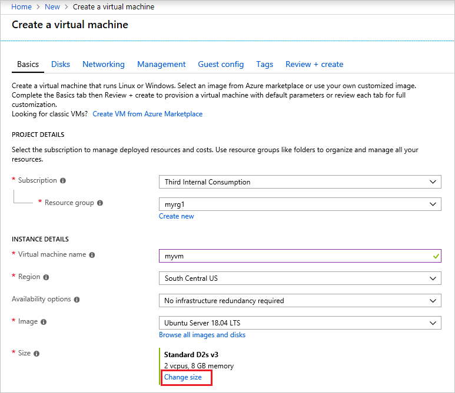
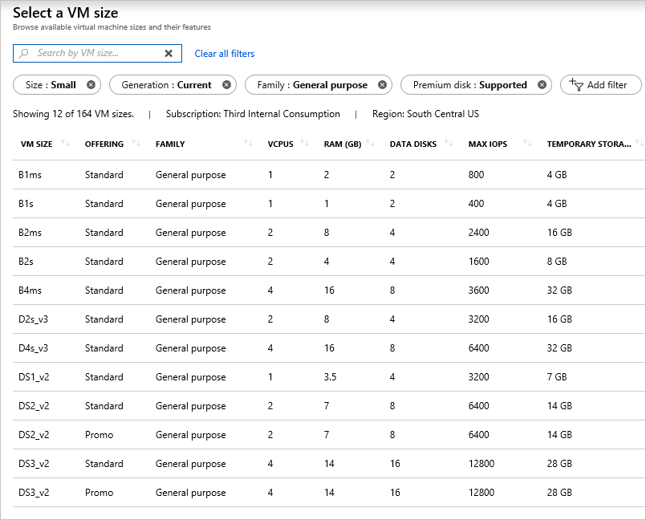

# Resolve errors for SKU not available

This article describes how to resolve the **SkuNotAvailable** error. If you're unable to find a suitable SKU in that region/zone or an alternative region/zone that meets your business needs, submit a [SKU request](https://aka.ms/skurestriction) to Azure Support.

[!INCLUDE [updated-for-az](../../../includes/updated-for-az.md)]

## Symptom

When deploying a resource (typically a virtual machine), you receive the following error code and error message:

```
Code: SkuNotAvailable
Message: The requested tier for resource '<resource>' is currently not available in location '<location>'
for subscription '<subscriptionID>'. Please try another tier or deploy to a different location.
```

## Cause

You receive this error when the resource SKU you've selected (such as VM size) isn't available for the location you've selected.

If you are deploying an Azure Spot VM or Spot scale set instance, there isn't any capacity for Azure Spot in this location. For more information, see [Spot error messages](../../virtual-machines/error-codes-spot.md).

## Solution 1 - PowerShell

To determine which SKUs are available in a region/zone, use the [Get-AzComputeResourceSku](/powershell/module/az.compute/get-azcomputeresourcesku) command. Filter the results by location. You must have the latest version of PowerShell for this command.

```azurepowershell-interactive
Get-AzComputeResourceSku | where {$_.Locations -icontains "centralus"}
```

The results include a list of SKUs for the location and any restrictions for that SKU. Notice that a SKU might be listed as `NotAvailableForSubscription`.

```powershell
ResourceType          Name           Locations   Zone      Restriction                      Capability           Value
------------          ----           ---------   ----      -----------                      ----------           -----
virtualMachines       Standard_A0    centralus             NotAvailableForSubscription      MaxResourceVolumeMB   20480
virtualMachines       Standard_A1    centralus             NotAvailableForSubscription      MaxResourceVolumeMB   71680
virtualMachines       Standard_A2    centralus             NotAvailableForSubscription      MaxResourceVolumeMB  138240
virtualMachines       Standard_D1_v2 centralus   {2, 1, 3}                                  MaxResourceVolumeMB
```

Some additional samples:

```azurepowershell-interactive
Get-AzComputeResourceSku | where {$_.Locations.Contains("centralus") -and $_.ResourceType.Contains("virtualMachines") -and $_.Name.Contains("Standard_DS14_v2")}
Get-AzComputeResourceSku | where {$_.Locations.Contains("centralus") -and $_.ResourceType.Contains("virtualMachines") -and $_.Name.Contains("v3")} | fc
```

Appending “fc” at the end returns more details.

## Solution 2 - Azure CLI

To determine which SKUs are available in a region, use the `az vm list-skus` command. Use the `--location` parameter to filter output to location you are using. Use the `--size` parameter to search by a partial size name.

```azurecli-interactive
az vm list-skus --location southcentralus --size Standard_F --output table
```

The command returns results like:

```azurecli
ResourceType     Locations       Name              Zones    Capabilities    Restrictions
---------------  --------------  ----------------  -------  --------------  --------------
virtualMachines  southcentralus  Standard_F1                ...             None
virtualMachines  southcentralus  Standard_F2                ...             None
virtualMachines  southcentralus  Standard_F4                ...             None
...
```


## Solution 3 - Azure portal

To determine which SKUs are available in a region, use the [portal](https://portal.azure.com). Sign in to the portal, and add a resource through the interface. As you set the values, you see the available SKUs for that resource. You don't need to complete the deployment.

For example, start the process of creating a virtual machine. To see other available size, select **Change size**.



You can filter and scroll through the available sizes.



## Solution 4 - REST

To determine which SKUs are available in a region, use the [Resource Skus - List](/rest/api/compute/resourceskus/list) operation.

It returns available SKUs and regions in the following format:

```json
{
  "value": [
    {
      "resourceType": "virtualMachines",
      "name": "Standard_A0",
      "tier": "Standard",
      "size": "A0",
      "locations": [
        "eastus"
      ],
      "restrictions": []
    },
    {
      "resourceType": "virtualMachines",
      "name": "Standard_A1",
      "tier": "Standard",
      "size": "A1",
      "locations": [
        "eastus"
      ],
      "restrictions": []
    },
    ...
  ]
}
```

