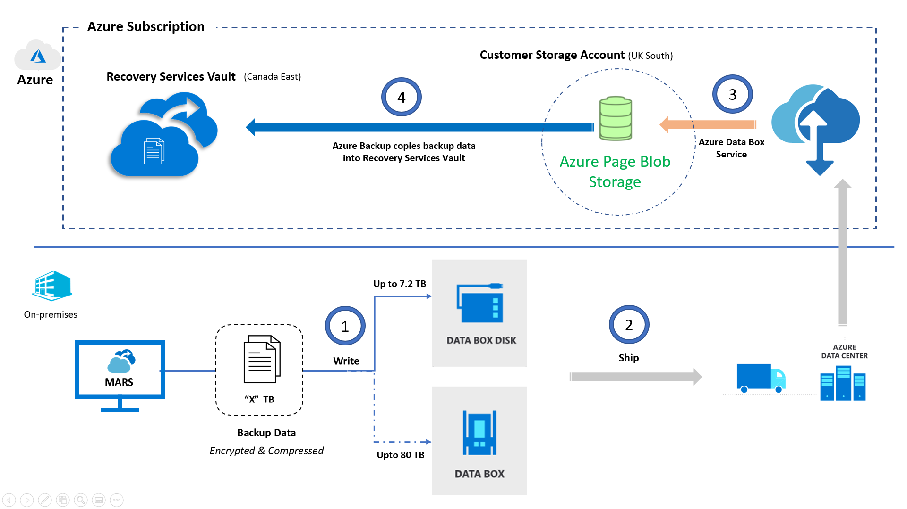
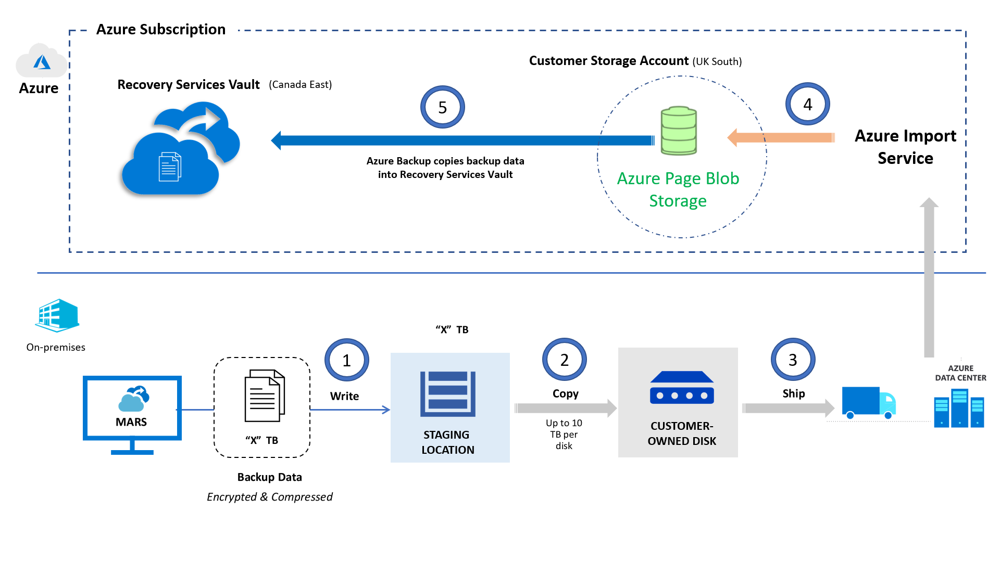

# Overview of Offline Backup

This article gives an overview of Offline Backup.

Initial full backups to Azure typically transfer large amounts of data online and require more network bandwidth when compared to subsequent backups that transfer only incremental changes. Remote offices or datacenters in certain geographies don't always have sufficient network bandwidth. Therefore, these initial backups take several days and during this time continuously use the same network that was provisioned for applications running in the on-premises datacenter.

Azure Backup supports "Offline Backup", which allows transferring initial backup data offline, without the use of network bandwidth. It provides a mechanism to copy backup data onto physical storage-devices that are then shipped to a nearby Azure Datacenter and uploaded onto a Recovery Services Vault. This process ensures robust transfer of backup data without using any network bandwidth.

## Offline Backup options

Offline-Backup is offered in two modes based on the ownership of the storage devices.

1. Azure Data Box based Offline Backup (preview)
2. Azure Import/Export based Offline Backup

## Azure Data Box based Offline Backup (Preview)

This mode is currently supported with the MARS Agent, in preview. This option takes advantage of the [Azure Data Box service](https://azure.microsoft.com/services/databox/) to ship Microsoft-proprietary, secure, and tamper-resistant transfer appliances with USB connectors, to your datacenter or remote office and backup data is  directly written onto these devices. **This option saves the effort required to procure your own Azure compatible disks and connectors or provisioning temporary storage as a staging location.** In addition, Microsoft handles the end-to-end transfer logistics, which you can track through the Azure portal. An architecture describing the movement of backup data with this option is shown below.

Here is a summary of the architecture:

1. Azure Backup directly copies backup data to these pre-configured devices.
2. You can then ship these devices back to an Azure Datacenter.
3. The Azure Data Box service copies the data onto a customer-owned storage account.
4. Azure Backup automatically copies backup data from the storage account to the designated Recovery Services Vault and incremental online backups are scheduled.

To use Azure Data Box based Offline Backup, refer to [this article](offline-backup-azure-data-box.md).

## Azure Import/Export based Offline Backup

This option is supported by Azure Backup Server (MABS) / DPM-A / MARS Agent. It leverages the [Azure Import/Export service](https://docs.microsoft.com/azure/storage/common/storage-import-export-service) that enables you to transfer initial backup data to Azure by using your own Azure-compatible disks and connectors. This approach requires provisioning a temporary storage known as the **Staging Location** and usage of pre-built utilities to format and copy the backup data onto customer-owned disks. An architecture describing the movement of backup data with this option is shown below:

Here is a summary of the architecture:

1. Instead of sending the backup data over the network, Azure Backup writes the backup data to a staging location.
2. The data in the staging location is written to one or more SATA disks using a custom utility.
3. As part of the preparatory work, the utility creates an Azure Import job. The SATA drives are shipped to the nearest Azure datacenter, and reference the import job to connect the activities.
4. At the Azure datacenter, the data on the disks is copied to an Azure storage account.
5. Azure Backup copies the backup data from the storage account to the Recovery Services vault, and incremental backups are scheduled.

To use Azure Import/Export based Offline Backup with the MARS Agent, refer to [this article](https://docs.microsoft.com/azure/backup/backup-azure-backup-import-export).

To use the same along with MABS/DPM-A, refer to [this article](https://docs.microsoft.com/azure/backup/backup-azure-backup-server-import-export-).

## Offline Backup Support Summary

The table below compares the two available options so you can make the appropriate choices based on your scenario.

| **Consideration**                                            | **Azure  Data Box Based offline Backup**                     | **Azure  Import/Export Based Offline Backup**                |
| ------------------------------------------------------------ | ------------------------------------------------------------ | ------------------------------------------------------------ |
| Azure  Backup Deployment models                              | MARS agent (Preview)                                              | MARS Agent, Azure Backup Server (MABS), DPM-A                                           |
| Maximum  Backup data per server (MARS) or per Protection Group (MABS, DPM-A) | [Azure Data Box Disk](https://docs.microsoft.com/azure/databox/data-box-disk-overview) - 7.2 TB   [Azure Data Box](https://docs.microsoft.com/azure/databox/data-box-overview) - 80 TB       | 80  TB (up to 10 disks of 8 TB each)                          |
| Security  (data, device & service)                           | [Data](https://docs.microsoft.com/azure/databox/data-box-security#data-box-data-protection) - AES-256 Bit  Encrypted   [Device](https://docs.microsoft.com/azure/databox/data-box-security#data-box-device-protection) - Rugged case,  proprietary credential-based interface to copy data   [Service](https://docs.microsoft.com/azure/databox/data-box-security#data-box-service-protection) - Protected by  Azure Security features | Data  - BitLocker Encrypted                                 |
| Temporary  Staging Location provisioning                     | Not  required                                                | More  than or equal to the estimated backup data size        |
| Supported  Regions                                           | [Azure Data Box   Disk regions](https://docs.microsoft.com/azure/databox/data-box-disk-overview#region-availability)   [Azure Data Box   regions](https://docs.microsoft.com/azure/databox/data-box-disk-overview#region-availability) | [Azure Import/Export Regions](https://docs.microsoft.com/azure/storage/common/storage-import-export-service#region-availability) |
| Cross-country  shipping*                                     | **Not  supported**       *Source  address & Destination Azure Datacenter must be in the same country* | Supported                                                    |
| Transfer  Logistics (delivery, transport, pick-up)           | Fully  Microsoft managed                                     | Customer  managed                                            |
| Pricing                                                      | [Azure Data Box   Pricing](https://azure.microsoft.com/pricing/details/databox/)   [Azure Data Box   Disk Pricing](https://azure.microsoft.com/pricing/details/databox/disk/) | [Azure   Import/Export Pricing](https://azure.microsoft.com/pricing/details/storage-import-export/) |

* *If your country doesn't have an Azure Datacenter, then you need to ship your disks to an Azure Datacenter in another country.*

## Next steps

* [Azure Data Box Based Offline Backup for MARS Agent](offline-backup-azure-data-box.md#backup-data-size-and-supported-data-box-skus)
* [Azure Import/Export based Offline Backup for MARS Agent](backup-azure-backup-import-export.md)  
* [Azure Import/Export based Offline Backup for MABS/DPM-A](backup-azure-backup-server-import-export-.md)
