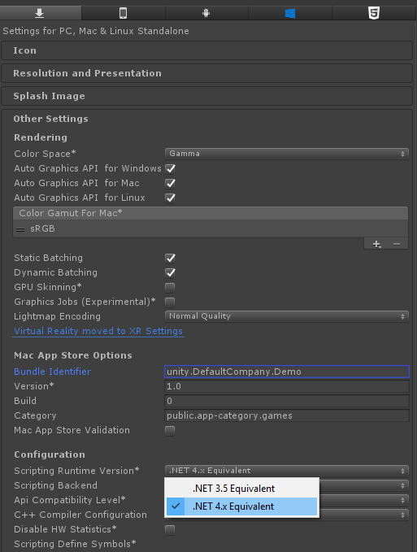

# Project Acoustics Unity Quickstart
Use Project Acoustics sample content for Unity to experiment with simulation-backed design controls.

Software requirements:
* [Unity 2018.2+](http://unity3d.com) for Windows
* [Project Acoustics sample content package](https://www.microsoft.com/download/details.aspx?id=57346)

What's included in the sample package?
* Unity scene with geometry, sound sources, and gameplay controls
* Project Acoustics plugin 
* Baked acoustics assets for the scene

## Import the sample package
Import the sample package to a new Unity project. 
* In Unity, go to **Assets > Import Package > Custom Package...**

      

* Choose **ProjectAcoustics.unitypackage**

If you're importing the package into an existing project, see [Unity integration](unity-integration.md) for additional steps and notes.

## Restart Unity
The bake portion of the acoustics toolkit requires the .NET 4.x scripting runtime version. Package import will update your Unity player settings. Restart Unity for this setting to take effect.

You can verify this setting took effect by opening the **Player Settings**:

## Experiment with design controls
Open the sample scene in the **ProjectAcousticsSample** folder, and click the play button in the Unity editor. Use W, A, S, D and the mouse to move around. To compare how the scene sounds with and without acoustics, press the **R** button until the overlay text turns red and says "Acoustics: Disabled." To see keyboard shortcuts for more controls, press **F1**. Controls are also useable by right-clicking to select the action to perform, then left clicking to perform the action.

The script **AcousticsAdjust** is attached to the sound sources in the sample scene, which enables the per-source design parameters. 

The following explores some of the effects that can be produced with the provided controls. For detailed information about each control, see the [Project Acoustics Unity Design Tutorial](unreal-workflow.md).

### Modify distance-based attenuation
The audio DSP provided by the **Project Acoustics** Unity spatializer plugin respects the per-source distance-based attenuation built into the Unity Editor. Controls for distance-based attenuation are in the **Audio Source** component found in the **Inspector** panel of sound sources, under **3D Sound Settings**:

Project Acoustics performs computation in a "simulation region" box centered around the player location. Since the acoustics assets in the sample package were baked with a simulation region size of 45m surrounding the player, the sound attenuation should be designed to fall to 0 at about 45 m.

### Modify occlusion and transmission
* If the **Occlusion** multiplier is greater than 1 (the default is 1), occlusion will be exaggerated. Setting it less than 1 makes the occlusion effect more subtle.

* To enable through-wall transmission, move the **Transmission (dB)** slider off its lowest level. 

### Modify wetness for a source
* To change how rapidly wetness changes with distance, use the **Perceptual Distance Warp**. **Project Acoustics** computes wet levels throughout the space from simulation, which vary smoothly with distance and provide perceptual distance cues. Increasing the distance warp exaggerates this effect by increasing distance-related wet levels. Warping values less than 1 make the distance-based reverberation change more subtle. This effect can also be adjusted in finer-grained detail by adjusting the **Wetness (dB)**.

* Increase the decay time throughout the space by adjusting the **Decay Time Scale**. If the simulation result for a particular source-listener location pair is a decay time of 1.5s, and the **Decay Time Scale** is set to 2, the decay time applied to the source is 3s.

## Next steps
* Read full details on the [Unity-based Project Acoustics design controls](unity-workflow.md)
* Further explore the concepts behind the [design process](design-process.md)
* [Create an Azure account](create-azure-account.md) to explore the pre-bake and bake processes

