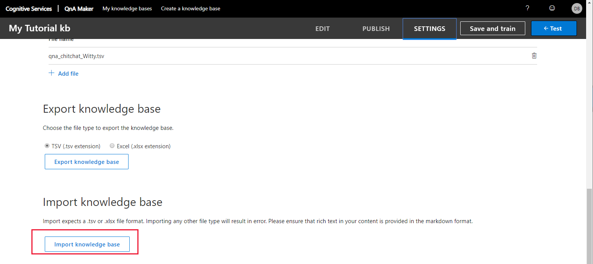

# Migrate a knowledge base using export-import

Migrating a knowledge base requires exporting from one knowledge base, then importing into another.

## Prerequisites

* Create a [free account](https://azure.microsoft.com/free/?WT.mc_id=A261C142F) before you begin.
* Set up a new [QnA Maker service](../How-To/set-up-qnamaker-service-azure.md)

## Migrate a knowledge base from QnA Maker
1. Sign in to [QnA Maker portal](https://qnamaker.ai).
1. Select the origin knowledge base you want to migrate.

1. On the **Settings** page, select **Export knowledge base** to download a .tsv file that contains the content of your origin knowledge base - questions, answers, metadata, follow-up prompts, and the data source names from which they were extracted.

1. Select **Create a knowledge base** from the top menu then create an _empty_ knowledge base. It is empty because when you create it, you are not going to add any URLs or files. Those are added during the import step, after creation.

    Configure the knowledge base. Set the new knowledge base name only. Duplicate names are supported and special characters are supported as well.

    Do not select anything from Step 4 because those values will be overwritten when you import the file.

1. In Step 5, select **Create**.

1. In this new knowledge base, open the **Settings** tab and select **Import knowledge base**. This imports the questions, answers, metadata, follow-up prompts, and retains the data source names from which they were extracted.

   > [!div class="mx-imgBorder"]
   > 

1. **Test** the new knowledge base using the Test panel. Learn how to [test your knowledge base](../How-To/test-knowledge-base.md).
1. **Publish** the knowledge base. Learn how to [publish your knowledge base](../Quickstarts/create-publish-knowledge-base.md#publish-the-knowledge-base).
1. Use the endpoint in your application or bot code. See here how to [create a QnA bot](../Tutorials/create-qna-bot.md).

    

    At this point, all the knowledge base content - questions, answers and metadata, along with the names of the source files and the URLs, are imported to the new knowledge base.

## Chat logs and alterations
Case-insensitive alterations (synonyms) are not imported automatically. Use the [V4 APIs](https://go.microsoft.com/fwlink/?linkid=2092179) to move the alterations in the new knowledge base.

There is no way to migrate chat logs, since the new knowledge base uses Application Insights for storing chat logs.

## Next steps

> [!div class="nextstepaction"]
> [Edit a knowledge base](../How-To/edit-knowledge-base.md)
