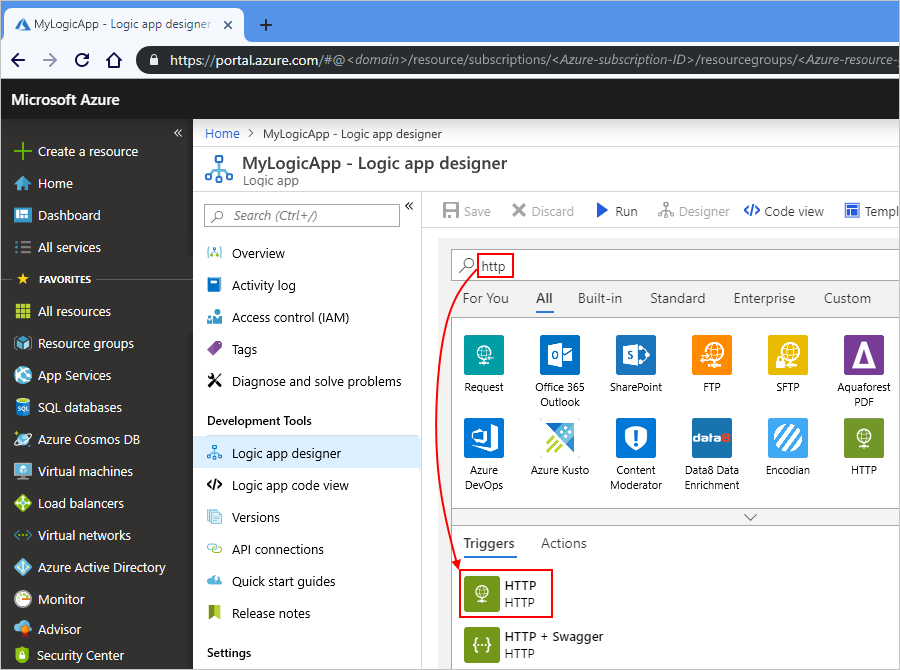
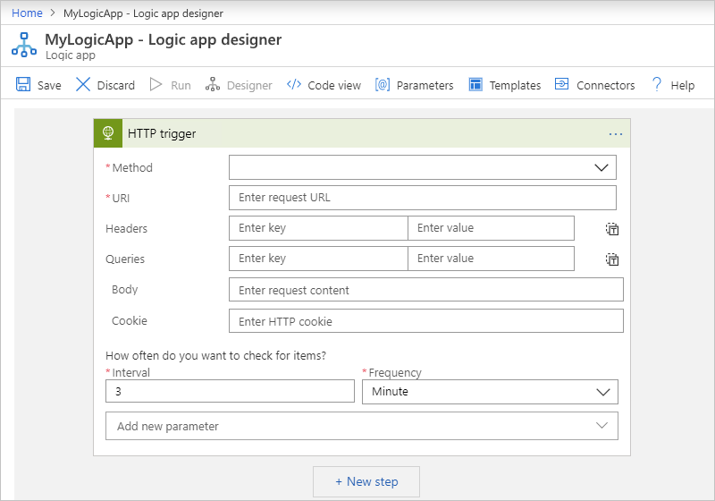
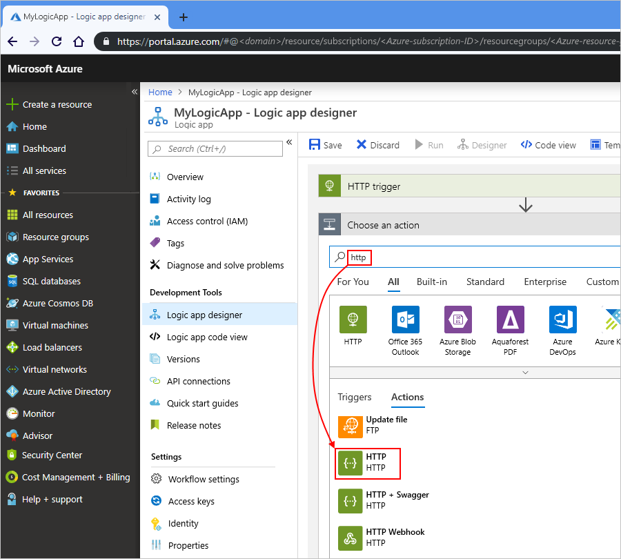

# Call HTTP or HTTPS endpoints with Azure Logic Apps

With Azure Logic Apps and the Hypertext Transfer Protocol (HTTP) connector, 
you can automate workflows that communicate with any HTTP or HTTPS endpoint 
by building logic apps. For example, you can monitor the service endpoint 
for your website. When an event happens at that endpoint, such as your 
website going down, the event triggers your logic app's workflow and runs 
the specified actions. 

You can use the HTTP trigger as the first step in your worklfow 
for checking or *polling* an endpoint on a regular schedule. 
On each check, the trigger sends a call or *request* to the endpoint. 
The endpoint's response determines whether your logic app's workflow runs. 
The trigger passes along any content from the response to the actions 
in your logic app. 

You can use the HTTP action as any other step in your workflow 
for calling the endpoint when you want. The endpoint's response 
determines how your workflow's remaining actions run.

If you're new to logic apps, review 
[What is Azure Logic Apps?](../logic-apps/logic-apps-overview.md)

## Prerequisites

* An Azure subscription. If you don't have an Azure subscription, 
<a href="https://azure.microsoft.com/free/" target="_blank">sign up for a free Azure account</a>. 

* The URL for the target endpoint you want to call 

* Basic knowledge about 
[how to create logic apps](../logic-apps/quickstart-create-first-logic-app-workflow.md)

* The logic app from where you want to call the target endpoint 
To start with the HTTP trigger, [create a blank logic app](../logic-apps/quickstart-create-first-logic-app-workflow.md). 
To use the HTTP action, start your logic app with a trigger.

## Add HTTP trigger

1. Sign in to the [Azure portal](https://portal.azure.com), 
and open your blank logic app in Logic App Designer, 
if not open already.

1. In the search box, enter "http" as your filter. 
Under the triggers list, select the **HTTP** trigger. 

   

1. Provide the [HTTP trigger's parameters and values](../logic-apps/logic-apps-workflow-actions-triggers.md##http-trigger) 
you want to include in the call to the target endpoint. 
Set up recurrence for how often you want the trigger to check the target endpoint.

   

   For more information about the HTTP trigger, parameters, and values, 
   see [Trigger and action types reference](../logic-apps/logic-apps-workflow-actions-triggers.md##http-trigger).

1. Continue building your logic app's workflow with actions that run 
when the trigger fires.

## Add HTTP action

[!INCLUDE [Create connection general intro](../../includes/connectors-create-connection-general-intro.md)]

1. Sign in to the [Azure portal](https://portal.azure.com), 
and open your logic app in Logic App Designer, if not open already.

1. Under the last step where you want to add the HTTP action, 
choose **New step**. 

   In this example, the logic app starts with the HTTP trigger as the first step.

1. In the search box, enter "http" as your filter. 
Under the actions list, select the **HTTP** action.

   

   To add an action between steps, 
   move your pointer over the arrow between steps. 
   Choose the plus sign (**+**) that appears, 
   and then select **Add an action**.

1. Provide the [HTTP action's parameters and values](../logic-apps/logic-apps-workflow-actions-triggers.md##http-action) 
you want to include in the call to the target endpoint. 

   

1. When you're done, make sure you save your logic app. 
On the designer toolbar, choose **Save**. 

## Authentication

To set authentication, choose **Show advanced options** inside the action or trigger. 
For more information about available authentication types for HTTP triggers and actions, 
see [Trigger and action types reference](../logic-apps/logic-apps-workflow-actions-triggers.md#connector-authentication).

## Get support

* For questions, visit the [Azure Logic Apps forum](https://social.msdn.microsoft.com/Forums/en-US/home?forum=azurelogicapps).
* To submit or vote on feature ideas, visit the [Logic Apps user feedback site](https://aka.ms/logicapps-wish).

## Next steps

* Learn about other [Logic Apps connectors](../connectors/apis-list.md)
