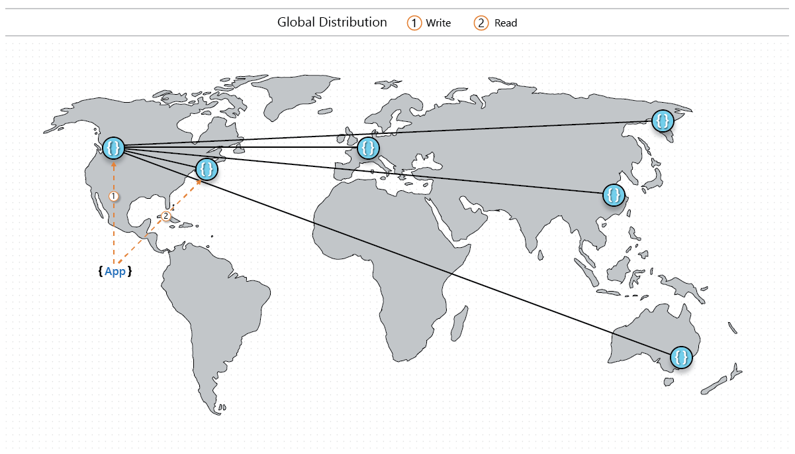

# How to implement custom synchronization to optimize for higher availability and performance

Azure Cosmos DB offers five well-defined consistency levels for you to choose from to balance the tradeoff between the consistency, performance, and availability. Strong consistency ensures data is synchronously replicated and durably persisted in every region where the Azure Cosmos account is available. This configuration, while providing the highest level of durability, comes at the cost of performance and availability. If an application wants to control/relax the data durability to suit the application need without compromising availability, it can employ custom synchronization at the application layer to achieve the desired level of durability.

The diagram below visually depicts the custom synchronization model.



In this scenario, an Azure Cosmos container is replicated globally across several regions across multiple continents. Using strong consistency for all regions in this scenario would impact performance. To ensure a higher level of data durability without compromising the write latency, the application can use two clients that share the same session token.

The first client can write data to the local region (for example, US West). The second client (for example, in US East) is a read client used for ensuring the synchronization. By flowing session token from the write response to the following read, the read will ensure synchronization of writes to US East. Azure Cosmos DB will ensure writes are seen by at least one region and are guaranteed to survive a regional outage, if the original write region were to go down. In this scenario, every write is synchronized to US East, reducing the latency of employing strong consistency across all regions. In a multi-master scenario, where writes are occurring in every region, this model can be extended to synchronize to multiple regions in parallel.

## Configure the clients

The sample below shows data access layer instantiating two clients for this purpose.

```csharp
class MyDataAccessLayer
{
    private DocumentClient writeClient;
    private DocumentClient readClient;

    public async Task InitializeAsync(Uri accountEndpoint, string key)
    {
        ConnectionPolicy writeConnectionPolicy = new ConnectionPolicy
        {
            ConnectionMode = ConnectionMode.Direct,
            ConnectionProtocol = Protocol.Tcp,
            UseMultipleWriteLocations = true
        };
        writeConnectionPolicy.SetCurrentLocation(LocationNames.WestUS);

        ConnectionPolicy readConnectionPolicy = new ConnectionPolicy
        {
            ConnectionMode = ConnectionMode.Direct,
            ConnectionProtocol = Protocol.Tcp
        };
        readConnectionPolicy.SetCurrentLocation(LocationNames.EastUS);

        writeClient = new DocumentClient(accountEndpoint, key, writeConnectionPolicy);
        readClient = new DocumentClient(accountEndpoint, key, readConnectionPolicy, ConsistencyLevel.Session);

        await Task.WhenAll(new Task[]
        {
            writeClient.OpenAsync(),
            readClient.OpenAsync()
        });
    }
}
```

## Implement custom synchronization

Once the clients are initialized, application can perform writes to local region (US West) and can force synchronize the writes to US East as follows.

```csharp
class MyDataAccessLayer
{
    public async Task CreateItem(string containerLink, Document document)
    {
        ResourceResponse<Document> response = await writeClient.CreateDocumentAsync(
            containerLink, document);

        await readClient.ReadDocumentAsync(response.Resource.SelfLink,
            new RequestOptions { SessionToken = response.SessionToken });
    }
}
```

This model can be extended to synchronize to multiple regions in parallel.

## Next steps

To learn more about global distribution and consistency in Azure Cosmos DB, read the following articles:

* [Choosing the right consistency level in Azure Cosmos DB](consistency-levels-choosing.md)

* [Consistency, availability, and performance tradeoffs in Azure Cosmos DB](consistency-levels-tradeoffs.md)

* [How to manage consistency in Azure Cosmos DB](how-to-manage-consistency.md)

* [Partitioning and data distribution in Azure Cosmos DB](partition-data.md)
