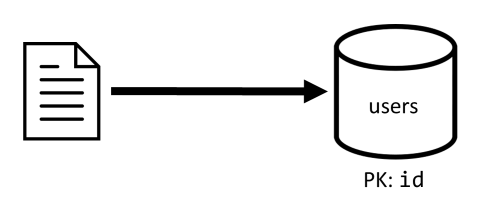
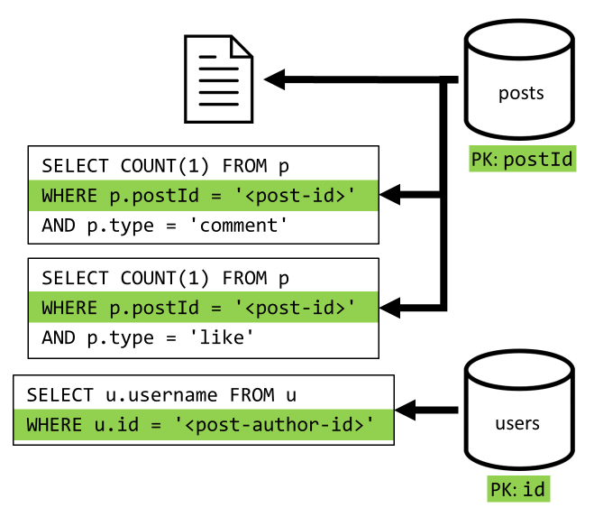
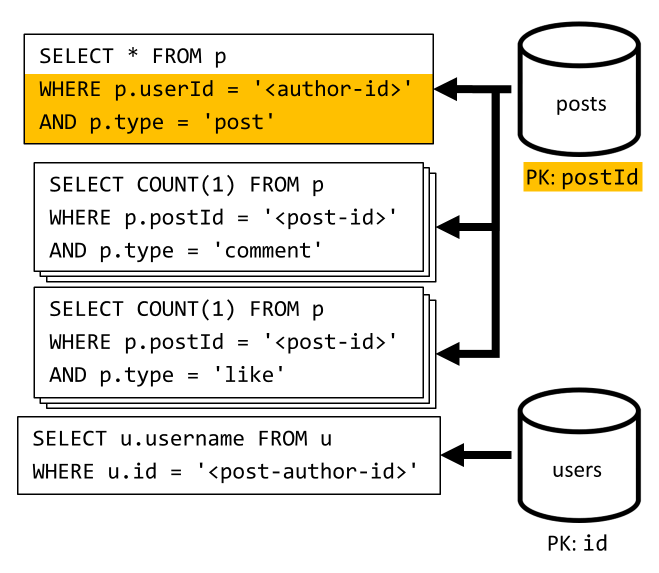
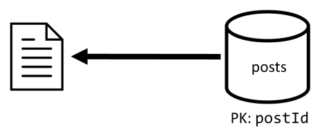
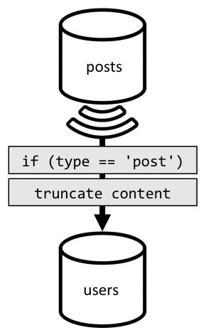
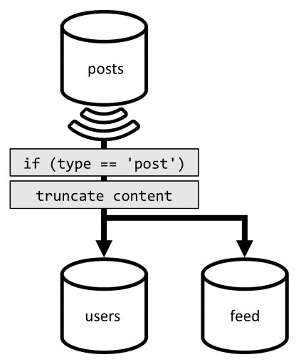

# How to model and partition data on Azure Cosmos DB using a real-world example

This article builds on several Azure Cosmos DB concepts like [data modeling](modeling-data.md), [partitioning](partitioning-overview.md), and [provisioned throughput](request-units.md) to demonstrate how to tackle a real-world data design exercise.

If you usually work with relational databases, you have probably built habits and intuitions on how to design a data model. Because of the specific constraints, but also the unique strengths of Azure Cosmos DB, most of these best practices don't translate well and may drag you into suboptimal solutions. The goal of this article is to guide you through the complete process of modeling a real-world use-case on Azure Cosmos DB, from item modeling to entity colocation and container partitioning.

## The scenario

For this exercise, we are going to consider the domain of a blogging platform where *users* can create *posts*. Users can also *like* and add *comments* to those posts.

> [!TIP]
> We have highlighted some words in *italic*; these words identify the kind of "things" our model will have to manipulate.

Adding more requirements to our specification:

- A front page displays a feed of recently created posts,
- We can fetch all posts for a user, all comments for a post and all likes for a post,
- Posts are returned with the username of their authors and a count of how many comments and likes they have,
- Comments and likes are also returned with the username of the users who have created them,
- When displayed as lists, posts only have to present a truncated summary of their content.

## Identify the main access patterns

To start, we give some structure to our initial specification by identifying our solution's access patterns. When designing a data model for Azure Cosmos DB, it's important to understand which requests our model will have to serve to make sure that the model will serve those requests efficiently.

To make the overall process easier to follow, we categorize those different requests as either commands or queries, borrowing some vocabulary from [CQRS](https://en.wikipedia.org/wiki/Command%E2%80%93query_separation#Command_query_responsibility_segregation) where commands are write requests (that is, intents to update the system) and queries are read-only requests.

Here is the list of requests that our platform will have to expose:

- **[C1]** Create/edit a user
- **[Q1]** Retrieve a user
- **[C2]** Create/edit a post
- **[Q2]** Retrieve a post
- **[Q3]** List a user's posts in short form
- **[C3]** Create a comment
- **[Q4]** List a post's comments
- **[C4]** Like a post
- **[Q5]** List a post's likes
- **[Q6]** List the *x* most recent posts created in short form (feed)

As this stage, we haven't thought about the details of what each entity (user, post etc.) will contain. This step is usually among the first ones to be tackled when designing against a relational store, because we have to figure out how those entities will translate in terms of tables, columns, foreign keys etc. It is much less of a concern with a document database that doesn't enforce any schema at write.

The main reason why it is important to identify our access patterns from the beginning, is because this list of requests is going to be our test suite. Every time we iterate over our data model, we will go through each of the requests and check its performance and scalability.

## V1: A first version

We start with two containers: `users` and `posts`.

### Users container

This container only stores user items:

    {
      "id": "<user-id>",
      "username": "<username>"
    }

We partition this container by `id`, which means that each logical partition within that container will only contain one item.

### Posts container

This container hosts posts, comments, and likes:

    {
      "id": "<post-id>",
      "type": "post",
      "postId": "<post-id>",
      "userId": "<post-author-id>",
      "title": "<post-title>",
      "content": "<post-content>",
      "creationDate": "<post-creation-date>"
    }

    {
      "id": "<comment-id>",
      "type": "comment",
      "postId": "<post-id>",
      "userId": "<comment-author-id>",
      "content": "<comment-content>",
      "creationDate": "<comment-creation-date>"
    }

    {
      "id": "<like-id>",
      "type": "like",
      "postId": "<post-id>",
      "userId": "<liker-id>",
      "creationDate": "<like-creation-date>"
    }

We partition this container by `postId`, which means that each logical partition within that container will contain one post, all the comments for that post and all the likes for that post.

Note that we have introduced a `type` property in the items stored in this container to distinguish between the three types of entities that this container hosts.

Also, we have chosen to reference related data instead of embedding it (check [this section](modeling-data.md) for details about these concepts) because:

- there's no upper limit to how many posts a user can create,
- posts can be arbitrarily long,
- there's no upper limit to how many comments and likes a post can have,
- we want to be able to add a comment or a like to a post without having to update the post itself.

## How well does our model perform?

It's now time to assess the performance and scalability of our first version. For each of the requests previously identified, we measure its latency and how many request units it consumes. This measurement is done against a dummy data set containing 100,000 users with 5 to 50 posts per user, and up to 25 comments and 100 likes per post.

### [C1] Create/edit a user

This request is straightforward to implement as we just create or update an item in the `users` container. The requests will nicely spread across all partitions thanks to the `id` partition key.



| **Latency** | **RU charge** | **Performance** |
| --- | --- | --- |
| 7 ms | 5.71 RU | ✅ |

### [Q1] Retrieve a user

Retrieving a user is done by reading the corresponding item from the `users` container.


| **Latency** | **RU charge** | **Performance** |
| --- | --- | --- |
| 2 ms | 1 RU | ✅ |

### [C2] Create/edit a post

Similarly to **[C1]**, we just have to write to the `posts` container.


| **Latency** | **RU charge** | **Performance** |
| --- | --- | --- |
| 9 ms | 8.76 RU | ✅ |

### [Q2] Retrieve a post

We start by retrieving the corresponding document from the `posts` container. But that's not enough, as per our specification we also have to aggregate the username of the post's author and the counts of how many comments and how many likes this post has, which requires 3 additional SQL queries to be issued.



Each of the additional queries filters on the partition key of its respective container, which is exactly what we want to maximize performance and scalability. But we eventually have to perform four operations to return a single post, so we'll improve that in a next iteration.

| **Latency** | **RU charge** | **Performance** |
| --- | --- | --- |
| 9 ms | 19.54 RU | ⚠ |

### [Q3] List a user's posts in short form

First, we have to retrieve the desired posts with a SQL query that fetches the posts corresponding to that particular user. But we also have to issue additional queries to aggregate the author's username and the counts of comments and likes.



This implementation presents many drawbacks:

- the queries aggregating the counts of comments and likes have to be issued for each post returned by the first query,
- the main query does not filter on the partition key of the `posts` container, leading to a fan-out and a partition scan across the container.

| **Latency** | **RU charge** | **Performance** |
| --- | --- | --- |
| 130 ms | 619.41 RU | ⚠ |

### [C3] Create a comment

A comment is created by writing the corresponding item in the `posts` container.


| **Latency** | **RU charge** | **Performance** |
| --- | --- | --- |
| 7 ms | 8.57 RU | ✅ |

### [Q4] List a post's comments

We start with a query that fetches all the comments for that post and once again, we also need to aggregate usernames separately for each comment.


Although the main query does filter on the container's partition key, aggregating the usernames separately penalizes the overall performance. We'll improve that later on.

| **Latency** | **RU charge** | **Performance** |
| --- | --- | --- |
| 23 ms | 27.72 RU | ⚠ |

### [C4] Like a post

Just like **[C3]**, we create the corresponding item in the `posts` container.


| **Latency** | **RU charge** | **Performance** |
| --- | --- | --- |
| 6 ms | 7.05 RU | ✅ |

### [Q5] List a post's likes

Just like **[Q4]**, we query the likes for that post, then aggregate their usernames.


| **Latency** | **RU charge** | **Performance** |
| --- | --- | --- |
| 59 ms | 58.92 RU | ⚠ |

### [Q6] List the x most recent posts created in short form (feed)

We fetch the most recent posts by querying the `posts` container sorted by descending creation date, then aggregate usernames and counts of comments and likes for each of the posts.


Once again, our initial query doesn't filter on the partition key of the `posts` container, which triggers a costly fan-out. This one is even worse as we target a much larger result set and sort the results with an `ORDER BY` clause, which makes it more expensive in terms of request units.

| **Latency** | **RU charge** | **Performance** |
| --- | --- | --- |
| 306 ms | 2063.54 RU | ⚠ |

## Reflecting on the performance of V1

Looking at the performance issues we faced in the previous section, we can identify two main classes of problems:

- some requests require multiple queries to be issued in order to gather all the data we need to return,
- some queries don't filter on the partition key of the containers they target, leading to a fan-out that impedes our scalability.

Let's resolve each of those problems, starting with the first one.

## V2: Introducing denormalization to optimize read queries

The reason why we have to issue additional requests in some cases is because the results of the initial request doesn't contain all the data we need to return. When working with a non-relational data store like Azure Cosmos DB, this kind of issue is commonly solved by denormalizing data across our data set.

In our example, we modify post items to add the username of the post's author, the count of comments and the count of likes:

    {
      "id": "<post-id>",
      "type": "post",
      "postId": "<post-id>",
      "userId": "<post-author-id>",
      "userUsername": "<post-author-username>",
      "title": "<post-title>",
      "content": "<post-content>",
      "commentCount": <count-of-comments>,
      "likeCount": <count-of-likes>,
      "creationDate": "<post-creation-date>"
    }

We also modify comment and like items to add the username of the user who has created them:

    {
      "id": "<comment-id>",
      "type": "comment",
      "postId": "<post-id>",
      "userId": "<comment-author-id>",
      "userUsername": "<comment-author-username>",
      "content": "<comment-content>",
      "creationDate": "<comment-creation-date>"
    }

    {
      "id": "<like-id>",
      "type": "like",
      "postId": "<post-id>",
      "userId": "<liker-id>",
      "userUsername": "<liker-username>",
      "creationDate": "<like-creation-date>"
    }

### Denormalizing comment and like counts

What we want to achieve is that every time we add a comment or a like, we also increment the `commentCount` or the `likeCount` in the corresponding post. As our `posts` container is partitioned by `postId`, the new item (comment or like) and its corresponding post sit in the same logical partition. As a result, we can use a [stored procedure](stored-procedures-triggers-udfs.md) to perform that operation.

Now when creating a comment (**[C3]**), instead of just adding a new item in the `posts` container we call the following stored procedure on that container:

```javascript
function createComment(postId, comment) {
  var collection = getContext().getCollection();

  collection.readDocument(
    `${collection.getAltLink()}/docs/${postId}`,
    function (err, post) {
      if (err) throw err;

      post.commentCount++;
      collection.replaceDocument(
        post._self,
        post,
        function (err) {
          if (err) throw err;

          comment.postId = postId;
          collection.createDocument(
            collection.getSelfLink(),
            comment
          );
        }
      );
    })
}
```

This stored procedure takes the ID of the post and the body of the new comment as parameters, then:

- retrieves the post
- increments the `commentCount`
- replaces the post
- adds the new comment

As stored procedures are executed as atomic transactions, it is guaranteed that the value of `commentCount` and the actual number of comments will always stay in sync.

We obviously call a similar stored procedure when adding new likes to increment the `likeCount`.

### Denormalizing usernames

Usernames require a different approach as users not only sit in different partitions, but in a different container. When we have to denormalize data across partitions and containers, we can use the source container's [change feed](change-feed.md).

In our example, we use the change feed of the `users` container to react whenever users update their usernames. When that happens, we propagate the change by calling another stored procedure on the `posts` container:


```javascript
function updateUsernames(userId, username) {
  var collection = getContext().getCollection();
  
  collection.queryDocuments(
    collection.getSelfLink(),
    `SELECT * FROM p WHERE p.userId = '${userId}'`,
    function (err, results) {
      if (err) throw err;

      for (var i in results) {
        var doc = results[i];
        doc.userUsername = username;

        collection.upsertDocument(
          collection.getSelfLink(),
          doc);
      }
    });
}
```

This stored procedure takes the ID of the user and the user's new username as parameters, then:

- fetches all items matching the `userId` (which can be posts, comments, or likes)
- for each of those items
  - replaces the `userUsername`
  - replaces the item

> [!IMPORTANT]
> This operation is costly because it requires this stored procedure to be executed on every partition of the `posts` container. We assume that most users choose a suitable username during sign-up and won't ever change it, so this update will run very rarely.

## What are the performance gains of V2?

### [Q2] Retrieve a post

Now that our denormalization is in place, we only have to fetch a single item to handle that request.



| **Latency** | **RU charge** | **Performance** |
| --- | --- | --- |
| 2 ms | 1 RU | ✅ |

### [Q4] List a post's comments

Here again, we can spare the extra requests that fetched the usernames and end up with a single query that filters on the partition key.


| **Latency** | **RU charge** | **Performance** |
| --- | --- | --- |
| 4 ms | 7.72 RU | ✅ |

### [Q5] List a post's likes

Exact same situation when listing the likes.


| **Latency** | **RU charge** | **Performance** |
| --- | --- | --- |
| 4 ms | 8.92 RU | ✅ |

## V3: Making sure all requests are scalable

Looking at our overall performance improvements, there are still two requests that we haven't fully optimized: **[Q3]** and **[Q6]**. They are the requests involving queries that don't filter on the partition key of the containers they target.

### [Q3] List a user's posts in short form

This request already benefits from the improvements introduced in V2, which spares additional queries.


But the remaining query is still not filtering on the partition key of the `posts` container.

The way to think about this situation is actually simple:

1. This request *has* to filter on the `userId` because we want to fetch all posts for a particular user
1. It doesn't perform well because it is executed against the `posts` container, which is not partitioned by `userId`
1. Stating the obvious, we would solve our performance problem by executing this request against a container that *is* partitioned by `userId`
1. It turns out that we already have such a container: the `users` container!

So we introduce a second level of denormalization by duplicating entire posts to the `users` container. By doing that, we effectively get a copy of our posts, only partitioned along a different dimensions, making them way more efficient to retrieve by their `userId`.

The `users` container now contains 2 kinds of items:

    {
      "id": "<user-id>",
      "type": "user",
      "userId": "<user-id>",
      "username": "<username>"
    }

    {
      "id": "<post-id>",
      "type": "post",
      "postId": "<post-id>",
      "userId": "<post-author-id>",
      "userUsername": "<post-author-username>",
      "title": "<post-title>",
      "content": "<post-content>",
      "commentCount": <count-of-comments>,
      "likeCount": <count-of-likes>,
      "creationDate": "<post-creation-date>"
    }

Note that:

- we have introduced a `type` field in the user item to distinguish users from posts,
- we have also added a `userId` field in the user item, which is redundant with the `id` field but is required as the `users` container is now partitioned by `userId` (and not `id` as previously)

To achieve that denormalization, we once again use the change feed. This time, we react on the change feed of the `posts` container to dispatch any new or updated post to the `users` container. And because listing posts does not require to return their full content, we can truncate them in the process.



We can now route our query to the `users` container, filtering on the container's partition key.


| **Latency** | **RU charge** | **Performance** |
| --- | --- | --- |
| 4 ms | 6.46 RU | ✅ |

### [Q6] List the x most recent posts created in short form (feed)

We have to deal with a similar situation here: even after sparing the additional queries left unnecessary by the denormalization introduced in V2, the remaining query does not filter on the container's partition key:


Following the same approach, maximizing this request's performance and scalability requires that it only hits one partition. This is conceivable because we only have to return a limited number of items; in order to populate our blogging platform's home page, we just need to get the 100 most recent posts, without the need to paginate through the entire data set.

So to optimize this last request, we introduce a third container to our design, entirely dedicated to serving this request. We denormalize our posts to that new `feed` container:

    {
      "id": "<post-id>",
      "type": "post",
      "postId": "<post-id>",
      "userId": "<post-author-id>",
      "userUsername": "<post-author-username>",
      "title": "<post-title>",
      "content": "<post-content>",
      "commentCount": <count-of-comments>,
      "likeCount": <count-of-likes>,
      "creationDate": "<post-creation-date>"
    }

This container is partitioned by `type`, which will always be `post` in our items. Doing that ensures that all the items in this container will sit in the same partition.

To achieve the denormalization, we just have to hook on the change feed pipeline we have previously introduced to dispatch the posts to that new container. One important thing to bare in mind is that we need to make sure that we only store the 100 most recent posts; otherwise, the content of the container may grow beyond the maximum size of a partition. This is done by calling a [post-trigger](stored-procedures-triggers-udfs.md#triggers) every time a document is added in the container:



Here's the body of the post-trigger that truncates the collection:

```javascript
function truncateFeed() {
  const maxDocs = 100;
  var context = getContext();
  var collection = context.getCollection();

  collection.queryDocuments(
    collection.getSelfLink(),
    "SELECT VALUE COUNT(1) FROM f",
    function (err, results) {
      if (err) throw err;

      processCountResults(results);
    });

  function processCountResults(results) {
    // + 1 because the query didn't count the newly inserted doc
    if ((results[0] + 1) > maxDocs) {
      var docsToRemove = results[0] + 1 - maxDocs;
      collection.queryDocuments(
        collection.getSelfLink(),
        `SELECT TOP ${docsToRemove} * FROM f ORDER BY f.creationDate`,
        function (err, results) {
          if (err) throw err;

          processDocsToRemove(results, 0);
        });
    }
  }

  function processDocsToRemove(results, index) {
    var doc = results[index];
    if (doc) {
      collection.deleteDocument(
        doc._self,
        function (err) {
          if (err) throw err;

          processDocsToRemove(results, index + 1);
        });
    }
  }
}
```

The final step is to reroute our query to our new `feed` container:


| **Latency** | **RU charge** | **Performance** |
| --- | --- | --- |
| 9 ms | 16.97 RU | ✅ |

## Conclusion

Let's have a look at the overall performance and scalability improvements we have introduced over the different versions of our design.

| | V1 | V2 | V3 |
| --- | --- | --- | --- |
| **[C1]** | 7 ms / 5.71 RU | 7 ms / 5.71 RU | 7 ms / 5.71 RU |
| **[Q1]** | 2 ms / 1 RU | 2 ms / 1 RU | 2 ms / 1 RU |
| **[C2]** | 9 ms / 8.76 RU | 9 ms / 8.76 RU | 9 ms / 8.76 RU |
| **[Q2]** | 9 ms / 19.54 RU | 2 ms / 1 RU | 2 ms / 1 RU |
| **[Q3]** | 130 ms / 619.41 RU | 28 ms / 201.54 RU | 4 ms / 6.46 RU |
| **[C3]** | 7 ms / 8.57 RU | 7 ms / 15.27 RU | 7 ms / 15.27 RU |
| **[Q4]** | 23 ms / 27.72 RU | 4 ms / 7.72 RU | 4 ms / 7.72 RU |
| **[C4]** | 6 ms / 7.05 RU | 7 ms / 14.67 RU | 7 ms / 14.67 RU |
| **[Q5]** | 59 ms / 58.92 RU | 4 ms / 8.92 RU | 4 ms / 8.92 RU |
| **[Q6]** | 306 ms / 2063.54 RU | 83 ms / 532.33 RU | 9 ms / 16.97 RU |

### We have optimized a read-heavy scenario

You may have noticed that we have concentrated our efforts towards improving the performance of read requests (queries) at the expense of write requests (commands). In many cases, write operations now trigger subsequent denormalization through change feeds, which makes them more computationally expensive and longer to materialize.

This is justified by the fact that a blogging platform (like most social apps) is read-heavy, which means that the amount of read requests it has to serve is usually orders of magnitude higher than the amount of write requests. So it makes sense to make write requests more expensive to execute in order to let read requests be cheaper and better performing.

If we look at the most extreme optimization we have done, **[Q6]** went from 2000+ RUs to just 17 RUs; we have achieved that by denormalizing posts at a cost of around 10 RUs per item. As we would serve a lot more feed requests than creation or updates of posts, the cost of this denormalization is negligible considering the overall savings.

### Denormalization can be applied incrementally

The scalability improvements we've explored in this article involve denormalization and duplication of data across the data set. It should be noted that these optimizations don't have to be put in place at day 1. Queries that filter on partition keys perform better at scale, but cross-partition queries can be totally acceptable if they are called rarely or against a limited data set. If you're just building a prototype, or launching a product with a small and controlled user base, you can probably spare those improvements for later; what's important then is to [monitor](use-metrics.md) your model's performance so you can decide if and when it's time to bring them in.

The change feed that we use to distribute updates to other containers store all those updates persistently. This makes it possible to request all updates since the creation of the container and bootstrap denormalized views as a one-time catch-up operation even if your system already has a lot of data.

## Next steps

After this introduction to practical data modeling and partitioning, you may want to check the following articles to review the concepts we have covered:

- [Work with databases, containers, and items](databases-containers-items.md)
- [Partitioning in Azure Cosmos DB](partitioning-overview.md)
- [Change feed in Azure Cosmos DB](change-feed.md)