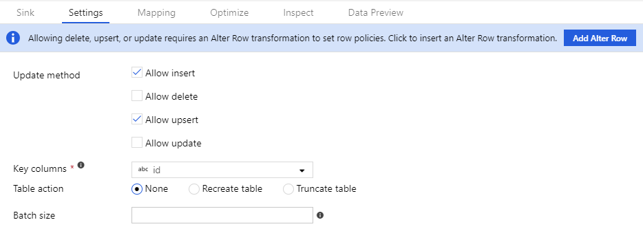

---
title: Azure Data Factory Mapping Data Flow Alter Row Transformation
description: How to update database target using Azure Data Factory Mapping Data Flow Alter Row Transformation
author: kromerm
ms.author: makromer
ms.service: data-factory
ms.topic: conceptual
ms.date: 03/12/2019
--- 

# Azure Data Factory Alter Row Transformation

Use the Alter Row transformation to set insert, delete, update, and upsert policies on rows. You can add one-to-many conditions as expressions. Each of those conditions can result in a row (or rows) being inserted, updated, deleted, or upsert. Alter Row can produce both DDL & DML actions against your database.

[!INCLUDE [notes](../../includes/data-factory-data-flow-preview.md)]

> [!NOTE]
> Alter Row transformations will only operate on database sinks in your data flow. The actions that you assign to rows (insert, update, delete, upsert) will not occur during debug sessions. You must add an Execute Data Flow task to a pipeline and use pipeline debug or triggers to enact the alter row policies on your database tables.

## View policies

Switch the Data Flow Debug mode to on and then view the results of your alter row policies in the Data Preview pane. Executing an alter row in Data Flow Debug mode will not produce DDL or DML actions against your target. In order to have those actions occur, execute the data flow inside an Execute Data Flow activity inside a pipeline.

This will allow you to verify and view the state of each row based on your conditions. There are icon represents for each insert, update, delete, and upsert action that will occur in your data flow, indicating which action will take place when you execute the data flow inside a pipeline.

## Sink settings

You must have a database sink type for Alter Row to work. In the sink Settings, you must set each action to be allowed.

The default behavior in ADF Data Flow with database sinks is to insert rows. If you want to allow updates, upserts, and deletes as well, you must also check these boxes in the sink to allow the actions.

> [!NOTE]
> If your inserts, updates, or upserts modify the schema of the target table in the sink, your data flow will fail. In order to modify the target schema in your database, you must choose the "Recreate table" option in the sink. This will drop and recreate your table with the new schema definition.

## Next steps

After the Alter Row transformation, you may want to [sink your data into a destination data store](data-flow-sink.md).
