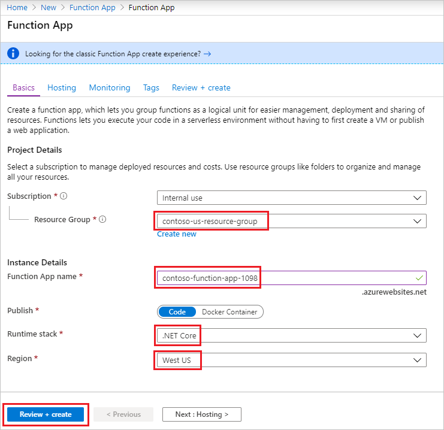
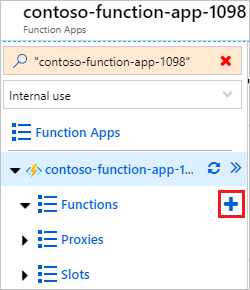
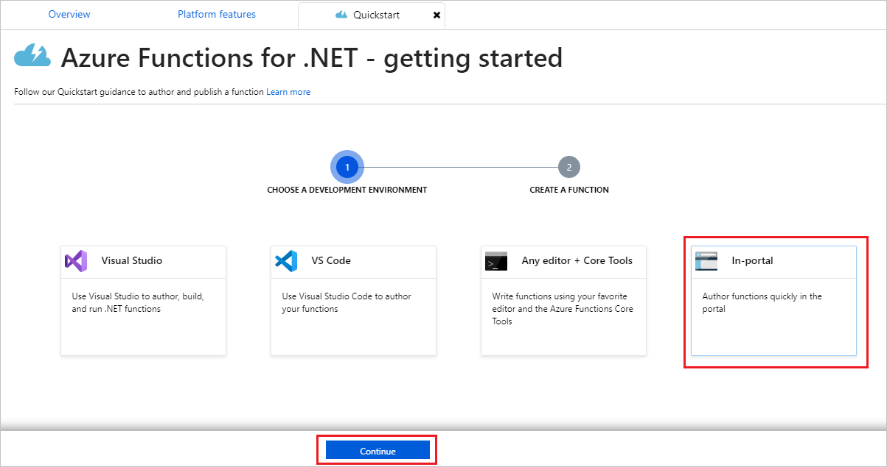
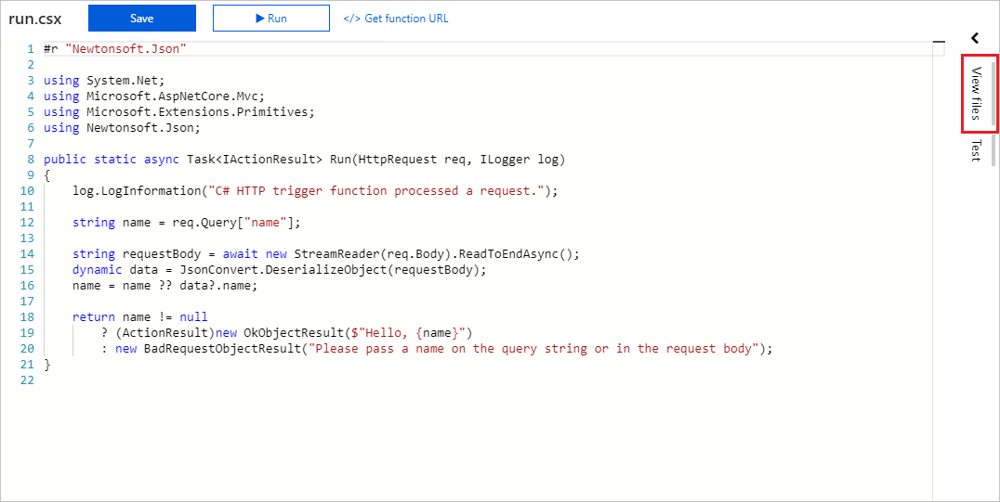
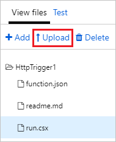
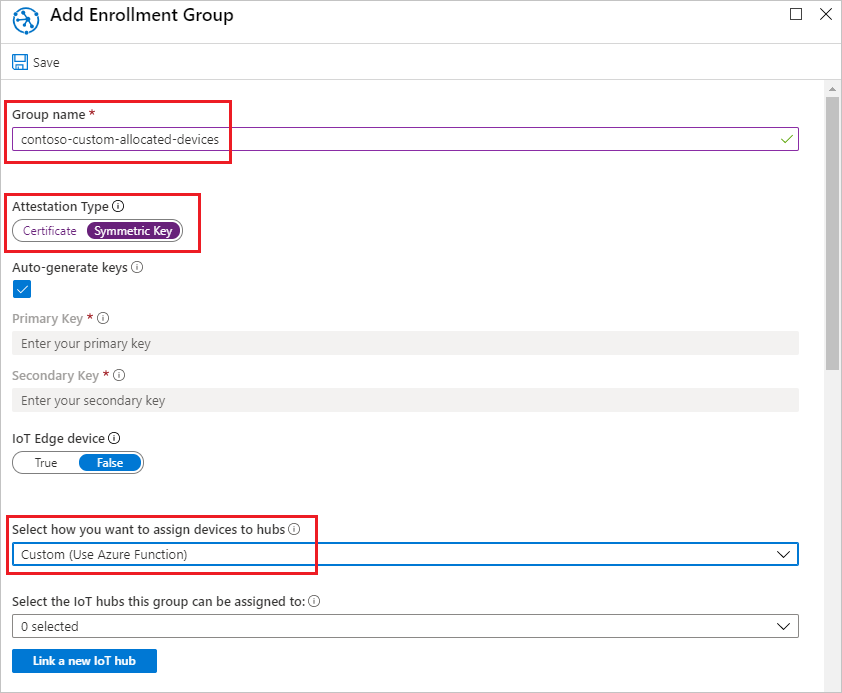
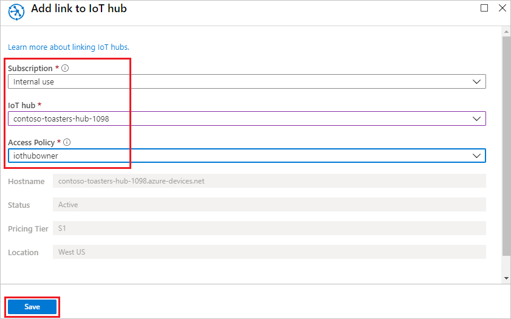
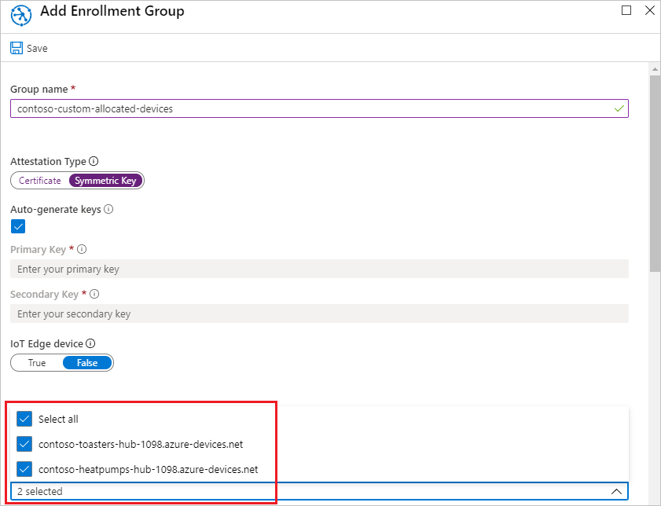
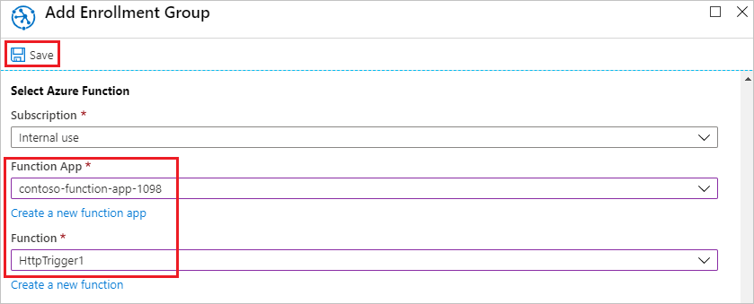

# How to use custom allocation policies

A custom allocation policy gives you more control over how devices are assigned to an IoT hub. This is accomplished by using custom code in an [Azure Function](../azure-functions/functions-overview.md) to assign devices to an IoT hub. The device provisioning service calls your Azure Function code providing all relevant information about the device and the enrollment. Your function code is executed and returns the IoT hub information used to provisioning the device.

By using custom allocation policies, you define your own allocation policies when the policies provided by the Device Provisioning Service don't meet the requirements of your scenario.

For example, maybe you want to examine the certificate a device is using during provisioning and assign the device to an IoT hub based on a certificate property. Or, maybe you have information stored in a database for your devices and need to query the database to determine which IoT hub a device should be assigned to.

This article demonstrates a custom allocation policy using an Azure Function written in C#. Two new IoT hubs are created representing a *Contoso Toasters Division* and a *Contoso Heat Pumps Division*. Devices requesting provisioning must have a registration ID with one of the following suffixes to be accepted for provisioning:

* **-contoso-tstrsd-007**: Contoso Toasters Division
* **-contoso-hpsd-088**: Contoso Heat Pumps Division

The devices will be provisioned based on one of these required suffixes on the registration ID. These devices will be simulated using a provisioning sample included in the [Azure IoT C SDK](https://github.com/Azure/azure-iot-sdk-c).

You perform the following steps in this article:

* Use the Azure CLI to create two Contoso division IoT hubs (**Contoso Toasters Division** and **Contoso Heat Pumps Division**)
* Create a new group enrollment using an Azure Function for the custom allocation policy
* Create device keys for two device simulations.
* Set up the development environment for the Azure IoT C SDK
* Simulate the devices and verify that they are provisioned according to the example code in the custom allocation policy

[!INCLUDE [quickstarts-free-trial-note](../../includes/quickstarts-free-trial-note.md)]

## Prerequisites

* [Visual Studio](https://visualstudio.microsoft.com/vs/) 2015 or later with the ['Desktop development with C++'](https://www.visualstudio.com/vs/support/selecting-workloads-visual-studio-2017/) workload enabled.
* Latest version of [Git](https://git-scm.com/download/) installed.

[!INCLUDE [cloud-shell-try-it.md](../../includes/cloud-shell-try-it.md)]

## Create the provisioning service and two divisional IoT hubs

In this section, you use the Azure Cloud Shell to create a provisioning service and two IoT hubs representing the **Contoso Toasters Division** and the **Contoso Heat Pumps division**.

> [!TIP]
> The commands used in this article create the provisioning service and other resources in the West US location. We recommend that you create your resources in the region nearest you that supports Device Provisioning Service. You can view a list of available locations by running the command `az provider show --namespace Microsoft.Devices --query "resourceTypes[?resourceType=='ProvisioningServices'].locations | [0]" --out table` or by going to the [Azure Status](https://azure.microsoft.com/status/) page and searching for "Device Provisioning Service". In commands, locations can be specified either in one word or multi-word format; for example: westus, West US, WEST US, etc. The value is not case sensitive. If you use multi-word format to specify location, enclose the value in quotes; for example, `-- location "West US"`.
>

1. Use the Azure Cloud Shell to create a resource group with the [az group create](/cli/azure/group#az-group-create) command. An Azure resource group is a logical container into which Azure resources are deployed and managed.

    The following example creates a resource group named *contoso-us-resource-group* in the *westus* region. It is recommended that you use this group for all resources created in this article. This approach will make clean up easier after you're finished.

    ```azurecli-interactive 
    az group create --name contoso-us-resource-group --location westus
    ```

2. Use the Azure Cloud Shell to create a device provisioning service with the [az iot dps create](/cli/azure/iot/dps#az-iot-dps-create) command. The provisioning service will be added to *contoso-us-resource-group*.

    The following example creates a provisioning service named *contoso-provisioning-service-1098* in the *westus* location. You must use a unique service name. Make up your own suffix in the service name in place of **1098**.

    ```azurecli-interactive 
    az iot dps create --name contoso-provisioning-service-1098 --resource-group contoso-us-resource-group --location westus
    ```

    This command may take a few minutes to complete.

3. Use the Azure Cloud Shell to create the **Contoso Toasters Division** IoT hub with the [az iot hub create](/cli/azure/iot/hub#az-iot-hub-create) command. The IoT hub will be added to *contoso-us-resource-group*.

    The following example creates an IoT hub named *contoso-toasters-hub-1098* in the *westus* location. You must use a unique hub name. Make up your own suffix in the hub name in place of **1098**. The example code for the custom allocation policy requires `-toasters-` in the hub name.

    ```azurecli-interactive 
    az iot hub create --name contoso-toasters-hub-1098 --resource-group contoso-us-resource-group --location westus --sku S1
    ```

    This command may take a few minutes to complete.

4. Use the Azure Cloud Shell to create the **Contoso Heat Pumps Division** IoT hub with the [az iot hub create](/cli/azure/iot/hub#az-iot-hub-create) command. This IoT hub will also be added to *contoso-us-resource-group*.

    The following example creates an IoT hub named *contoso-heatpumps-hub-1098* in the *westus* location. You must use a unique hub name. Make up your own suffix in the hub name in place of **1098**. The example code for the custom allocation policy requires `-heatpumps-` in the hub name.

    ```azurecli-interactive 
    az iot hub create --name contoso-heatpumps-hub-1098 --resource-group contoso-us-resource-group --location westus --sku S1
    ```

    This command may take a few minutes to complete.

## Create the custom allocation function

In this section, you create an Azure function that implements your custom allocation policy. This function decides which divisional IoT hub a device should be registered to based on whether its registration ID contains the string **-contoso-tstrsd-007** or **-contoso-hpsd-088**. It also sets the initial state of the device twin based on whether the device is a toaster or a heat pump.

1. Sign in to the [Azure portal](https://portal.azure.com). From your home page, select **+ Create a resource**.

2. In the *Search the Marketplace* search box, type "Function App". From the drop-down list select **Function App**, and then select **Create**.

3. On **Function App** create page, under the **Basics** tab, enter the following settings for your new function app and select **Review + create**:

    **Resource Group**: Select the **contoso-us-resource-group** to keep all resources created in this article together.

    **Function App name**: Enter a unique function app name. This example uses **contoso-function-app-1098**.

    **Publish**: Verify that **Code** is selected.

    **Runtime Stack**: Select **.NET Core** from the drop-down.

    **Region**: Select the same region as your resource group. This example uses **West US**.

    > [!NOTE]
    > By default, Application Insights is enabled. Application Insights is not necessary for this article, but it might help you understand and investigate any issues you encounter with the custom allocation. If you prefer, you can disable Application Insights by selecting the **Monitoring** tab and then selecting **No** for **Enable Application Insights**.

    

4. On the **Summary** page, select **Create** to create the function app. Deployment may take several minutes. When it completes, select **Go to resource**.

5. On the left pane of the function app **Overview** page, select **+** next to **Functions** to add a new function.

    

6. On the **Azure Functions for .NET - getting started** page, for the **CHOOSE A DEPLOYMENT ENVIRONMENT** step, select the **In-portal** tile, then select **Continue**.

    

7. On the next page, for the **CREATE A FUNCTION** step, select the **Webhook + API** tile, then select **Create**. A function named **HttpTrigger1** is created, and the portal displays the contents of the **run.csx** code file.

8. Reference required Nuget packages. To create the initial device twin, the custom allocation function uses classes that are defined in two Nuget packages that must be loaded into the hosting environment. With Azure Functions, Nuget packages are referenced using a *function.host* file. In this step, you save and upload a *function.host* file.

    1. Copy the following lines into your favorite editor and save the file on your computer as *function.host*.

        ```xml
        <Project Sdk="Microsoft.NET.Sdk">  
            <PropertyGroup>  
                <TargetFramework>netstandard2.0</TargetFramework>  
            </PropertyGroup>  
            <ItemGroup>  
                <PackageReference Include="Microsoft.Azure.Devices.Provisioning.Service" Version="1.5.0" />  
                <PackageReference Include="Microsoft.Azure.Devices.Shared" Version="1.16.0" />  
            </ItemGroup>  
        </Project>
        ```

    2. On the **HttpTrigger1** function, expand the **View Files** tab on the right side of the window.

        

    3. Select **Upload**, browse to the **function.proj** file, and select **Open** to upload the file.

        

9. Replace the code for the **HttpTrigger1** function with the following code and select **Save**:

    ```csharp
    #r "Newtonsoft.Json"

    using System.Net;
    using Microsoft.AspNetCore.Mvc;
    using Microsoft.Extensions.Primitives;
    using Newtonsoft.Json;

    using Microsoft.Azure.Devices.Shared;               // For TwinCollection
    using Microsoft.Azure.Devices.Provisioning.Service; // For TwinState

    public static async Task<IActionResult> Run(HttpRequest req, ILogger log)
    {
        log.LogInformation("C# HTTP trigger function processed a request.");

        // Get request body
        string requestBody = await new StreamReader(req.Body).ReadToEndAsync();
        dynamic data = JsonConvert.DeserializeObject(requestBody);

        log.LogInformation("Request.Body:...");
        log.LogInformation(requestBody);

        // Get registration ID of the device
        string regId = data?.deviceRuntimeContext?.registrationId;

        string message = "Uncaught error";
        bool fail = false;
        ResponseObj obj = new ResponseObj();

        if (regId == null)
        {
            message = "Registration ID not provided for the device.";
            log.LogInformation("Registration ID : NULL");
            fail = true;
        }
        else
        {
            string[] hubs = data?.linkedHubs.ToObject<string[]>();

            // Must have hubs selected on the enrollment
            if (hubs == null)
            {
                message = "No hub group defined for the enrollment.";
                log.LogInformation("linkedHubs : NULL");
                fail = true;
            }
            else
            {
                // This is a Contoso Toaster Model 007
                if (regId.Contains("-contoso-tstrsd-007"))
                {
                    //Find the "-toasters-" IoT hub configured on the enrollment
                    foreach(string hubString in hubs)
                    {
                        if (hubString.Contains("-toasters-"))
                            obj.iotHubHostName = hubString;
                    }

                    if (obj.iotHubHostName == null)
                    {
                        message = "No toasters hub found for the enrollment.";
                        log.LogInformation(message);
                        fail = true;
                    }
                    else
                    {
                        // Specify the initial tags for the device.
                        TwinCollection tags = new TwinCollection();
                        tags["deviceType"] = "toaster";

                        // Specify the initial desired properties for the device.
                        TwinCollection properties = new TwinCollection();
                        properties["state"] = "ready";
                        properties["darknessSetting"] = "medium";

                        // Add the initial twin state to the response.
                        TwinState twinState = new TwinState(tags, properties);
                        obj.initialTwin = twinState;
                    }
                }
                // This is a Contoso Heat pump Model 008
                else if (regId.Contains("-contoso-hpsd-088"))
                {
                    //Find the "-heatpumps-" IoT hub configured on the enrollment
                    foreach(string hubString in hubs)
                    {
                        if (hubString.Contains("-heatpumps-"))
                            obj.iotHubHostName = hubString;
                    }

                    if (obj.iotHubHostName == null)
                    {
                        message = "No heat pumps hub found for the enrollment.";
                        log.LogInformation(message);
                        fail = true;
                    }
                    else
                    {
                        // Specify the initial tags for the device.
                        TwinCollection tags = new TwinCollection();
                        tags["deviceType"] = "heatpump";

                        // Specify the initial desired properties for the device.
                        TwinCollection properties = new TwinCollection();
                        properties["state"] = "on";
                        properties["temperatureSetting"] = "65";

                        // Add the initial twin state to the response.
                        TwinState twinState = new TwinState(tags, properties);
                        obj.initialTwin = twinState;
                    }
                }
                // Unrecognized device.
                else
                {
                    fail = true;
                    message = "Unrecognized device registration.";
                    log.LogInformation("Unknown device registration");
                }
            }
        }

        log.LogInformation("\nResponse");
        log.LogInformation((obj.iotHubHostName != null) ? JsonConvert.SerializeObject(obj) : message);

        return (fail)
            ? new BadRequestObjectResult(message) 
            : (ActionResult)new OkObjectResult(obj);
    }

    public class ResponseObj
    {
        public string iotHubHostName {get; set;}
        public TwinState initialTwin {get; set;}
    }
    ```

## Create the enrollment

In this section, you'll create a new enrollment group that uses the custom allocation policy. For simplicity, this article uses [Symmetric key attestation](concepts-symmetric-key-attestation.md) with the enrollment. For a more secure solution, consider using [X.509 certificate attestation](concepts-security.md#x509-certificates) with a chain of trust.

1. Still on the [Azure portal](https://portal.azure.com), open your provisioning service.

2. Select **Manage enrollments** on the left pane, and then select the **Add enrollment group** button at the top of the page.

3. On **Add Enrollment Group**, enter the following information, and select the **Save** button.

    **Group name**: Enter **contoso-custom-allocated-devices**.

    **Attestation Type**: Select **Symmetric Key**.

    **Auto Generate Keys**: This checkbox should already be checked.

    **Select how you want to assign devices to hubs**: Select **Custom (Use Azure Function)**.

    

4. On **Add Enrollment Group**, select **Link a new IoT hub** to link both of your new divisional IoT hubs.

    Execute this step for both of your divisional IoT hubs.

    **Subscription**: If you have multiple subscriptions, choose the subscription where you created the divisional IoT hubs.

    **IoT hub**: Select one of the divisional hubs you created.

    **Access Policy**: Choose **iothubowner**.

    

5. On **Add Enrollment Group**, once both divisional IoT hubs have been linked, you must select them as the IoT Hub group for the enrollment group as shown below:

    

6. On **Add Enrollment Group**, scroll down to the **Select Azure Function** section, select the Function app you created in the previous section. Then select the function you created and select Save to save the enrollment group.

    

7. After saving the enrollment, reopen it and make a note of the **Primary Key**. You must save the enrollment first to have the keys generated. This key will be used to generate unique device keys for simulated devices later.

## Derive unique device keys

In this section, you create two unique device keys. One key will be used for a simulated toaster device. The other key will be used for a simulated heat pump device.

To generate the device key, you use the **Primary Key** you noted earlier to compute the [HMAC-SHA256](https://wikipedia.org/wiki/HMAC) of the device registration ID for each device and convert the result into Base64 format. For more information on creating derived device keys with enrollment groups, see the group enrollments section of [Symmetric key attestation](concepts-symmetric-key-attestation.md).

For the example in this article, use the following two device registration IDs and compute a device key for both devices. Both registration IDs have a valid suffix to work with the example code for the custom allocation policy:

* **breakroom499-contoso-tstrsd-007**
* **mainbuilding167-contoso-hpsd-088**

### Linux workstations

If you're using a Linux workstation, you can use openssl to generate your derived device keys as shown in the following example.

1. Replace the value of **KEY** with the **Primary Key** you noted earlier.

    ```bash
    KEY=oiK77Oy7rBw8YB6IS6ukRChAw+Yq6GC61RMrPLSTiOOtdI+XDu0LmLuNm11p+qv2I+adqGUdZHm46zXAQdZoOA==

    REG_ID1=breakroom499-contoso-tstrsd-007
    REG_ID2=mainbuilding167-contoso-hpsd-088

    keybytes=$(echo $KEY | base64 --decode | xxd -p -u -c 1000)
    devkey1=$(echo -n $REG_ID1 | openssl sha256 -mac HMAC -macopt hexkey:$keybytes -binary | base64)
    devkey2=$(echo -n $REG_ID2 | openssl sha256 -mac HMAC -macopt hexkey:$keybytes -binary | base64)

    echo -e $"\n\n$REG_ID1 : $devkey1\n$REG_ID2 : $devkey2\n\n"
    ```

    ```bash
    breakroom499-contoso-tstrsd-007 : JC8F96eayuQwwz+PkE7IzjH2lIAjCUnAa61tDigBnSs=
    mainbuilding167-contoso-hpsd-088 : 6uejA9PfkQgmYylj8Zerp3kcbeVrGZ172YLa7VSnJzg=
    ```

### Windows-based workstations

If you're using a Windows-based workstation, you can use PowerShell to generate your derived device key as shown in the following example.

1. Replace the value of **KEY** with the **Primary Key** you noted earlier.

    ```powershell
    $KEY='oiK77Oy7rBw8YB6IS6ukRChAw+Yq6GC61RMrPLSTiOOtdI+XDu0LmLuNm11p+qv2I+adqGUdZHm46zXAQdZoOA=='

    $REG_ID1='breakroom499-contoso-tstrsd-007'
    $REG_ID2='mainbuilding167-contoso-hpsd-088'

    $hmacsha256 = New-Object System.Security.Cryptography.HMACSHA256
    $hmacsha256.key = [Convert]::FromBase64String($key)
    $sig1 = $hmacsha256.ComputeHash([Text.Encoding]::ASCII.GetBytes($REG_ID1))
    $sig2 = $hmacsha256.ComputeHash([Text.Encoding]::ASCII.GetBytes($REG_ID2))
    $derivedkey1 = [Convert]::ToBase64String($sig1)
    $derivedkey2 = [Convert]::ToBase64String($sig2)

    echo "`n`n$REG_ID1 : $derivedkey1`n$REG_ID2 : $derivedkey2`n`n"
    ```

    ```powershell
    breakroom499-contoso-tstrsd-007 : JC8F96eayuQwwz+PkE7IzjH2lIAjCUnAa61tDigBnSs=
    mainbuilding167-contoso-hpsd-088 : 6uejA9PfkQgmYylj8Zerp3kcbeVrGZ172YLa7VSnJzg=
    ```

The simulated devices will use the derived device keys with each registration ID to perform symmetric key attestation.

## Prepare an Azure IoT C SDK development environment

In this section, you prepare the development environment used to build the [Azure IoT C SDK](https://github.com/Azure/azure-iot-sdk-c). The SDK includes the sample code for the simulated device. This simulated device will attempt provisioning during the device's boot sequence.

This section is oriented toward a Windows-based workstation. For a Linux example, see the set-up of the VMs in [How to provision for multitenancy](how-to-provision-multitenant.md).

1. Download the [CMake build system](https://cmake.org/download/).

    It is important that the Visual Studio prerequisites (Visual Studio and the 'Desktop development with C++' workload) are installed on your machine **before** starting the `CMake` installation. Once the prerequisites are in place and the download is verified, install the CMake build system.

2. Open a command prompt or Git Bash shell. Execute the following command to clone the Azure IoT C SDK GitHub repository:

    ```cmd/sh
    git clone https://github.com/Azure/azure-iot-sdk-c.git --recursive
    ```

    You should expect this operation to take several minutes to complete.

3. Create a `cmake` subdirectory in the root directory of the git repository, and navigate to that folder. 

    ```cmd/sh
    cd azure-iot-sdk-c
    mkdir cmake
    cd cmake
    ```

4. Run the following command, which builds a version of the SDK specific to your development client platform. A Visual Studio solution for the simulated device will be generated in the `cmake` directory. 

    ```cmd
    cmake -Dhsm_type_symm_key:BOOL=ON -Duse_prov_client:BOOL=ON  ..
    ```

    If `cmake` doesn't find your C++ compiler, you might get build errors while running the command. If that happens, try running the command in the [Visual Studio command prompt](https://docs.microsoft.com/dotnet/framework/tools/developer-command-prompt-for-vs).

    Once the build succeeds, the last few output lines will look similar to the following output:

    ```cmd/sh
    $ cmake -Dhsm_type_symm_key:BOOL=ON -Duse_prov_client:BOOL=ON  ..
    -- Building for: Visual Studio 15 2017
    -- Selecting Windows SDK version 10.0.16299.0 to target Windows 10.0.17134.
    -- The C compiler identification is MSVC 19.12.25835.0
    -- The CXX compiler identification is MSVC 19.12.25835.0

    ...

    -- Configuring done
    -- Generating done
    -- Build files have been written to: E:/IoT Testing/azure-iot-sdk-c/cmake
    ```

## Simulate the devices

In this section, you update a provisioning sample named **prov\_dev\_client\_sample** located in the Azure IoT C SDK you set up previously.

This sample code simulates a device boot sequence that sends the provisioning request to your Device Provisioning Service instance. The boot sequence will cause the toaster device to be recognized and assigned to the IoT hub using the custom allocation policy.

1. In the Azure portal, select the **Overview** tab for your Device Provisioning service and note down the **_ID Scope_** value.

     

2. In Visual Studio, open the **azure_iot_sdks.sln** solution file that was generated by running CMake earlier. The solution file should be in the following location:

    ```
    azure-iot-sdk-c\cmake\azure_iot_sdks.sln
    ```

3. In Visual Studio's *Solution Explorer* window, navigate to the **Provision\_Samples** folder. Expand the sample project named **prov\_dev\_client\_sample**. Expand **Source Files**, and open **prov\_dev\_client\_sample.c**.

4. Find the `id_scope` constant, and replace the value with your **ID Scope** value that you copied earlier. 

    ```c
    static const char* id_scope = "0ne00002193";
    ```

5. Find the definition for the `main()` function in the same file. Make sure the `hsm_type` variable is set to `SECURE_DEVICE_TYPE_SYMMETRIC_KEY` as shown below:

    ```c
    SECURE_DEVICE_TYPE hsm_type;
    //hsm_type = SECURE_DEVICE_TYPE_TPM;
    //hsm_type = SECURE_DEVICE_TYPE_X509;
    hsm_type = SECURE_DEVICE_TYPE_SYMMETRIC_KEY;
    ```

6. Right-click the **prov\_dev\_client\_sample** project and select **Set as Startup Project**.

### Simulate the Contoso toaster device

1. To simulate the toaster device, find the call to `prov_dev_set_symmetric_key_info()` in **prov\_dev\_client\_sample.c** which is commented out.

    ```c
    // Set the symmetric key if using they auth type
    //prov_dev_set_symmetric_key_info("<symm_registration_id>", "<symmetric_Key>");
    ```

    Uncomment the function call and replace the placeholder values (including the angle brackets) with the toaster registration ID and derived device key you generated previously. The key value **JC8F96eayuQwwz+PkE7IzjH2lIAjCUnAa61tDigBnSs=** shown below is only given as an example.

    ```c
    // Set the symmetric key if using they auth type
    prov_dev_set_symmetric_key_info("breakroom499-contoso-tstrsd-007", "JC8F96eayuQwwz+PkE7IzjH2lIAjCUnAa61tDigBnSs=");
    ```

    Save the file.

2. On the Visual Studio menu, select **Debug** > **Start without debugging** to run the solution. In the prompt to rebuild the project, select **Yes**, to rebuild the project before running.

    The following output is an example of the simulated toaster device successfully booting up and connecting to the provisioning service instance to be assigned to the toasters IoT hub by the custom allocation policy:

    ```cmd
    Provisioning API Version: 1.3.6

    Registering Device

    Provisioning Status: PROV_DEVICE_REG_STATUS_CONNECTED
    Provisioning Status: PROV_DEVICE_REG_STATUS_ASSIGNING
    Provisioning Status: PROV_DEVICE_REG_STATUS_ASSIGNING

    Registration Information received from service: contoso-toasters-hub-1098.azure-devices.net, deviceId: breakroom499-contoso-tstrsd-007

    Press enter key to exit:
    ```

### Simulate the Contoso heat pump device

1. To simulate the heat pump device, update the call to `prov_dev_set_symmetric_key_info()` in **prov\_dev\_client\_sample.c** again with the heat pump registration ID and derived device key you generated earlier. The key value **6uejA9PfkQgmYylj8Zerp3kcbeVrGZ172YLa7VSnJzg=** shown below is also only given as an example.

    ```c
    // Set the symmetric key if using they auth type
    prov_dev_set_symmetric_key_info("mainbuilding167-contoso-hpsd-088", "6uejA9PfkQgmYylj8Zerp3kcbeVrGZ172YLa7VSnJzg=");
    ```

    Save the file.

2. On the Visual Studio menu, select **Debug** > **Start without debugging** to run the solution. In the prompt to rebuild the project, select **Yes** to rebuild the project before running.

    The following output is an example of the simulated heat pump device successfully booting up and connecting to the provisioning service instance to be assigned to the Contoso heat pumps IoT hub by the custom allocation policy:

    ```cmd
    Provisioning API Version: 1.3.6

    Registering Device

    Provisioning Status: PROV_DEVICE_REG_STATUS_CONNECTED
    Provisioning Status: PROV_DEVICE_REG_STATUS_ASSIGNING
    Provisioning Status: PROV_DEVICE_REG_STATUS_ASSIGNING

    Registration Information received from service: contoso-heatpumps-hub-1098.azure-devices.net, deviceId: mainbuilding167-contoso-hpsd-088

    Press enter key to exit:
    ```

## Troubleshooting custom allocation policies

The following table shows expected scenarios and the results error codes you might receive. Use this table to help troubleshoot custom allocation policy failures with your Azure Functions.

| Scenario | Registration result from Provisioning Service | Provisioning SDK Results |
| -------- | --------------------------------------------- | ------------------------ |
| The webhook returns 200 OK with ‘iotHubHostName’ set to a valid IoT hub host name | Result status: Assigned  | SDK returns PROV_DEVICE_RESULT_OK along with hub information |
| The webhook returns 200 OK with ‘iotHubHostName’ present in the response, but set to an empty string or null | Result status: Failed<br><br> Error code: CustomAllocationIotHubNotSpecified (400208) | SDK returns PROV_DEVICE_RESULT_HUB_NOT_SPECIFIED |
| The webhook returns 401 Unauthorized | Result status: Failed<br><br>Error code: CustomAllocationUnauthorizedAccess (400209) | SDK returns PROV_DEVICE_RESULT_UNAUTHORIZED |
| An Individual Enrollment was created to disable the device | Result status: Disabled | SDK returns PROV_DEVICE_RESULT_DISABLED |
| The webhook returns error code >= 429 | DPS’ orchestration will retry a number of times. The retry policy is currently:<br><br>&nbsp;&nbsp;- Retry count: 10<br>&nbsp;&nbsp;- Initial interval: 1s<br>&nbsp;&nbsp;- Increment: 9s | SDK will ignore error and submit another get status message in the specified time |
| The webhook returns any other status code | Result status: Failed<br><br>Error code: CustomAllocationFailed (400207) | SDK returns PROV_DEVICE_RESULT_DEV_AUTH_ERROR |

## Clean up resources

If you plan to continue working with the resources created in this article, you can leave them. If you don't plan to continue using the resources, use the following steps to delete all of the resources created in this article to avoid unnecessary charges.

The steps here assume you created all resources in this article as instructed in the same resource group named **contoso-us-resource-group**.

> [!IMPORTANT]
> Deleting a resource group is irreversible. The resource group and all the resources contained in it are permanently deleted. Make sure that you don't accidentally delete the wrong resource group or resources. If you created the IoT Hub inside an existing resource group that contains resources you want to keep, only delete the IoT Hub resource itself instead of deleting the resource group.
>

To delete the resource group by name:

1. Sign in to the [Azure portal](https://portal.azure.com) and select **Resource groups**.

2. In the **Filter by name...** textbox, type the name of the resource group containing your resources, **contoso-us-resource-group**. 

3. To the right of your resource group in the result list, select **...** then **Delete resource group**.

4. You'll be asked to confirm the deletion of the resource group. Type the name of your resource group again to confirm, and then select **Delete**. After a few moments, the resource group and all of its contained resources are deleted.

## Next steps

* To learn more Reprovisioning, see [IoT Hub Device reprovisioning concepts](concepts-device-reprovision.md) 
* To learn more Deprovisioning, see [How to deprovision devices that were previously autoprovisioned](how-to-unprovision-devices.md) 
