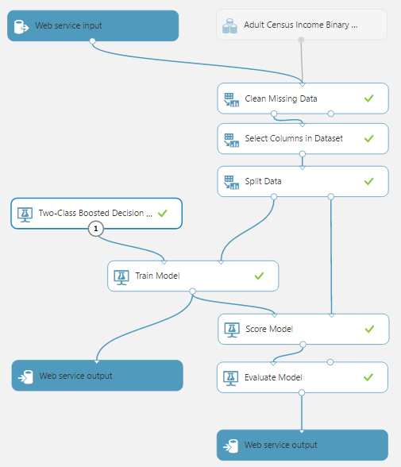
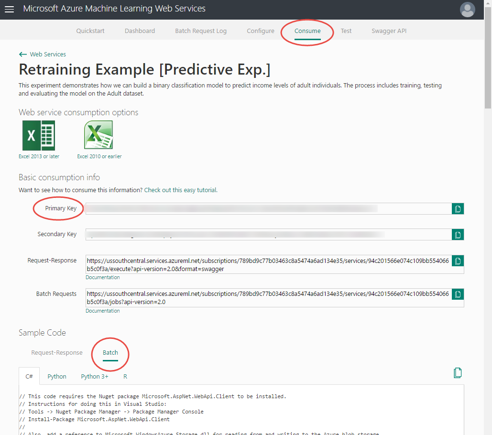

# Retrain and deploy a machine learning model

Retraining is one way to ensure machine learning models stay accurate and based on the most relevant data available. This article shows how to retrain and deploy a machine learning model as a new web service in Studio. If you're looking to retrain a classic web service, [view this how-to article.](retrain-classic-web-service.md)

This article assumes you already have a predictive web service deployed. If you don't already have a predictive web service, [learn how to deploy a Studio web service here.](publish-a-machine-learning-web-service.md)

You'll follow these steps to retrain and deploy a machine learning new web service:

1. Deploy a **retraining web service**
1. Train a new model using your **retraining web service**
1. Update your existing **predictive experiment** to use the new model

[!INCLUDE [updated-for-az](../../../includes/updated-for-az.md)]

## Deploy the retraining web service

A retraining web service lets you retrain your model with a new set of parameters, like new data, and save it for later. When you connect a **Web Service Output**  to a **Train Model**, the training experiment outputs a new model for you to use.

Use the following steps to deploy a retraining web service:

1. Connect a **Web Service Input** module to your data input. Typically, you want to ensure that your input data is processed in the same way as your original training data.
1. Connect a **Web Service Output** module to the output of your **Train Model**.
1. If you have an **Evaluate Model** module, you can connect a **Web Service Output** module to output the evaluation results
1. Run your experiment.

    After running your experiment, the resulting workflow should be similar to the following image:

    

    Now, you deploy the training experiment as a retraining web service that outputs a trained model and model evaluation results.

1. At the bottom of the experiment canvas, click **Set Up Web Service**
1. Select **Deploy Web Service [New]**. The Azure Machine Learning Web Services portal opens to the **Deploy Web Service** page.
1. Type a name for your web service and choose a payment plan.
1. Select **Deploy**.

## Retrain the model

For this example, we're using C# to create the retraining application. You can also use Python or R sample code to accomplish this task.

Use the following steps to call the retraining APIs:

1. Create a C# console application in Visual Studio: **New** > **Project** > **Visual C#** > **Windows Classic Desktop** > **Console App (.NET Framework)**.
1. Sign in to the Machine Learning Web Services portal.
1. Click the web service that you're working with.
1. Click **Consume**.
1. At the bottom of the **Consume** page, in the **Sample Code** section, click **Batch**.
1. Copy the sample C# code for batch execution and paste it into the Program.cs file. Make sure that the namespace remains intact.

Add the NuGet package Microsoft.AspNet.WebApi.Client, as specified in the comments. To add the reference to Microsoft.WindowsAzure.Storage.dll, you might  need to install the [client library for Azure Storage services](https://www.nuget.org/packages/WindowsAzure.Storage).

The following screenshot shows the **Consume** page in the Azure Machine Learning Web Services portal.

### Update the apikey declaration

Locate the **apikey** declaration:

    const string apiKey = "abc123"; // Replace this with the API key for the web service

In the **Basic consumption info** section of the **Consume** page, locate the primary key, and copy it to the **apikey** declaration.

### Update the Azure Storage information

The BES sample code uploads a file from a local drive (for example, "C:\temp\CensusInput.csv") to Azure Storage, processes it, and writes the results back to Azure Storage.

1. Sign into the Azure portal
1. In the left navigation column, click **More services**, search for **Storage accounts**, and select it.
1. From the list of storage accounts, select one to store the retrained model.
1. In the left navigation column, click **Access keys**.
1. Copy and save the **Primary Access Key**.
1. In the left navigation column, click **Containers**.
1. Select an existing container, or create a new one and save the name.

Locate the *StorageAccountName*, *StorageAccountKey*, and *StorageContainerName* declarations, and update the values that you saved from the portal.

    const string StorageAccountName = "mystorageacct"; // Replace this with your Azure storage account name
    const string StorageAccountKey = "a_storage_account_key"; // Replace this with your Azure Storage key
    const string StorageContainerName = "mycontainer"; // Replace this with your Azure Storage container name

You also must ensure that the input file is available at the location that you specify in the code.

### Specify the output location

When you specify the output location in the Request Payload, the extension of the file that is specified in *RelativeLocation* must be specified as `ilearner`.

    Outputs = new Dictionary<string, AzureBlobDataReference>() {
        {
            "output1",
            new AzureBlobDataReference()
            {
                ConnectionString = storageConnectionString,
                RelativeLocation = string.Format("{0}/output1results.ilearner", StorageContainerName) /*Replace this with the location you want to use for your output file and a valid file extension (usually .csv for scoring results or .ilearner for trained models)*/
            }
        },

Here is an example of retraining output:

### Evaluate the retraining results

When you run the application, the output includes the URL and shared access signatures token that are necessary to access the evaluation results.

You can see the performance results of the retrained model by combining the *BaseLocation*, *RelativeLocation*, and *SasBlobToken* from the output results for *output2* and pasting the complete URL into the browser address bar.

Examine the results to determine if the newly trained model performs better than the existing one.

Save the *BaseLocation*, *RelativeLocation*, and *SasBlobToken* from the output results.

## Update the predictive experiment

### Sign in to Azure Resource Manager

First, sign in to your Azure account from within the PowerShell environment by using the [Connect-AzAccount](/powershell/module/az.profile/connect-azaccount) cmdlet.

### Get the Web Service Definition object

Next, get the Web Service Definition object by calling the [Get-AzMlWebService](https://docs.microsoft.com/powershell/module/az.machinelearning/get-azmlwebservice) cmdlet.

    $wsd = Get-AzMlWebService -Name 'RetrainSamplePre.2016.8.17.0.3.51.237' -ResourceGroupName 'Default-MachineLearning-SouthCentralUS'

To determine the resource group name of an existing web service, run the Get-AzMlWebService cmdlet without any parameters to display the web services in your subscription. Locate the web service, and then look at its web service ID. The name of the resource group is the fourth element in the ID, just after the *resourceGroups* element. In the following example, the resource group name is Default-MachineLearning-SouthCentralUS.

    Properties : Microsoft.Azure.Management.MachineLearning.WebServices.Models.WebServicePropertiesForGraph
    Id : /subscriptions/<subscription ID>/resourceGroups/Default-MachineLearning-SouthCentralUS/providers/Microsoft.MachineLearning/webServices/RetrainSamplePre.2016.8.17.0.3.51.237
    Name : RetrainSamplePre.2016.8.17.0.3.51.237
    Location : South Central US
    Type : Microsoft.MachineLearning/webServices
    Tags : {}

Alternatively, to determine the resource group name of an existing web service, sign in to the Azure Machine Learning Web Services portal. Select the web service. The resource group name is the fifth element of the URL of the web service, just after the *resourceGroups* element. In the following example, the resource group name is Default-MachineLearning-SouthCentralUS.

    https://services.azureml.net/subscriptions/<subscription ID>/resourceGroups/Default-MachineLearning-SouthCentralUS/providers/Microsoft.MachineLearning/webServices/RetrainSamplePre.2016.8.17.0.3.51.237

### Export the Web Service Definition object as JSON

To modify the definition of the trained model to use the newly trained model, you must first use the [Export-AzMlWebService](https://docs.microsoft.com/powershell/module/az.machinelearning/export-azmlwebservice) cmdlet to export it to a JSON-format file.

    Export-AzMlWebService -WebService $wsd -OutputFile "C:\temp\mlservice_export.json"

### Update the reference to the ilearner blob

In the assets, locate the [trained model], update the *uri* value in the *locationInfo* node with the URI of the ilearner blob. The URI is generated by combining the *BaseLocation* and the *RelativeLocation* from the output of the BES retraining call.

     "asset3": {
        "name": "Retrain Sample [trained model]",
        "type": "Resource",
        "locationInfo": {
          "uri": "https://mltestaccount.blob.core.windows.net/azuremlassetscontainer/baca7bca650f46218633552c0bcbba0e.ilearner"
        },
        "outputPorts": {
          "Results dataset": {
            "type": "Dataset"
          }
        }
      },

### Import the JSON into a Web Service Definition object

Use the [Import-AzMlWebService](https://docs.microsoft.com/powershell/module/az.machinelearning/import-azmlwebservice) cmdlet to convert the modified JSON file back into a Web Service Definition object that you can use to update the predicative experiment.

    $wsd = Import-AzMlWebService -InputFile "C:\temp\mlservice_export.json"

### Update the web service

Finally, use the [Update-AzMlWebService](https://docs.microsoft.com/powershell/module/az.machinelearning/update-azmlwebservice) cmdlet to update the predictive experiment.

    Update-AzMlWebService -Name 'RetrainSamplePre.2016.8.17.0.3.51.237' -ResourceGroupName 'Default-MachineLearning-SouthCentralUS'

## Next steps

To learn more about how to manage web services or keep track of multiple experiments runs, see the following articles:

* [Explore the  Web Services portal](manage-new-webservice.md)
* [Manage experiment iterations](manage-experiment-iterations.md)
