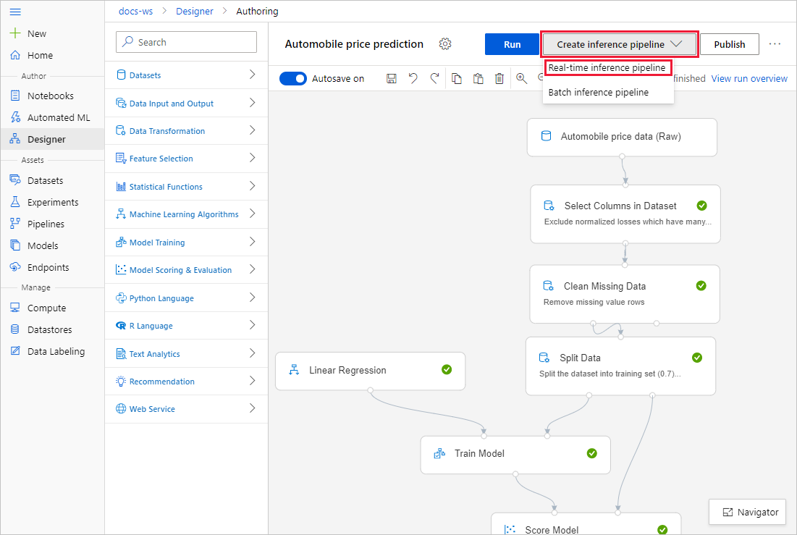
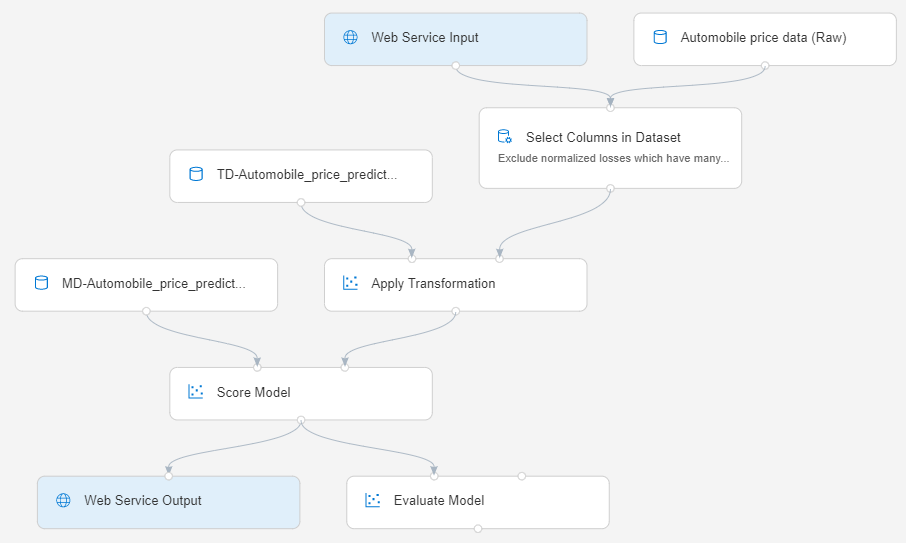
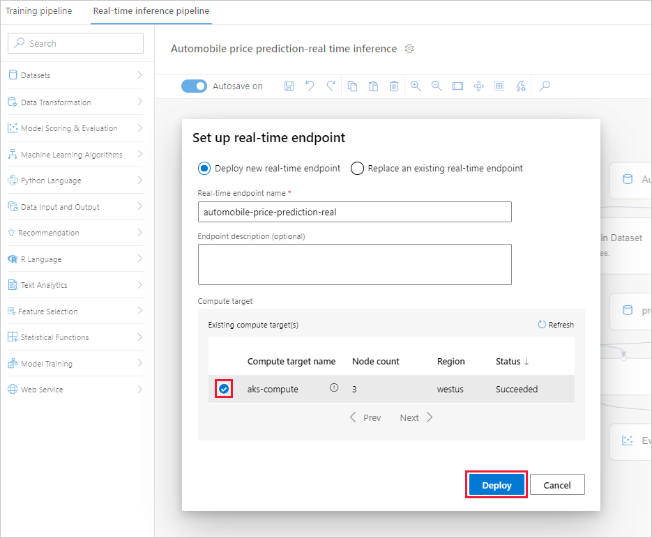
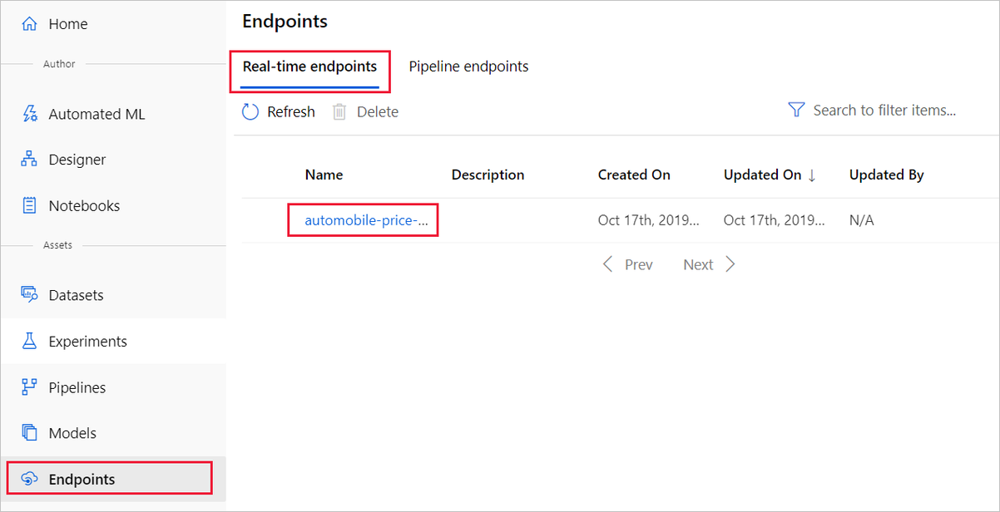
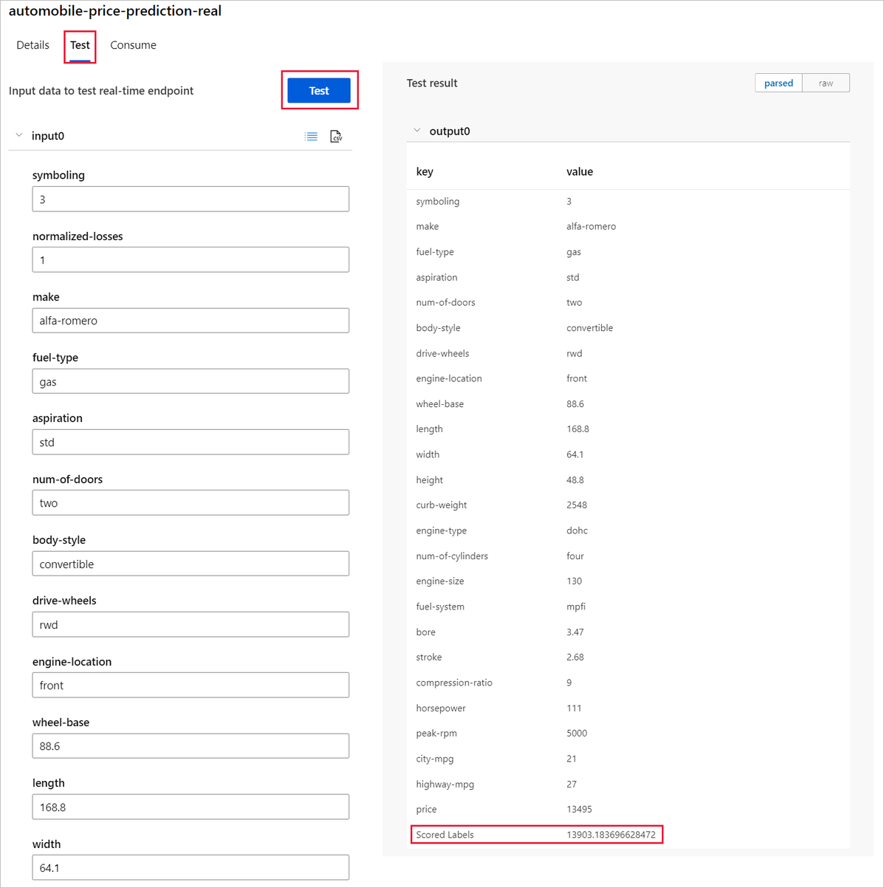

# Tutorial: Deploy a machine learning model with the designer (preview)
[!INCLUDE [applies-to-skus](../../includes/aml-applies-to-enterprise-sku.md)]

You can deploy the predictive model developed in [part one of the tutorial](tutorial-designer-automobile-price-train-score.md) to give others a chance to use it. In part one, you trained your model. Now, it's time to generate new predictions based on user input. In this part of the tutorial, you will:

> [!div class="checklist"]
> * Create a real-time inference pipeline.
> * Create an inferencing cluster.
> * Deploy the real-time endpoint.
> * Test the real-time endpoint.

## Prerequisites

Complete [part one of the tutorial](tutorial-designer-automobile-price-train-score.md) to learn how to train and score a machine learning model in the designer.

## Create a real-time inference pipeline

To deploy your pipeline, you must first convert the training pipeline into a real-time inference pipeline. This process removes training modules and adds web service inputs and outputs to handle requests.

### Create a real-time inference pipeline

1. Above the pipeline canvas, select **Create inference pipeline** > **Real-time inference pipeline**.

    

    Your pipeline should now look like this: 

   

    When you select **Create inference pipeline**, several things happen:
    
    * The trained model is stored as a **Dataset** module in the module palette. You can find it under **My Datasets**.
    * Training modules like **Train Model** and **Split Data** are removed.
    * The saved trained model is added back into the pipeline.
    * **Web Service Input** and **Web Service Output** modules are added. These modules show where user data enters the pipeline and where data is returned.

    > [!NOTE]
    > By default, the **Web Service Input** will expect the same data schema as the training data used to create the predictive pipeline. In this scenario, price is included in the schema. However, price isn't used as a factor during prediction.
    >

1. Select **Run**, and use the same compute target and experiment that you used in part one.

1. Select **Deploy**.

## Create an inferencing cluster

In the dialog box that appears, you can select from any existing Azure Kubernetes Service (AKS) clusters to deploy your model to. If you don't have an AKS cluster, use the following steps to create one.

1. Select **Compute** in the dialog box that appears to go to the **Compute** page.

1. On the navigation ribbon, select **Inference Clusters** > **+ New**.

    

1. In the inference cluster pane, configure a new Kubernetes Service.

1. Enter *aks-compute* for the **Compute name**.
    
1. Select a nearby region that's available for the **Region**.

1. Select **Create**.

    > [!NOTE]
    > It takes approximately 15 minutes to create a new AKS service. You can check the provisioning state on the **Inference Clusters** page.
    >

## Deploy the real-time endpoint

After your AKS service has finished provisioning, return to the real-time inferencing pipeline to complete deployment.

1. Select **Deploy** above the canvas.

1. Select **Deploy new real-time endpoint**. 

1. Select the AKS cluster you created.

1. Select **Deploy**.

    

    A success notification above the canvas appears after deployment finishes. It might take a few minutes.

## Test the real-time endpoint

After deployment finishes, you can test your real-time endpoint by going to the **Endpoints** page.

1. On the **Endpoints** page, select the endpoint you deployed.

    

1. Select **Test**.

1. You can manually input testing data or use the autofilled sample data, and select **Test**.

    The portal submits a test request to the endpoint and shows the results. Although a price value is generated for the input data, it isn't used to generate the prediction value.

    

## Clean up resources

[!INCLUDE [aml-ui-cleanup](../../includes/aml-ui-cleanup.md)]

## Next steps

In this tutorial, you learned the key steps in how to create, deploy, and consume a machine learning model in the designer. To learn more about how you can use the designer to solve other types of problems, see our other sample pipelines.

> [!div class="nextstepaction"]
> [Credit risk classification sample](how-to-designer-sample-classification-credit-risk-cost-sensitive.md)
