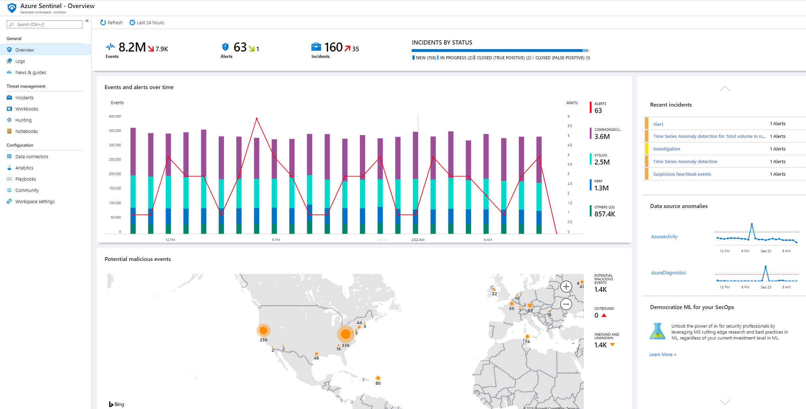
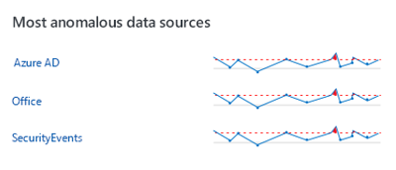
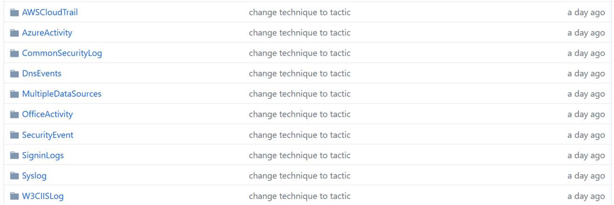
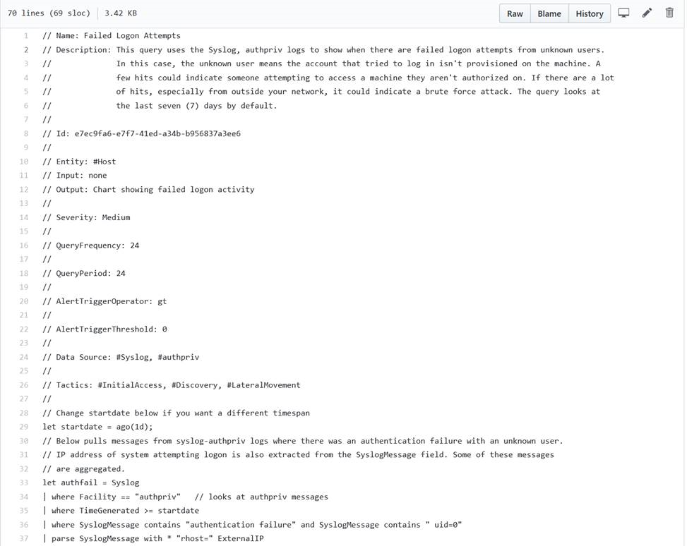
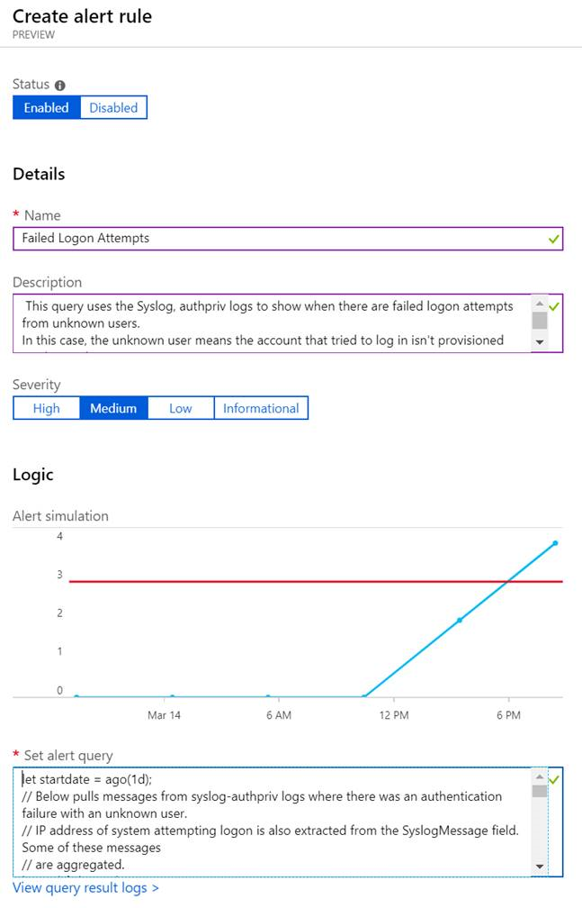

# Quickstart: Get started with Azure Sentinel Preview

> [!IMPORTANT]
> Azure Sentinel is currently in public preview.
> This preview version is provided without a service level agreement, and it's not recommended for production workloads. Certain features might not be supported or might have constrained capabilities. 
> For more information, see [Supplemental Terms of Use for Microsoft Azure Previews](https://azure.microsoft.com/support/legal/preview-supplemental-terms/).

In this quickstart you will learn how to quickly be able to view and monitor what's happening across your environment using Azure Sentinel. After you connected your data sources to Azure Sentinel, you get instant visualization and analysis of data so that you can know what's happening across all your connected data sources. Azure Sentinel gives you dashboards that provide you with the full power of tools already available in Azure as well as tables and charts that are built in to provide you with analytics for your logs and queries. You can either use built-in dashboards or create a new dashboard easily, from scratch or based on an existing dashboard. 

## Get visualization

To visualize and get analysis of what's happening on your environment, first, take a look at the overview dashboard to get an idea of the security posture of your organization. You can click on each element of these tiles to drill down to the raw data from which they are created. To help you reduce noise and minimize the number of alerts you have to review and investigate, Azure Sentinel uses a fusion technique to correlate alerts into cases. **Cases** are groups of related alerts that together create an actionable incident that you can investigate and resolve.

- In the Azure portal, select Azure Sentinel and then select the workspace you want to monitor.

  

- The toolbar across the top tells you how many events you got over the time period selected, and it compares it to the previous 24 hours. The toolbar tells you from these events, the alerts that were triggered (the small number represents change over the last 24 hours), and then it tells you for those events, how many are open, in progress, and closed. Check to see that there isn't a dramatic increase or drop in the number of events. If there is a drop, it could be that a connection stopped reporting to Azure Sentinel. If there is an increase, something suspicious may have happened. Check to see if you have new alerts.

   

The main body of the overview page gives insight at a glance into the security status of your workspace:

- **Events and alerts over time**: Lists the number of events and how many alerts were created from those events. If you see a spike that's unusual, you should see alerts for it - if there's something unusual where there is a spike in events but you don't see alerts, it might be cause for concern.

- **Potential malicious events**: When traffic is detected from sources that are known to be malicious, Azure Sentinel alerts you on the map. If you see orange, it is inbound traffic: someone is trying to access your organization from a known malicious IP address. If you see Outbound (red) activity, it means that data from your network is being streamed out of your organization to a known malicious IP address.

   

- **Recent cases**: To view your recent cases, their severity and the number of alerts associated with the case. If you see as sudden peak in a specific type of alert, it could mean that there is an active attack currently running. For example, if you have a sudden peak of 20 Pass-the-hash events from Azure ATP, it's possible that someone is currently trying to attack you.

- **Data source anomalies**: Microsoft's data analysts created models that constantly search the data from your data sources for anomalies. If there aren't any anomalies, nothing is displayed. If anomalies are detected, you should deep dive into them to see what happened. For example, click on the spike in Azure Activity. You can click on **Chart** to see when the spike happened, and then filter for activities that occurred during that time period to see what caused the spike.

   

## Use built-in dashboards

Built-in dashboards provide integrated data from your connected data sources to let you deep dive into the events generated in those services. The built-in dashboards include Azure ID, Azure activity events, and on-premises, which can be data from Windows Events from servers, from first party alerts, from any third party including firewall traffic logs, Office 365, and insecure protocols based on Windows events.

1. Under **Settings**, select **Dashboards**. Under **Installed**, you can see all your installed dashboards. Under **All** you can see the whole gallery of built-in dashboards that are available for installation. 
2. Search for a specific dashboard to see the whole list and description of what each offers. 
3. Assuming you use Azure AD, to get up and running with Azure Sentinel, we recommend that you install at least the following dashboards:
   - **Azure AD**: Use either or both of the following:
       - **Azure AD sign-ins** analyzes sign-ins over time to see if there are anomalies. This dashboard provides failed sign-ins by applications, devices, and locations so that you can notice, at a glance if something unusual happens. Pay attention to multiple failed sign-ins. 
       - **Azure AD audit logs** analyzes admin activities, such as changes in users (add, remove, etc.), group creation, and modifications.  

   - Add a dashboard for your firewall. For example, add the Palo Alto dashboard. The dashboard analyzes your firewall traffic, providing you with correlations between your firewall data and threat events, and highlights suspicious events across entities. Dashboards provides you with information about trends in your traffic and lets you drill down into and filter results. 

      

You can customize the dashboards either by editing the main query . You can click the button  to go to [Log Analytics to edit the query there](../azure-monitor/log-query/get-started-portal.md), and you can select the ellipsis (...) and select **Customize tile data**, which enables you to edit the main time filter, or remove the specific tiles from the dashboard.

For more information on working with queries, see [Tutorial: Visual data in Log Analytics](../azure-monitor/learn/tutorial-logs-dashboards.md)

### Add a new tile

If you want to add a new tile, you can add it to an existing dashboard, either one that you create or an Azure Sentinel built-in dashboard. 
1. In Log Analytics, create a tile using the instructions found in [Tutorial: Visual data in Log Analytics](../azure-monitor/learn/tutorial-logs-dashboards.md). 
2. After the tile is created, under **Pin**, select the dashboard in which you want the tile to appear.

## Create new dashboards
You can create a new dashboard from scratch or use a built-in dashboard as the basis for your new dashboard.

1. To create a new dashboard from scratch, select **Dashboards** and then **+New dashboard**.
2. Select the subscription the dashboard is created in and give it a descriptive name. Each dashboard is an Azure resource like any other, and you can assign it roles (RBAC) to define and limit who can access. 
3. To enable it to show up in your dashboards to pin visualizations to, you have to share it. Click **Share** and then **Manage users**. 
 
1. Use the **Check access** and **Role assignments** as you would for any other Azure resource. For more information, see [Share Azure dashboards by using RBAC](../azure-portal/azure-portal-dashboard-share-access.md).

## New dashboard examples

The following sample query enables you to compare trends of traffic across weeks. You can easily switch which device vendor and data source you run the query on. This example uses SecurityEvent from Windows, you can switch it to run on AzureActivity or CommonSecurityLog on any other firewall.

     |where DeviceVendor = = "Palo Alto Networks":
      // week over week query
      SecurityEvent
      | where TimeGenerated > ago(14d)
      | summarize count() by bin(TimeGenerated, 1d)
      | extend Week = iff(TimeGenerated>ago(7d), "This Week", "Last Week"), TimeGenerated = iff(TimeGenerated>ago(7d), TimeGenerated, TimeGenerated + 7d)

You might want to create a query that incorporates data from multiples sources. You can create a query that looks at Azure Active Directory audit logs for new users that were just created, and then checks your Azure logs to see if the user started making role assignment changes within 24 hours of creation. That suspicious activity would show up on this dashboard:

    AuditLogs
    | where OperationName == "Add user"
    | project AddedTime = TimeGenerated, user = tostring(TargetResources[0].userPrincipalName)
    | join (AzureActivity
    | where OperationName == "Create role assignment"
    | project OperationName, RoleAssignmentTime = TimeGenerated, user = Caller) on user
    | project-away user1

You can create different dashboards based on role of person looking at the data and what they're looking for. For example, you can create a dashboard for your network admin that includes the firewall data. You can also create dashboards based on how frequently you want to look at them, whether there are things you want to review daily, and others items you want to check once an hour, for example, you might want to look at your Azure AD sign-ins every hour to search for anomalies. 

## Create new detections

Generate detections on the [data sources that you connected to Azure Sentinel](connect-data-sources.md) to investigate threats in your organization.

When you create a new detection, leverage the built-in detections crafted by Microsoft security researchers that are tailored to the data sources you connected.

1. [In the GitHub community](https://github.com/Azure/Azure-Sentinel/tree/master/Detections) go to the **Detections** folder and select the relevant folders.
   
 
3.	Go to the **Analytics** tab and select **add**.
   

3.	Copy all parameters to the rule and click **Create**.
   

 
## Next steps
In this quickstart, you learned how to get started using Azure Sentinel. Continue to the tutorial for [how to detect threats](tutorial-detect-threats.md).
> [!div class="nextstepaction"]
> [Detect threats](tutorial-detect-threats.md) to automate your responses to threats.

