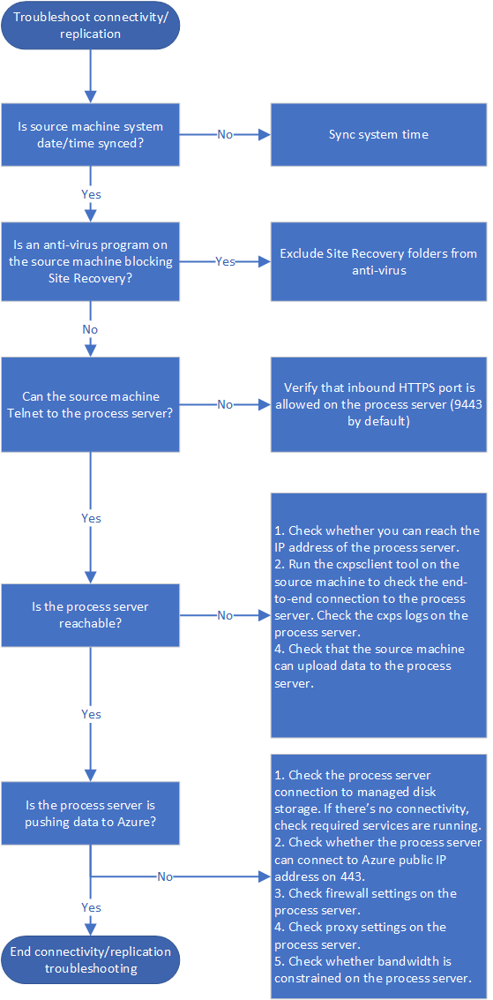
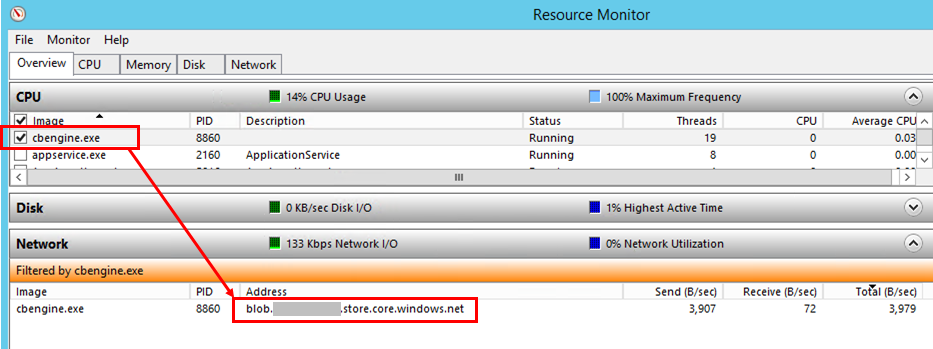

# Troubleshoot the process server

The [Site Recovery](site-recovery-overview.md) process server is used when you set up disaster recovery to Azure for on-premises VMware VMs and physical servers. This article describes how to troubleshoot issues with the process server, including replication and connectivity issues.

[Learn more](vmware-physical-azure-config-process-server-overview.md) about the process server.

## Before you start

Before you start troubleshooting:

1. Make sure you understand how to [monitor process servers](vmware-physical-azure-monitor-process-server.md).
2. Review the best practices below.
3. Make sure you follow [capacity considerations](site-recovery-plan-capacity-vmware.md#capacity-considerations), and use sizing guidance for the [configuration server](site-recovery-plan-capacity-vmware.md#size-recommendations-for-the-configuration-server-and-inbuilt-process-server) or [standalone process servers](site-recovery-plan-capacity-vmware.md#size-recommendations-for-the-process-server).

## Best practices for process server deployment

For optimum performance of process servers, we've summarized a number of general best practices.

**Best practice** | **Details**
--- |---
**Usage** | Make sure the configuration server/standalone process server are only used for the intended purpose. Don't run anything else on the machine.
**IP address** | Make sure that the process server has a static IPv4 address, and doesn't have NAT configured.
**Control memory/CPU usage** |Keep CPU and memory usage under 70%.
**Ensure free space** | Free space refers to the cache disk space on the process server. Replication data is stored in the cache before it's uploaded to Azure.<br/><br/> Keep free space above 25%. If it goes below 20%, replication is throttled for replicated machines that are associated with the process server.

## Check process server health

The first step in troubleshooting is to check the health and status of the process server. To do this, review all alerts, check that required services are running, and verify that there's a heartbeat from the process server. These steps are summarized in the following graphic, followed by procedures to help you perform the steps.


## Step 1: Troubleshoot process server health alerts

The process server generates a number of health alerts. These alerts, and recommended actions, are summarized in the following table.

**Alert type** | **Error** | **Troubleshoot**
--- | --- | --- 
![Healthy][green] | None  | Process server is connected and healthy.
![Warning][yellow] | Specified services aren't running. | 1. Check that services are running.<br/> 2. If services are running as expected, follow the instructions below to [troubleshoot connectivity and replication issues](#check-connectivity-and-replication).
![Warning][yellow]  | CPU utilization > 80% for the last 15 minutes. | 1. Don't add new machines.<br/>2. Check that the number of VMs using the process server aligns to [defined limits](site-recovery-plan-capacity-vmware.md#capacity-considerations), and consider setting up an [additional process server](vmware-azure-set-up-process-server-scale.md).<br/>3. Follow the instructions below to [troubleshoot connectivity and replication issues](#check-connectivity-and-replication).
![Critical][red] |  CPU utilization > 95% for the last 15 minutes. | 1. Don't add new machines.<br/>2. Check that the number of VMs using the process server aligns to [defined limits](site-recovery-plan-capacity-vmware.md#capacity-considerations), and consider setting up an [additional process server](vmware-azure-set-up-process-server-scale.md).<br/>3. Follow the instructions below to [troubleshoot connectivity and replication issues](#check-connectivity-and-replication).<br/> 4. If the issue persists, run the [Deployment Planner](http://aka.ms/asr-v2a-deployment-planner) for VMware/physical server replication.
![Warning][yellow] | Memory usage > 80% for the last 15 minutes. |  1. Don't add new machines.<br/>2. Check that the number of VMs using the process server aligns to [defined limits](site-recovery-plan-capacity-vmware.md#capacity-considerations), and consider setting up an [additional process server](vmware-azure-set-up-process-server-scale.md).<br/>3. Follow any instructions associated with the warning.<br/> 4. If the issue persists, follow the instructions below to [troubleshoot connectivity and replication issues](#check-connectivity-and-replication).
![Critical][red] | Memory usage > 95% for the last 15 minutes. | 1. Don't add new machines, and considering setting up an [additional process server](vmware-azure-set-up-process-server-scale.md).<br/> 2. Follow any instructions associated with the warning.<br/> 3. 4. If the issue continues, follow the instructions below to [troubleshoot connectivity and replication issues](#check-connectivity-and-replication).<br/> 4. If the issue persists, run the [Deployment Planner](http://aka.ms/asr-v2a-deployment-planner) for VMware/physical server replication issues.
![Warning][yellow] | Cache folder free space < 30% for the last 15 minutes. | 1. Don't add new machines, and consider setting up an [additional process server](vmware-azure-set-up-process-server-scale.md).<br/>2. Check that the number of VMs using the process server aligns to [guidelines](site-recovery-plan-capacity-vmware.md#capacity-considerations).<br/> 3. Follow the instructions below to [troubleshoot connectivity and replication issues](#check-connectivity-and-replication).
![Critical][red] |  Free space < 25% for last 15 minutes | 1. Follow the instructions associated with the warning for this issue.<br/> 2. 3. Follow the instructions below to [troubleshoot connectivity and replication issues](#check-connectivity-and-replication).<br/> 3. If the issue persists, run the [Deployment Planner](http://aka.ms/asr-v2a-deployment-planner) for VMware/physical server replication.
![Critical][red] | No heartbeat from the process server for 15 minutes or more. The tmansvs service isn't communicating with the configuration server. | 1) Check that the process server is up and running.<br/> 2. Check that the tmassvc is running on the process server.<br/> 3. Follow the instructions below to [troubleshoot connectivity and replication issues](#check-connectivity-and-replication).


## Step 2: Check process server services

Services that should be running on the process server are summarized in the following table. There are slight differences in services, depending on how the process server is deployed. 

For all services except the Microsoft Azure Recovery Services Agent (obengine), check that the StartType is set to **Automatic** or **Automatic (Delayed Start)**.
 
**Deployment** | **Running services**
--- | ---
**Process server on the configuration server** | ProcessServer; ProcessServerMonitor; cxprocessserver; InMage PushInstall; Log Upload Service (LogUpload); InMage Scout Application Service; Microsoft Azure Recovery Services Agent (obengine); InMage Scout VX Agent-Sentinel/Outpost (svagents); tmansvc; World Wide Web Publishing Service (W3SVC); MySQL; Microsoft Azure Site Recovery Service (dra)
**Process server running as a standalone server** | ProcessServer; ProcessServerMonitor; cxprocessserver; InMage PushInstall; Log Upload Service (LogUpload); InMage Scout Application Service; Microsoft Azure Recovery Services Agent (obengine); InMage Scout VX Agent-Sentinel/Outpost (svagents); tmansvc.
**Process server deployed in Azure for failback** | ProcessServer; ProcessServerMonitor; cxprocessserver; InMage PushInstall; Log Upload Service (LogUpload)


## Step 3: Check the process server heartbeat

If there's no heartbeat from the process server (error code 806), do the following:

1. Verify that the process server VM is up and running.
2. Check these logs for errors.

    C:\ProgramData\ASR\home\svsystems\eventmanager*.log
    C\ProgramData\ASR\home\svsystems\monitor_protection*.log

## Check connectivity and replication

 Initial and ongoing replication failures are often caused by connectivity issues between source machines and the process server, or between the process server and Azure. These steps are summarized in the following graphic, followed by procedures to help you perform the steps.




## Step 4: Verify time sync on source machine

Ensure that the system date/time for the replicated machine is in sync. [Learn more](https://docs.microsoft.com/windows-server/networking/windows-time-service/accurate-time)

## Step 5: Check anti-virus software on source machine

Check that no anti-virus software on the replicated machine is blocking Site Recovery. If you need to exclude Site Recovery from anti-virus programs, review [this article](vmware-azure-set-up-source.md#azure-site-recovery-folder-exclusions-from-antivirus-program).

## Step 6: Check connectivity from source machine


1. Install the [Telnet client](https://technet.microsoft.com/library/cc771275(v=WS.10).aspx) on the source machine if you need to. Don't use Ping.
2. From the source machine, ping the process server on the HTTPS port with Telnet. By default 9443 is the HTTPS port for replication traffic.

    `telnet <process server IP address> <port>`

3. Verify whether the connection is successful.


**Connectivity** | **Details** | **Action**
--- | --- | ---
**Successful** | Telnet shows a blank screen, and the process server is reachable. | No further action required.
**Unsuccessful** | You can't connect | Make sure that inbound port 9443 is allowed on the process server. For example, if you have a perimeter network or a screened subnet. Check connectivity again.
**Partially successful** | You can connect, but the source machine reports that the process server can't be reached. | Continue with the next troubleshooting procedure.

## Step 7: Troubleshoot an unreachable process server

If the process server isn't reachable from the source machine, error 78186 will be displayed. If not addressed, this issue will lead to both app-consistent and crash-consistent recovery points not being generated as expected.

Troubleshoot by checking whether the source machine can reach the IP address of the process server, and run the cxpsclient tool on the source machine, to check the end-to-end connection.


### Check the IP connection on the process server

If telnet is successful but the source machine reports that the process server can't be reached, check whether you can reach the IP address of the process server.

1. In a web browser, try to reach IP address https://<PS_IP>:<PS_Data_Port>/.
2. If this check shows an HTTPS certificate error, that's normal. If you ignore the error, you should see a 400 - Bad Request. This means that the server can't serve the browser request, and that the standard HTTPS connection is fine.
3. If this check doesn't work, then note the browser error message. For example, a 407 error will indicate an issue with proxy authentication.

### Check the connection with cxpsclient

Additionally, you can run the cxpsclient tool to check the end-to-end connection.

1. Run the tool as follows:

    ```
    <install folder>\cxpsclient.exe -i <PS_IP> -l <PS_Data_Port> -y <timeout_in_secs:recommended 300>
    ```

2. On the process server, check the generated logs in these folders:

    C:\ProgramData\ASR\home\svsystems\transport\log\cxps.err
    C:\ProgramData\ASR\home\svsystems\transport\log\cxps.xfer


### Check source VM logs for upload failures (error 78028)

Issue with data uploads blocked from source machines to the process service can result in both crash-consistent and app-consistent recovery points not being generated. 

1. To troubleshoot network upload failures, you can look for errors in this log:

    C:\Program Files (x86)\Microsoft Azure Site Recovery\agent\svagents*.log 

2. Use the rest of the procedures in this article can help you to resolve data upload issues.


## Step 8: Check whether the process server is pushing data

Check whether the process server is actively pushing data to Azure.

  1. On the process server, open Task Manager (press Ctrl+Shift+Esc).
  2. Select the **Performance** tab > **Open Resource Monitor**.
  3. In **Resource Monitor** page, select the **Network** tab. Under **Processes with Network Activity**, check whether cbengine.exe is actively sending a large vNotolume of data.

       

  If cbengine.exe isn't sending a large volume of data, complete the steps in the following sections.

## Step 9: Check the process server connection to Azure blob storage

1. In Resource Monitor, select **cbengine.exe**.
2. Under **TCP Connections**, check to see whether there is connectivity from the process server to the Azure storage.

  

### Check services

If there's no connectivity from the process server to the Azure blob storage URL, check that services are running.

1. In the Control Panel, select **Services**.
2. Verify that the following services are running:

    - cxprocessserver
    - InMage Scout VX Agent – Sentinel/Outpost
    - Microsoft Azure Recovery Services Agent
    - Microsoft Azure Site Recovery Service
    - tmansvc

3. Start or restart any service that isn't running.
4. Verify that the process server is connected and reachable. 

## Step 10: check the process server connection to Azure public IP address

1. On the process server, in **%programfiles%\Microsoft Azure Recovery Services Agent\Temp**, open the latest CBEngineCurr.errlog file.
2. In the file, search for **443**, or for the string **connection attempt failed**.

  

3. If you see issues, located your Azure public IP address in the CBEngineCurr.currLog file by using port 443:

  `telnet <your Azure Public IP address as seen in CBEngineCurr.errlog>  443`

5. At the command line on the process server, use Telnet to ping your Azure public IP address.
6. If you can't connect, follow the next procedure.

## Step 11: Check process server firewall settings. 

Check whether the IP address-based firewall on the process server is blocking access.

1. For IP address-based firewall rules:

    a) Download the complete list of [Microsoft Azure datacenter IP ranges](https://www.microsoft.com/download/details.aspx?id=41653).

    b) Add the IP address ranges to your firewall configuration, to ensure that the firewall allows communication to Azure (and to the default HTTPS port, 443).

    c) Allow IP address ranges for the Azure region of your subscription, and for the Azure West US region (used for access control and identity management).

2. For URL-based firewalls, add the URLs listed in the following table to the firewall configuration.

    [!INCLUDE [site-recovery-URLS](../../includes/site-recovery-URLS.md)]  


## Step 12: Verify process server proxy settings 

1. If you use a proxy server, ensure that the proxy server name is resolved by the DNS server. Check the value that you provided when you set up the configuration server in registry key **HKEY_LOCAL_MACHINE\SOFTWARE\Microsoft\Azure Site Recovery\ProxySettings**.
2. Ensure that the same settings are used by the Azure Site Recovery agent to send data.

    a) Search for **Microsoft Azure Backup**.

    b) Open **Microsoft Azure Backup**, and select **Action** > **Change Properties**.

    c) On the **Proxy Configuration** tab, the proxy address should be same as the proxy address that's shown in the registry settings. If not, change it to the same address.

## Step 13: Check bandwidth

Increase the bandwidth between the process server and Azure, and then check whether the problem still occurs.


## Next steps

If you need more help, post your question in the [Azure Site Recovery forum](https://social.msdn.microsoft.com/Forums/azure/home?forum=hypervrecovmgr). 

[green]: ./media/vmware-physical-azure-troubleshoot-process-server/green.png
[yellow]: ./media/vmware-physical-azure-troubleshoot-process-server/yellow.png
[red]: ./media/vmware-physical-azure-troubleshoot-process-server/red.png