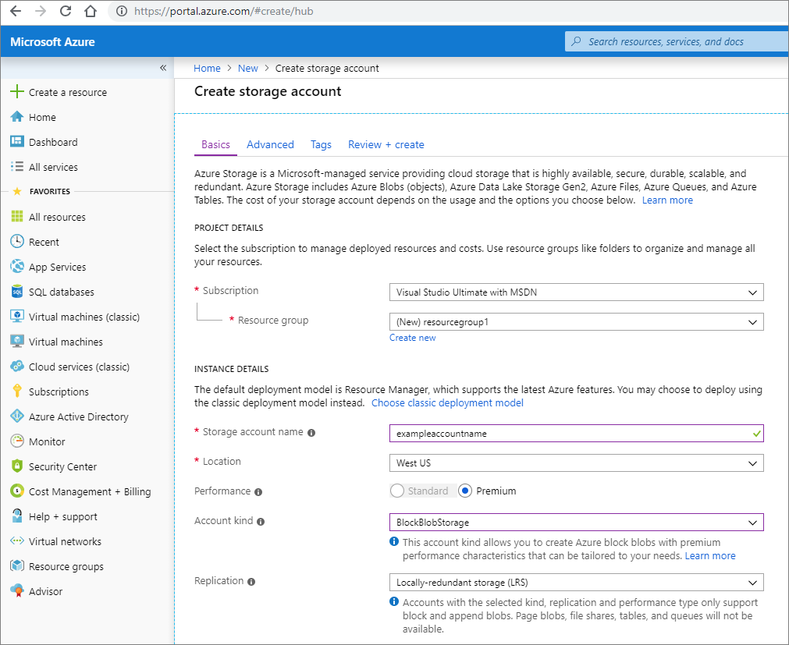

# Create a block blob storage account

The block blob storage account type lets you create block blobs with premium performance characteristics. This type of storage account is optimized for workloads with high transactions rates or that require very fast access times. This article shows how to create a block blob storage account by using the Azure portal, the Azure CLI, or Azure PowerShell.

For more information about block blob storage accounts, see [Azure storage account overview](https://docs.microsoft.com/azure/storage/common/storage-account-overview).

## Create account in the Azure portal

To create a block blob storage account in the Azure portal, follow these steps:

1. In the Azure portal, select **All services** > the **Storage** category > **Storage accounts**.

1. Under **Storage accounts**, select **Add**.

1. In the **Subscription** field, select the subscription in which to create the storage account.

1. In the **Resource group** field, select an existing resource group or select **Create new**, and enter a name for the new resource group.

1. In the **Storage account name** field, enter a name for the account. Note the following guidelines:

   - The name must be unique across Azure.
   - The name must be between three and 24 characters long.
   - The name can include only numbers and lowercase letters.

1. In the **Location** field, select a location for the storage account, or use the default location.

1. For the rest of the settings, configure the following:

   |Field     |Value  |
   |---------|---------|
   |**Performance**    |  Select **Premium**.   |
   |**Account kind**    | Select **BlockBlobStorage**.      |
   |**Replication**    |  Leave the default setting of **Locally-redundant storage (LRS)**.      |

   

1. Select **Review + create** to review the storage account settings.

1. Select **Create**.

## Create account using Azure PowerShell

[!INCLUDE [updated-for-az](../../../includes/updated-for-az.md)]

1. Open an elevated Windows PowerShell session (Run as administrator).

1. Run the following command to make sure the latest version of the `Az` PowerShell module is installed.

   ```powershell
   Install-Module -Name Az -AllowClobber
   ```

1. Open a new PowerShell console and sign in with your Azure account.

   ```powershell
   Connect-AzAccount -SubscriptionId <SubscriptionID>
   ```

1. If needed, create a new resource group. Replace the values in quotations, and run the following command.

   ```powershell
   $resourcegroup = "new_resource_group_name"
   $location = "region_name"
   New-AzResourceGroup -Name $resourceGroup -Location $location
   ```

1. Create the block blob storage account. Replace the values in quotations, and run the following command.

   ```powershell
   $resourcegroup = "resource_group_name"
   $storageaccount = "new_storage_account_name"
   $location = "region_name"

   New-AzStorageAccount -ResourceGroupName $resourcegroup -Name $storageaccount -Location $location -Kind "BlockBlobStorage" -SkuName "Premium_LRS"
   ```

## Create account using Azure CLI

To create a block blob account by using the Azure CLI, you must first install Azure CLI v. 2.0.46 or a later version. Run `az --version` to find the version. If you need to install or upgrade, see [Install the Azure CLI](/cli/azure/install-azure-cli).

1. Sign in to your Azure subscription.

   ```azurecli
   az login
   ```

1. If needed, create a new resource group. Replace the values in brackets (including the brackets), and run the following command.

   ```azurecli
   az group create \
    --name "<new_resource_group_name>" \
    --location "<location>"
   ```

1. Create the block blob storage account. Replace the values in brackets (including the brackets), and run the following command.

   ```azurecli
   az storage account create \
    --location "<location>" \
    --name "<new_storage_account_name>" \
    --resource-group "<resource_group_name>" \
    --kind "BlockBlobStorage" \
    --sku "Premium_LRS"
   ```

## Next steps

- For more information about storage accounts, see [Azure storage account overview](https://docs.microsoft.com/azure/storage/common/storage-account-overview).

- For more information about resource groups, see [Azure Resource Manager overview](https://docs.microsoft.com/azure/azure-resource-manager/resource-group-overview).
