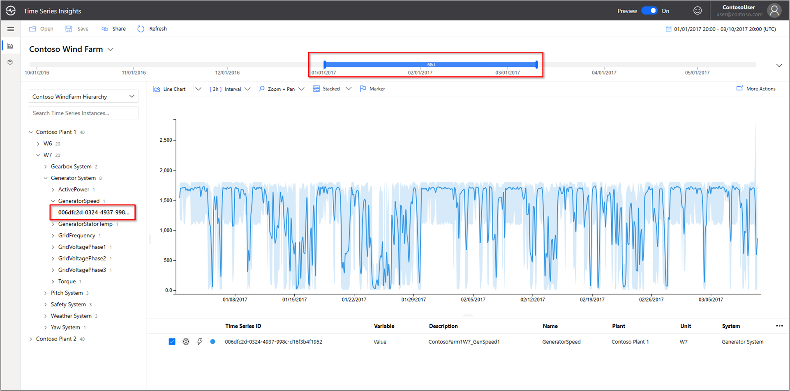
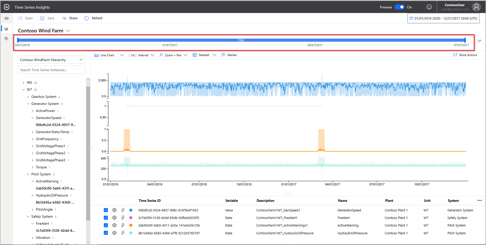
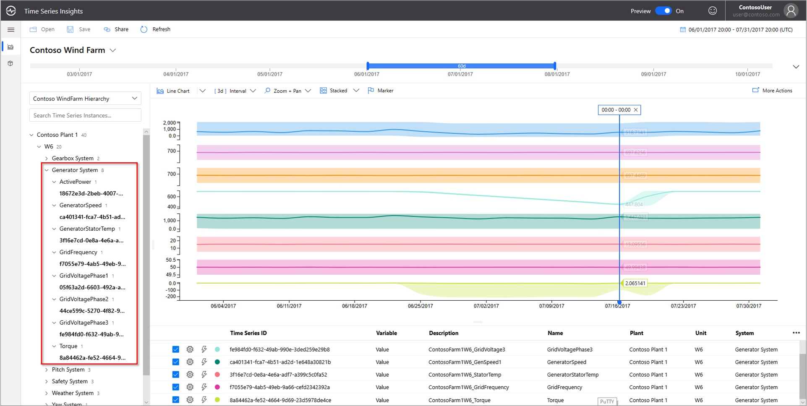

# Quickstart: Explore the Azure Time Series Insights Preview demo environment

This quickstart gets you started with the Azure Time Series Insights Preview. Through the free demo, you'll tour key features that have been added in the Time Series Insights Preview.

The Preview demo environment contains a scenario company, Contoso, that operates two wind turbine farms, each with 10 turbines. Each turbine has 20 sensors that report data every minute to Azure IoT Hub. The sensors gather information about weather conditions, blade pitch, and yaw position. Also, generator performance, gearbox behavior, and safety monitors.

 You'll learn to use Time Series Insights to find actionable insights in Contoso data. You'll also conduct a short root-cause analysis to better predict critical failures and perform maintenance.

## Explore the Time Series Insights explorer in a demo environment

The Time Series Insights Preview explorer demonstrates historical data and root causes analysis. To get started:

1. Create a [free Azure account](https://azure.microsoft.com/free/?ref=microsoft.com&utm_source=microsoft.com&utm_medium=docs&utm_campaign=visualstudio) if one hasn't been created.

1. Navigate to the [Contoso Wind Farm demo](https://insights.timeseries.azure.com/preview/samples) environment.  

1. If you're prompted, sign in to the Time Series Insights explorer using your Azure account credentials.

## Work with historical data

1. Look at wind turbine **W7** in **Contoso Plant 1**.  

    * Update the view range to **1/1/17 20:00 to 3/10/17 20:00 (UTC)**.
    * Select the **Contoso Plant 1** > **W7** > **Generator System** > **GeneratorSpeed** sensor. Then review the resultant values.

      

1. Recently, Contoso found a fire in wind turbine **W7**. Opinions vary about what the proximate cause of the fire was. Upon closer inspection, we see that the fire alert sensor was activated during the fire.

    * Update the view range to **3/9/17 20:00 to 3/10/17 20:00 (UTC)**.
    * Select the **Safety System** > **FireAlert** sensor.

      

1. Review other events around the time of the fire to understand what occurred. Both oil pressure and active warnings spiked just before the fire.

    * Select the **Pitch System** > **HydraulicOilPressure** sensor.
    * Select the **Pitch System** > **ActiveWarning** sensor.

      

1. The oil pressure and active warning sensors spiked right before the fire. Expand the displayed time series to see other signs present leading up to the fire. Both sensors fluctuated consistently over time indicating a persistent and worrisome pattern.

    * Update the view range to **2/24/17 20:00 to 3/10/17 20:00 (UTC)**.

      

1. Examining two years of historical reveals another fire event with the same sensor fluctuations.

    * Update the view range to **1/1/16 to 12/31/17** (all data).

      

Using Azure Time Series Insights and our sensor telemetry, we've discovered a long-term and problematic trend hidden in our historical data. With these new insights, we can explain:

> [!div class="checklist"]
> * What actually occurred
> * Correct the problem
> * Put superior alert notification systems into place.

## Root-cause analysis

1. Some scenarios require sophisticated analysis to uncover subtle clues in data. Select the windmill **W6** on date **6/25**

    * Update the view range to **6/1/17 20:00 to 7/1/17 20:00 (UTC)**
    * Then select the **Contoso Plant 1** > **W6** > **Safety System** > **VoltageActuatorSwitchWarning** sensor.

      

1. The warning indicates an issue with the voltage being output by the generator. The overall power output of the generator is operating within normal parameters given our current interval. By increasing our interval, another pattern emerges: there's a definite drop-off.

    * Remove the **VoltageActuatorSwitchWarning** sensor.
    * Select the **Generator System** > **ActivePower** sensor.
    * Update the interval to **3d**.

      

1. By expanding the time range, we can determine whether the issue has stopped or whether it continues.

    * Extend the time span to 60 days.

      

1. Other sensor data points can be added to provide superior context. The more sensors we can view, the fuller our understanding of the problem is. Let’s drop a marker to see the actual values. 

    * Select the **Generator System** > **GridVoltagePhase1**, **GridVoltagePhase2**, and **GridVoltagePhase3** sensors.
    * Drop a marker on the last data point in the visible area.

      

    The three voltage sensors are operating comparably and within normal parameters. It looks like the **GridVoltagePhase3** sensor is the culprit.

1. With highly contextual data added, the phase 3 drop-off appears even more as the problem. We’re now ready to refer the issue to our maintenance team with a good lead on the cause of the warning.  

    * Update the display to overlay all **Generator System** sensors on the same chart scale.

       

## Next steps

You're ready to create your own Time Series Insights Preview environment:

> [!div class="nextstepaction"]
> [Plan your Time Series Insights Preview environment](time-series-insights-update-plan.md)