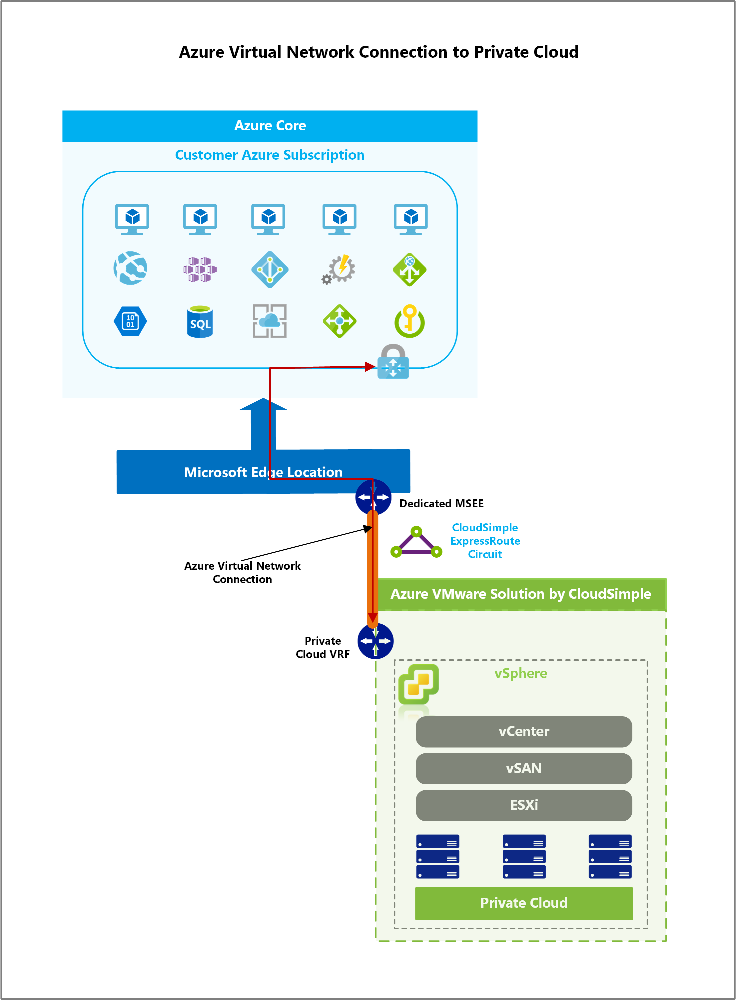
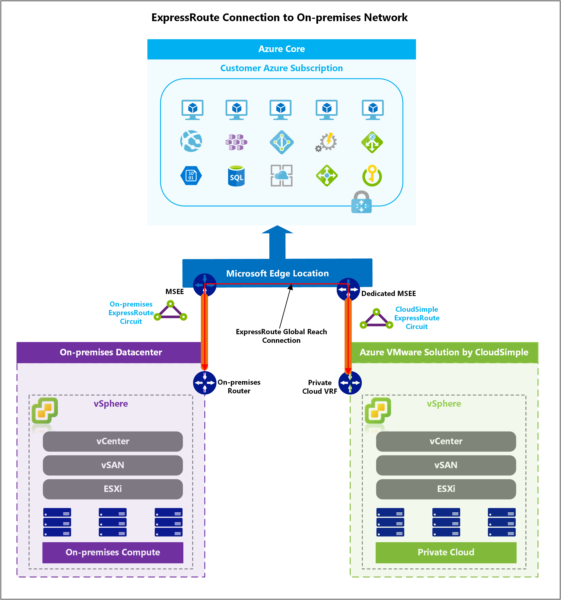
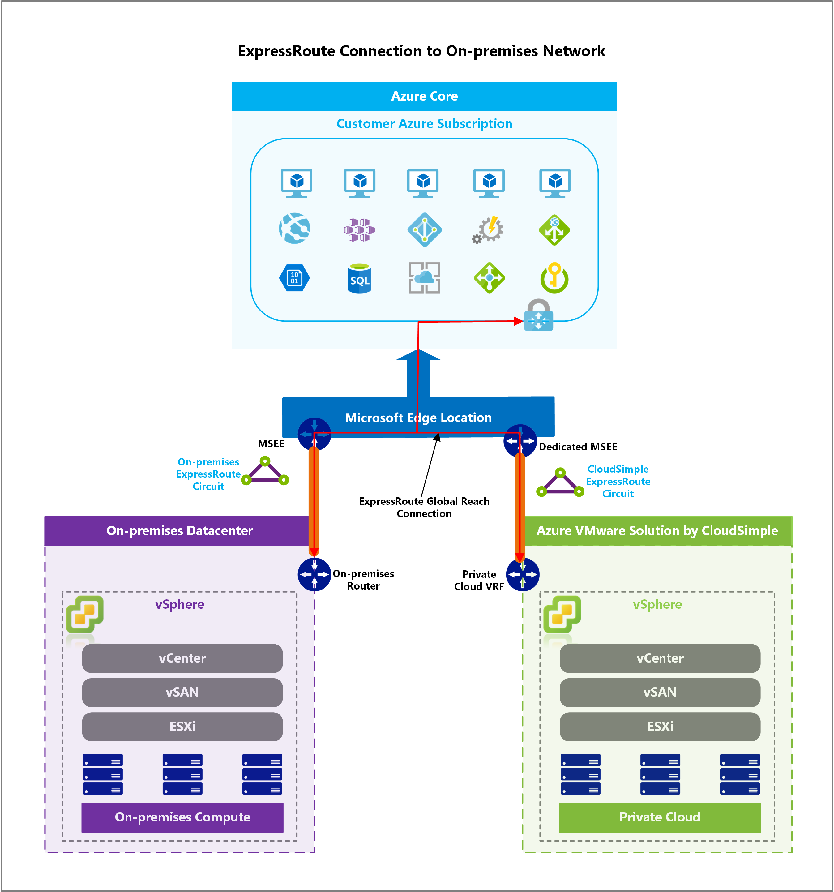

# Azure network connections overview

When you create an AVS service in a region and create nodes, you can:

* Request an Azure ExpressRoute circuit and attach it to the AVS network in that region.
* Connect your AVS region network to your Azure virtual network or your on-premises network using Azure ExpressRoute.
* Provide access to services running in your Azure subscription or your on-premises network from your Private Cloud environment.

The ExpressRoute connection is high bandwidth with low latency.

## Benefits

Azure network connection allows you to:

* Use Azure as a backup target for virtual machines on your Private Cloud.
* Deploy KMS servers in your Azure subscription to encrypt your Private Cloud vSAN datastore.
* Use hybrid applications where the web tier of the application runs in the AVS Public Cloud while the application and database tiers run in your Private Cloud.

## Azure virtual network connection

AVS Private Clouds can be connected to your Azure resources using ExpressRoute. The ExpressRoute connection allows you to access resources running in your Azure subscription from your AVS Private Cloud. This connection allows you to extend your AVS Private Cloud network to your Azure virtual network. Routes from an AVS network will be exchanged with your Azure virtual network via BGP. If you have virtual network peering configured, all peered virtual networks will be accessible from your AVS network.

## ExpressRoute connection to on-premises network

You can connect your existing Azure ExpressRoute circuit to your AVS region. ExpressRoute Global Reach feature is used to connect the two circuits with each other. A connection is established between the on-premises and AVS ExpressRoute circuits. This connection allows you to extend your on-premises networks to an AVS Private Cloud network. Routes from your AVS network will be exchanged via BGP with your on-premises network.

## Connection to on-premises network and Azure virtual network

Connections to on-premises network and Azure virtual network can coexist from your AVS network. The connection uses BGP to exchange routes between an on-premises network, Azure virtual network, and an AVS network. When you connect your AVS network to your Azure virtual network in the presence of a Global Reach connection, Azure virtual network routes will be visible on your on-premises network. Route exchange happens in Azure between the edge routers.

### Important considerations

Connecting to an AVS network from an on-premises network and/or from an Azure virtual network allows route exchange between all networks.

* An Azure virtual network will be visible from both an on-premises network and an AVS network.
* If you have connected to your Azure virtual network from an on-premises network, connection to an AVS network using Global Reach will allow access to virtual networks from AVS network.
* Subnet addresses **must not** overlap between any of the networks connected.
* AVS will **not** advertise a default route to the ExpressRoute connections
* If your on-premises router advertises the default route, traffic from the AVS network and Azure virtual network will use the advertised default route. As a result, virtual machines on Azure cannot be accessed using public IP addresses.

## Next steps

* [Connect Azure virtual network to AVS using ExpressRoute](virtual-network-connection.md)
* [Connect from on-premises to AVS using ExpressRoute](on-premises-connection.md)
