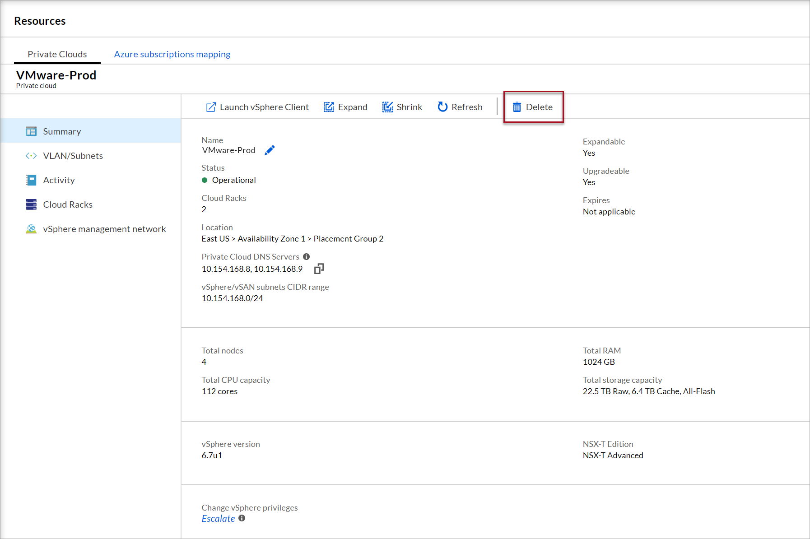
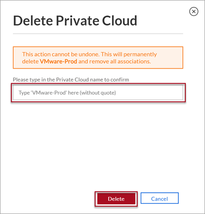

--- 
title: Delete an Azure VMware Solutions (AVS) Private Cloud
description: Describes how to delete an AVS Private Cloud.
author: sharaths-cs 
ms.author: b-shsury 
ms.date: 08/06/2019 
ms.topic: article 
ms.service: azure-vmware-cloudsimple 
ms.reviewer: cynthn 
manager: dikamath 
---

# Delete an AVS Private Cloud

AVS provides the flexibility to delete an AVS Private Cloud. An AVS Private Cloud consists of one or more vSphere clusters. Each cluster can have 3 to 16 nodes. When you delete an AVS Private Cloud, all clusters will be deleted.

## Before you begin

Deletion of an AVS Private Cloud deletes the entire AVS Private Cloud. All components of the AVS Private Cloud will be deleted. If you want to keep any of the data, ensure you've backed up the data to on-premises storage or Azure storage.

The components of an AVS Private Cloud include:

* AVS Nodes
* Virtual machines
* VLANs/Subnets
* All user data stored on the AVS Private Cloud
* All firewall rule attachments to a VLAN/Subnet

## Sign in to Azure

Sign in to the Azure portal at [https://portal.azure.com](https://portal.azure.com).

## Delete an AVS Private Cloud

1. [Access the AVS portal](access-cloudsimple-portal.md).

2. Open the **Resources** page.

3. Click on the AVS Private Cloud you want to delete

4. On the summary page, click **Delete**.

    

5. On the confirmation page, enter the name of the AVS Private Cloud and click **Delete**. 

    

The AVS Private Cloud is marked for deletion. The deletion process starts after three hours and deletes the AVS Private Cloud.

> [!CAUTION]
> Nodes must be deleted after deletion of the AVS Private Cloud. Metering of nodes will continue until nodes are deleted from your subscription.

## Next steps

* [Delete nodes](delete-nodes.md)
