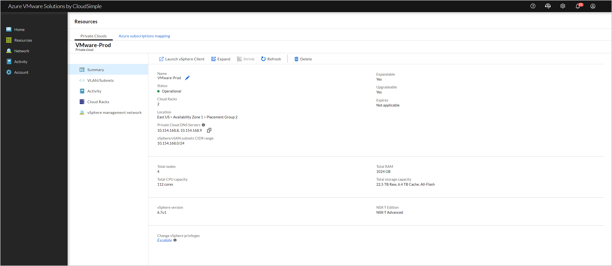
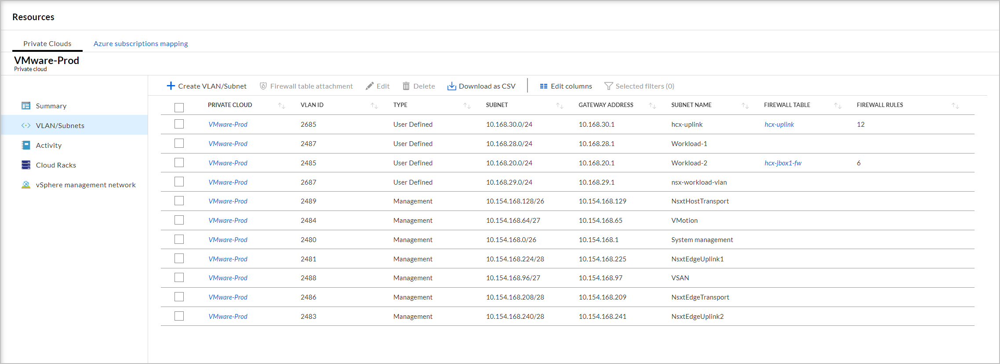
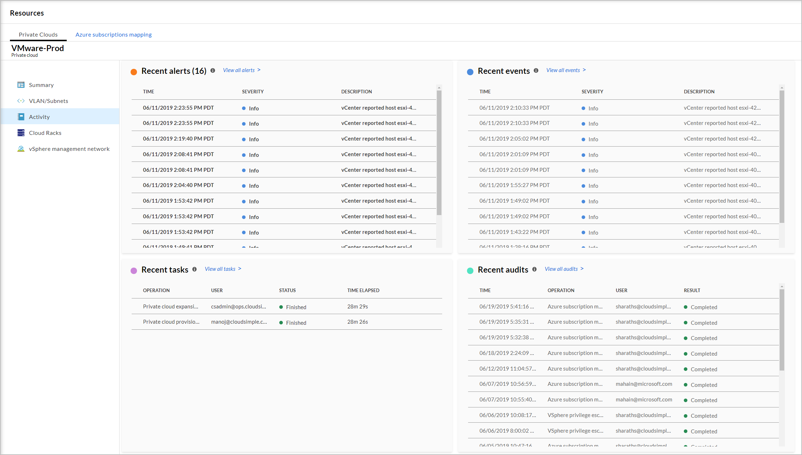

--- 
title: Manage Azure VMware Solutions (AVS) Private Cloud
description: Describes the capabilities available to manage your AVS Private Cloud resources and activity
author: sharaths-cs
ms.author: b-shsury 
ms.date: 06/10/2019 
ms.topic: article 
ms.service: azure-vmware-cloudsimple 
ms.reviewer: cynthn 
manager: dikamath 
---

# Manage AVS Private Cloud resources and activities

AVS Private clouds are managed from the AVS portal. Check the status, available resources, activity on the AVS private cloud, and other settings from the AVS portal.

## Sign in to Azure

Sign in to the Azure portal at [https://portal.azure.com](https://portal.azure.com).

## Access the AVS portal

Access the [AVS portal](access-cloudsimple-portal.md).

## View the List of AVS Private Clouds

The **AVS Private Clouds** tab on the **Resources** page lists all AVS Private Clouds in your subscription. Information includes the name, number of vSphere clusters, location, current state of the AVS Private Cloud and, resource information.

Select an AVS Private Cloud for additional information and actions.

## AVS Private Cloud summary

View a comprehensive summary of the selected AVS Private Cloud. Summary page includes the DNS servers deployed on the AVS Private Cloud. You can set up DNS forwarding from on-premises DNS servers to your AVS Private Cloud DNS servers. For more information on DNS forwarding, see [Configure DNS for name resolution for AVS Private Cloud vCenter from on-premises](https://docs.azure.cloudsimple.com/on-premises-dns-setup/).

### Available actions

* [Launch vSphere client](https://docs.azure.cloudsimple.com/vsphere-access/). Access the vCenter for this AVS Private Cloud.
* [Purchase nodes](create-nodes.md). Add nodes to this AVS Private Cloud.
* [Expand](expand-private-cloud.md). Add nodes to this AVS Private Cloud.
* **Refresh**. Update the information on this page.
* **Delete**. You can delete the AVS Private Cloud at any time. **Before deleting, make sure that you have backed up all systems and data.** Deleting an AVS Private Cloud deletes all the VMs, vCenter configuration, and data. Click **Delete** in the summary section for the selected AVS Private Cloud. Following deletion, all the AVS Private Cloud data is erased in a secure, highly compliant erasure process.
* [Change vSphere privileges](escalate-private-cloud-privileges.md). Escalate your privileges on this AVS Private Cloud.

## AVS Private Cloud VLANS/subnets

View the list of defined VLANs/subnets for the selected AVS Private Cloud. The list includes the management VLANs/subnets created when the AVS Private Cloud was created.

 

### Available actions

* [Add VLANS/Subnets](https://docs.azure.cloudsimple.com/create-vlan-subnet/). Add a VLAN/subset to this AVS Private Cloud.

Select a VLAN/Subnet for following actions
* [Attach firewall table](https://docs.azure.cloudsimple.com/firewall/). Attach a firewall table to this AVS Private Cloud.
* **Edit**
* **Delete** (only user-defined VLANs/Subnets)

## AVS Private Cloud activity

View the following information for the selected AVS Private Cloud. The activity information is a filtered list of all activities for the selected AVS Private Cloud. This page shows up to 25 recent activities.

* Recent alerts
* Recent events
* Recent tasks
* Recent audit

## Cloud Racks

Cloud racks are the building blocks of your AVS Private Cloud. Each rack provides a unit of capacity. AVS automatically configures cloud racks based on your selections when creating or expanding an AVS Private Cloud. View the full list of cloud racks, including the AVS Private Cloud that each is assigned to.

## vSphere Management Network

List of VMware management resources and virtual machines that are currently configured on the AVS Private Cloud. Information includes the software version, fully qualified domain name (FQDN), and IP address of the resources.

## Next steps

* [Consume VMware VMs on Azure](quickstart-create-vmware-virtual-machine.md)
* Learn more about [AVS Private Clouds](cloudsimple-private-cloud.md)