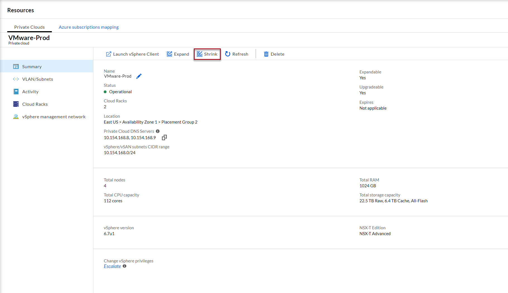
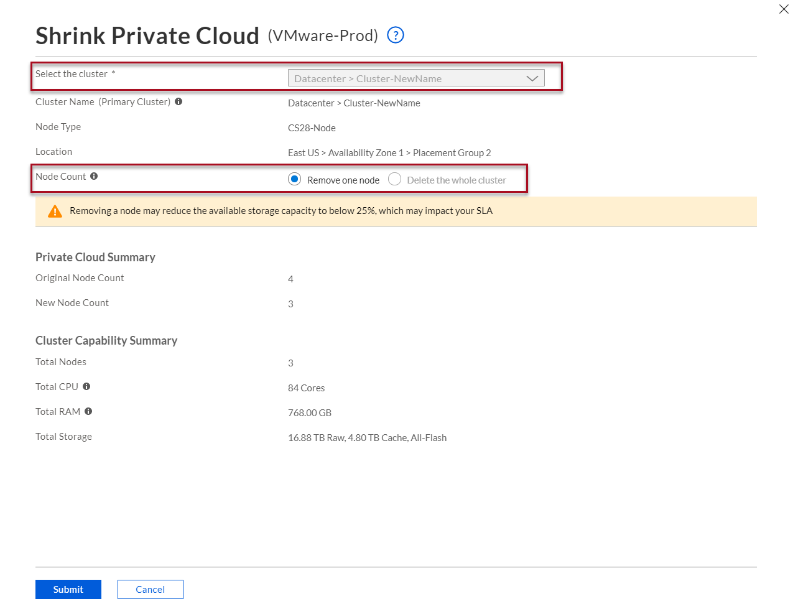

--- 
title: Shrink Azure VMware Solutions (AVS) Private Cloud
description: Describes how to shrink an AVS Private Cloud.
author: sharaths-cs 
ms.author: b-shsury 
ms.date: 07/01/2019 
ms.topic: article 
ms.service: azure-vmware-cloudsimple 
ms.reviewer: cynthn 
manager: dikamath 
---

# Shrink an AVS Private Cloud

AVS provides the flexibility to dynamically shrink an AVS Private Cloud. An AVS Private Cloud consists of one or more vSphere clusters. Each cluster can have 3 to 16 nodes. When shrinking an AVS Private Cloud, you remove a node from the existing cluster or delete an entire cluster. 

## Before you begin

The following conditions must be met before shrinking an AVS Private Cloud. The Management cluster (first cluster) is created when the AVS Private Cloud was created. It cannot be deleted.

* A vSphere cluster must have three nodes. A cluster with only three nodes cannot be shrunk.
* Total storage consumed should not exceed the total capacity after shrinking the cluster.
* Check if any Distributed Resource Scheduler (DRS) rules prevents vMotion of a virtual machine. If rules are present, disable or delete the rules. DRS rules include virtual machine to host affinity rules.

## Sign in to Azure

Sign in to the Azure portal at [https://portal.azure.com](https://portal.azure.com).

## Shrinking an AVS Private Cloud

1. [Access the AVS portal](access-cloudsimple-portal.md).

2. Open the **Resources** page.

3. Click on the AVS Private Cloud you want to shrink

4. On the summary page, click **Shrink**.

    

5. Select the cluster that you want to shrink or delete. 

    

6. Select **Remove one node** or **Delete the whole cluster**. 

7. Verify the cluster capacity

8. Click **Submit** to shrink the AVS Private Cloud.

Shrinking of the AVS Private Cloud starts. You can monitor the progress in tasks. The shrink process can take a few hours depending on the data, which needs to be resynced on vSAN.

> [!NOTE]
> 1. If you shrink a private cloud by deleting the last or the only cluster in the datacenter, the datacenter will not be deleted.
> 2. If any DRS rule violation occurs, node will not be removed from the cluster and the task description shows that removing a node will violate DRS rules on the cluster.    

## Next steps

* [Consume VMware VMs on Azure](quickstart-create-vmware-virtual-machine.md)
* Learn more about [AVS Private Clouds](cloudsimple-private-cloud.md)
