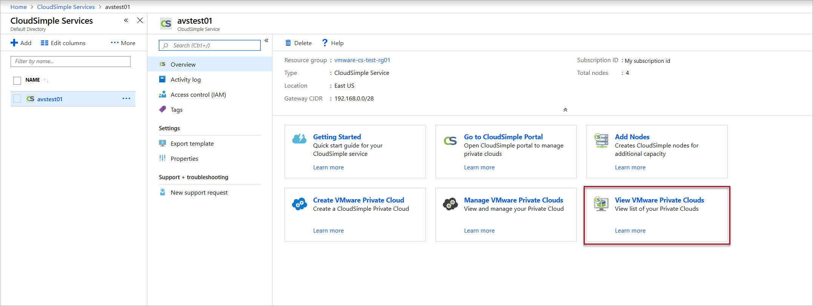
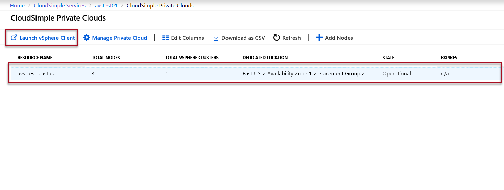
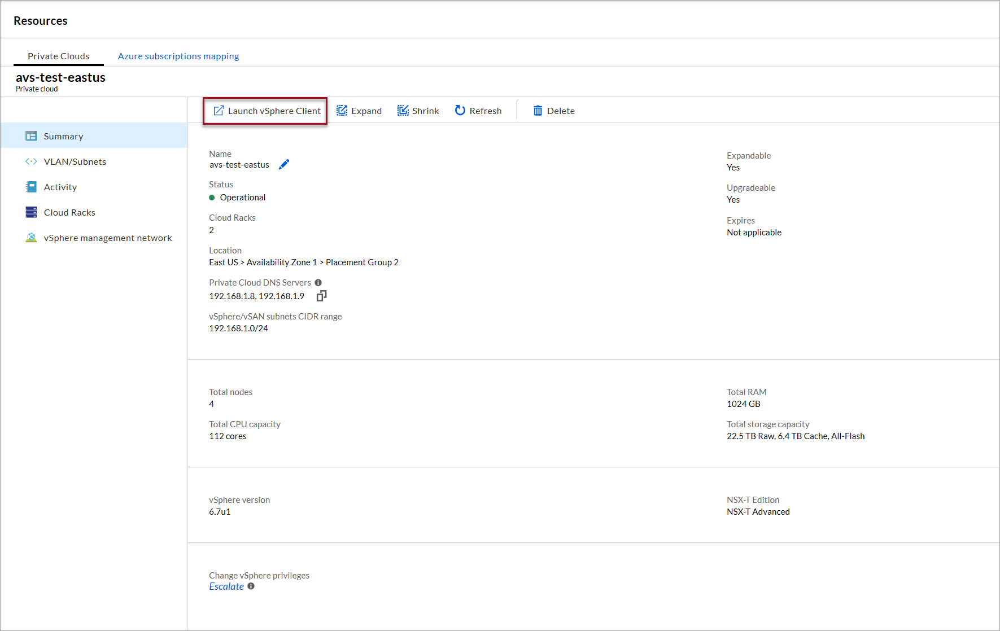

--- 
title: Azure VMware Solutions (AVS) - Access vSphere client
description: Describes how to access vCenter from your AVS Private Cloud.
author: sharaths-cs 
ms.author: b-shsury 
ms.date: 08/30/2019 
ms.topic: article 
ms.service: azure-vmware-cloudsimple 
ms.reviewer: cynthn 
manager: dikamath 
---

# Access your AVS Private Cloud vCenter portal

You can launch your AVS Private Cloud vCenter portal from Azure portal or AVS portal. vCenter portal allows you to manage VMware infrastructure on your AVS Private Cloud.

## Before you begin

Network connection must be established and DNS name resolution must be enabled for accessing vCenter portal. You can establish network connection to your AVS Private Cloud using any of the options below.

* [Connect from on-premises to AVS using ExpressRoute](on-premises-connection.md)
* [Configure a VPN connection to your AVS Private Cloud](set-up-vpn.md)

To set up DNS name resolution of your AVS Private Cloud VMware infrastructure components, see [Configure DNS for name resolution for AVS Private Cloud vCenter access from on-premises workstations](on-premises-dns-setup.md)

## Sign in to Azure

Sign in to the Azure portal at [https://portal.azure.com](https://portal.azure.com).

## Access vCenter from Azure portal

You can launch vCenter portal of your AVS Private Cloud from Azure portal.

1. Select **All services**.

2. Search for **AVS Services**.

3. Select the AVS service of your AVS Private Cloud to which you want to connect.

4. On the **Overview** page, click **View VMware AVS Private Clouds**

    

5. Select the AVS Private Cloud from the list of AVS Private Clouds and click **Launch vSphere Client**.

    

## Access vCenter from AVS portal

You can launch vCenter portal of your AVS Private Cloud from AVS portal.

1. Access your [AVS portal](access-cloudsimple-portal.md).

2. From the **Resources** select the AVS Private Cloud, which you want to access and click on **Launch vSphere Client**.

    

3. You can also launch the vCenter portal from summary screen of your AVS Private Cloud.

    

## Next steps

* [Create and manage VLANs/subnets for your AVS Private Clouds](create-vlan-subnet.md)
* [AVS Private Cloud permission model of VMware vCenter](learn-private-cloud-permissions.md)