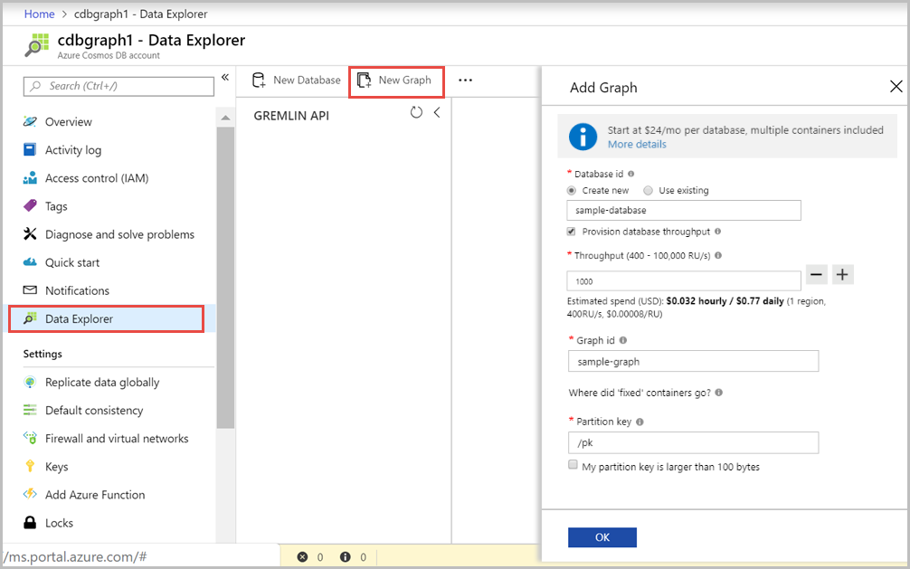

You can now use the Data Explorer tool in the Azure portal to create a graph database. 

1. Click **Data Explorer** > **New Graph**.

    The **Add Graph** area is displayed on the far right, you may need to scroll right to see it.

    

2. In the **Add graph** page, enter the settings for the new graph.

    Setting|Suggested value|Description
    ---|---|---
    Database ID|sample-database|Enter *sample-database* as the name for the new database. Database names must be between 1 and 255 characters, and cannot contain `/ \ # ?` or a trailing space.
    Throughput|400 RUs|Change the throughput to 400 request units per second (RU/s). If you want to reduce latency, you can scale up the throughput later.
    Graph ID|sample-graph|Enter *sample-graph* as the name for your new collection. Graph names have the same character requirements as database IDs.
    Partition Key| /pk |All Cosmos DB accounts need a partition key to horizontally scale. Learn how to select an appropriate partition key in the [Graph Data Partitioning article](https://docs.microsoft.com/azure/cosmos-db/graph-partitioning).

3. Once the form is filled out, click **OK**.
