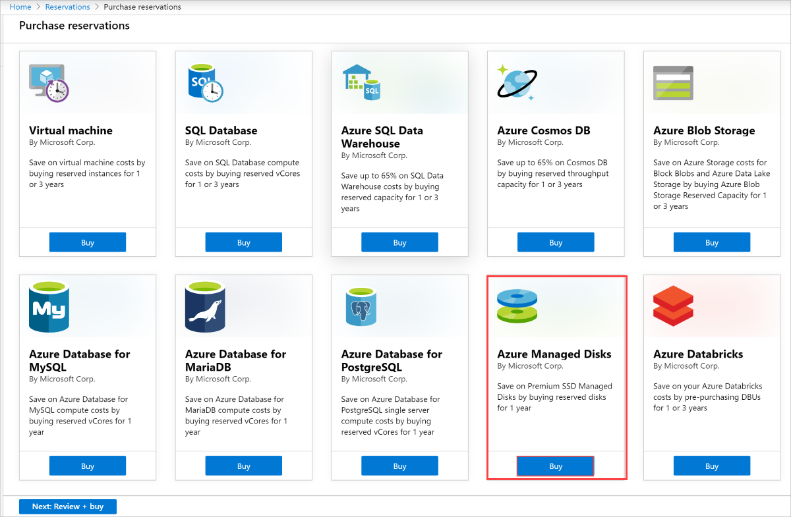
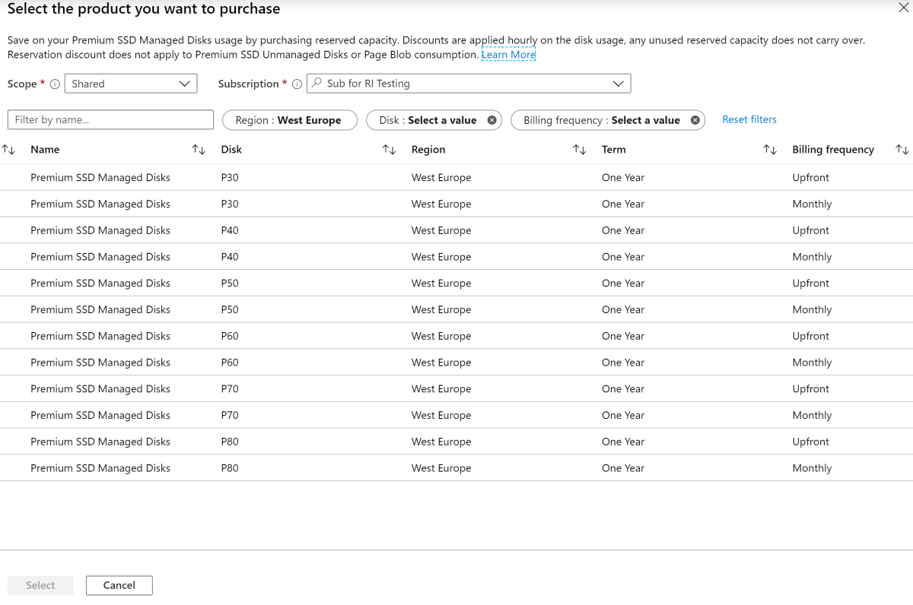

Save on your premium solid-state drive (SSD) usage with reserved capacity, combined with Reserved Virtual Machine Instances you can decrease your total VM costs. The reservation discount is applied automatically to the matching disks in the selected reservation scope, you don't need to assign a reservation to a Managed disk to get the discounts. Discounts are applied hourly on the disk usage and any unused reserved capacity does not carry over. Managed disk reservation discount does not apply to unmanaged disks, ultra disks, or page blob consumption.

## Determine your storage needs

Before you purchase a reservation, you should determine what your storage needs are. Currently, disk reservation is only available for select premium SSD SKUs. The SKU of a premium SSD determines the disk's size and performance. When determining your storage needs, we do not recommend thinking of disks just as a total capacity, you cannot use a reservation for a larger disk (like a P40) and use that to pay for two smaller disks (P30). When purchasing a reservation, you are only purchasing the total number of disks per SKU.

Disk reservation is made per Disk SKU, hence the reservation consumption is based on the unit of the Disk SKUs instead of the provided size. For example, if you have reserved 1 P40 of 2 TiB provisioned capacity but only allocated 2 P30 disks, the two P30 consumption will not be accounted for P40 reservation and you will pay the pay-as-you-go rate.

[!INCLUDE [disk-storage-premium-ssd-sizes](disk-storage-premium-ssd-sizes.md)]

## Purchase considerations

We recommend the following best practices when considering disk reservation purchase:

- Analyze your usage information to help determine which reservations you should purchase. Make sure you are tracking the usage in Disk SKUs instead of provisioned or used disk capacity. 
- Examine your Disk Reservation along with your VM reservation. We highly recommend making reservation for both VM and Disk usage for maximum saving. You can start with determining the right VM reservation, then evaluate the disk reservation accordingly. Generally, you’ll have a standard configuration for each of your workloads, for example, a SQL server might have two P40 data disks and one P30 OS disk. This kind of pattern may help you determine the amount of reservations you might purchase. This approach can simplify the evaluation process and also make sure that you have an aligned plan for both VM and Disks in terms of subscriptions, regions, and others. 

## Purchase restrictions

Reservation discounts are not currently available for the following disks:
- Unmanaged disks/page blobs
- Standard SSD or standard HDD
- Premium SSD SKUs smaller than P30 – Reservations aren’t available for P1/P2/P3/P4/P6/P10/P15/P20 Premium SSD SKUs.
- Clouds - Reservations aren't available for purchase in Azure Gov, Germany, or China regions.
- Capacity restrictions - In rare circumstances, Azure limits the purchase of new reservations for subset of disk SKUs, because of low capacity in a region.

## Buy a Disk Reservation

You can purchase Azure disk reservations through the [Azure portal](https://portal.azure.com/). You can either pay for the reservation up front or with monthly payments. For more information about purchasing with monthly payments, see [Purchase reservations with monthly payments](../articles/cost-management-billing/reservations/monthly-payments-reservations.md).

Follow these steps to purchase reserved capacity:

1. Navigate to the [Purchase reservations](https://portal.azure.com/#blade/Microsoft_Azure_Reservations/CreateBlade/referrer/Browse_AddCommand) blade in the Azure portal.
1. Select **Azure Managed Disks** to purchase a reservation.

        

1. Fill in the required fields as described in the following table:

   |Field  |Description  |
   |---------|---------|
   |**Scope**   |  Indicates how many subscriptions can use the billing benefit associated with the reservation. It also controls how the reservation is applied to specific subscriptions.    If you select **Shared**, the reservation discount is applied to Azure Storage capacity in any subscription within your billing context. The billing context is based on how you signed up for Azure. For enterprise customers, the shared scope is the enrollment and includes all subscriptions within the enrollment. For pay-as-you-go customers, the shared scope includes all individual subscriptions with pay-as-you-go rates created by the account administrator.      If you select **Single subscription**, the reservation discount is applied to Azure Storage capacity in the selected subscription.    If you select **Single resource group**, the reservation discount is applied to Azure Storage capacity in the selected subscription and the selected resource group within that subscription.    You can change the reservation scope after you purchase the reservation.  |
   |**Subscription**  | The subscription that's used to pay for the Azure Storage reservation. The payment method on the selected subscription is used in charging the costs. The subscription must be one of the following types:     Enterprise Agreement (offer numbers: MS-AZR-0017P or MS-AZR-0148P): For an Enterprise subscription, the charges are deducted from the enrollment's monetary commitment balance or charged as overage.    Individual subscription with pay-as-you-go rates (offer numbers: MS-AZR-0003P or MS-AZR-0023P): For an individual subscription with pay-as-you-go rates, the charges are billed to the credit card or invoice payment method on the subscription.    |
   | **Disks** | The SKU you are looking to create. |
   | **Region** | The region where the reservation is in effect. |
   | **Billing frequency** | Indicates how often the account is billed for the reservation. Options include *Monthly* or *Upfront*. |

    

1. After you select the parameters for your reservation, the Azure portal displays the cost. The portal also shows the discount percentage over pay-as-you-go billing. Select **Next** to proceed to the **Purchase reservations** blade.

1. In the **Purchase reservations** pane, you can name your reservation and select the total quantity of reservations you wish to make. The number of reservations map to the number of disks. For example, if you wanted to reserve a hundred disks, you'd change **Quantity** to 100.
1. Review the total cost of the reservation.

    

After you purchase a reservation, it is automatically applied to any existing Azure Disk storage resources that matches the terms of the reservation. If you haven't created any Azure Disk storage resources yet, the reservation will apply whenever you create a resource that matches the terms of the reservation. In either case, the term of the reservation begins immediately after a successful purchase.

## Exchange or refund a reservation

With certain limitations, you can exchange or refund a reservation.

To exchange or refund a reservation, navigate to the reservation details in the Azure portal. Select **Exchange or Refund**, and follow the instructions to submit a support request. When the request has been processed, Microsoft will send you an email to confirm completion of the request.

For more information about Azure Reservations policies, see [Self-service exchanges and refunds for Azure Reservations](../articles/cost-management-billing/reservations/exchange-and-refund-azure-reservations.md).

### Exchange a reservation

Exchanging a reservation enables you to receive a prorated refund based on the unused portion of the reservation. You can then apply the refund to the purchase price of a new Azure disk reservation.
There's no limit on the number of exchanges you can make. Additionally, there's no fee associated with an exchange. The new reservation that you purchase must be of equal or greater value than the prorated credit from the original reservation. An Azure disk reservation can be exchanged only for another Azure disk reservation, and not for a reservation for any other Azure service.

### Refund a reservation

You may cancel an Azure disk reservation at any time. If you cancel, you'll receive a prorated refund based on the remaining term of the reservation, minus a 12 percent early termination fee. The maximum refund per year is $50,000.
Cancelling a reservation immediately terminates the reservation and returns the remaining months to Microsoft. The remaining prorated balance, minus the fee, will be refunded to your original form of purchase.

## Expiration of a reservation

When a reservation expires, any Azure Disk capacity that you are using under that reservation is billed at the pay-as-you-go rate. Reservations don't renew automatically.
You will receive an email notification 30 days prior to the expiration of the reservation, and again on the expiration date. To continue taking advantage of the cost savings that a reservation provides, renew it no later than the expiration date.

## Need help? Contact us

If you have questions or need help, [create a support request](https://go.microsoft.com/fwlink/?linkid=2083458).

## Next steps

- [What are Azure Reservations?](../articles/cost-management-billing/reservations/save-compute-costs-reservations.md)
- [Understand how your reservation discount is applied to Azure Disk Storage](../articles/cost-management-billing/reservations/understand-disk-reservations.md)